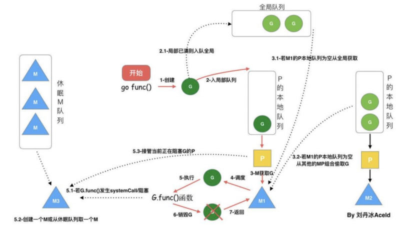
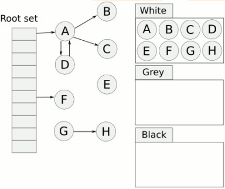
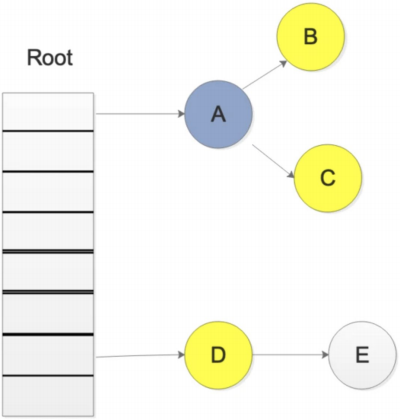
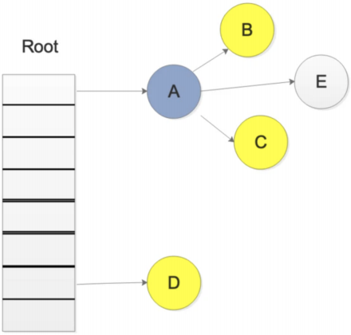

## Goroutine 定义

Goroutine 是一个与其他 goroutines 并行运行在同一地址空间的 Go 函数或方法。一个运行的程序由一个或更多个 goroutine 组成。它与线程、协程、进程等不同。它是一个 goroutine” —— Rob Pike

Goroutines 在同一个用户地址空间里并行独立执行 functions，channels 则用于 goroutines 间的通信和同步访问控制。

## GMP 指的是什么

**G（Goroutine）**：我们所说的协程，为用户级的轻量级线程，每个 Goroutine 对象中的 sched 保存着其上下文信息.

**M（Machine）**：对内核级线程的封装，数量对应真实的 CPU 数（真正干活的对象）.

**P（Processor）**：即为 G 和 M 的调度对象，用来调度 G 和 M 之间的关联关系，其数量可通过 GOMAXPROCS() 来设置，默认为核心数。

## 1.0 之前 GM 调度模型

调度器把 G 都分配到 M 上，不同的 G 在不同的 M 并发运行时，都需要向系统申请资源，比如堆栈内存等，因为资源是全局的，就会因为资源竞争照成很多性能损耗。为了解决这一的问题 go 从 1.1 版本引入，在运行时系统的时候加入 p 对象，让 P 去管理这个 G 对象，M 想要运行 G，必须绑定 P，才能运行 P 所管理的 G。

1. 单一全局互斥锁(Sched.Lock)和集中状态存储
2. Goroutine 传递问题（M 经常在 M 之间传递”可运行”的 goroutine）
3. 每个 M 做内存缓存，导致内存占用过高，数据局部性较差
4. 频繁 syscall 调用，导致严重的线程阻塞/解锁，加剧额外的性能损耗。

## GMP 调度流程

* 每个 P 有个局部队列，局部队列保存待执行的 goroutine(流程 2)，当 M 绑定的 P 的的局部队列已经满了之后就会把 goroutine 放到全局队列(流程 2-1)
* 每个 P 和一个 M 绑定，M 是真正的执行 P 中 goroutine 的实体(流程 3)，M 从绑定的 P 中的局部队列获取 G 来执行
* 当 M 绑定的 P 的局部队列为空时，M 会从全局队列获取到本地队列来执行 G(流程 3.1)，当从全局队列中没有获取到可执行的 G 时候，M 会从其他 P 的局部队列中偷取 G 来执行(流程 3.2)，这种从其他 P 偷的方式称为 work stealing
* 当 G 因系统调用(syscall)阻塞时会阻塞 M，此时 P 会和 M 解绑即 hand off，并寻找新的 idle 的 M，若没有 idle 的 M 就会新建一个 M(流程 5.1)。
* 当 G 因 channel 或者 network I/O 阻塞时，不会阻塞 M，M 会寻找其他 runnable 的 G；当阻塞的 G 恢复后会重新进入 runnable 进入 P 队列等待执行(流程 5.3)

## GMP 中 work stealing 机制

存到 P 本地队列或者是全局队列。P 此时去唤醒一个 M。P 继续执行它的执行序。M 寻找是否有空闲的 P，如果有则将该 G 对象移动到它本身。接下来 M 执行一个调度循环(调用 G 对象->执行->清理线程→继续找新的 Goroutine 执行)。

## GMP 中 hand off 机制

当本线程 M 因为 G 进行的系统调用阻塞时，线程释放绑定的 P，把 P 转移给其他空闲的 M' 执行。当发生上线文切换时，需要对执行现场进行保护，以便下次被调度执行时进行现场恢复。Go 调度器 M 的栈保存在 G 对象上，只需要将 M 所需要的寄存器(SP、PC 等)保存到 G 对象上就可以实现现场保护。当这些寄存器数据被保护起来，就随时可以做上下文切换了，在中断之前把现场保存起来。如果此时 G 任务还没有执行完，M 可以将任务重新丢到 P 的任务队列，等待下一次被调度执行。当再次被调度执行时，M 通过访问 G 的 vdsoSP、vdsoPC 寄存器进行现场恢复(从上次中断位置继续执行)。

## 协作式的抢占式调度

在 1.14 版本之前，程序只能依靠 Goroutine 主动让出 CPU 资源才能触发调度，存在问题

* 某些 Goroutine 可以长时间占用线程，造成其它 Goroutine 的饥饿
* 垃圾回收需要暂停整个程序（Stop-the-world，STW），最长可能需要几分钟的时间，导致整个程序无法工作。 

## 基于信号的抢占式调度

在任何情况下，Go 运行时并行执行（注意，不是并发）的 goroutines 数量是小于等于 P 的数量的。为了提高系统的性能，P 的数量肯定不是越小越好，所以官方默认值就是 CPU 的核心数，设置的过小的话，如果一个持有 P 的 M，由于 P 当前执行的 G 调用了 syscall 而导致 M 被阻塞，那么此时关键点：GO 的调度器是迟钝的，它很可能什么都没做，直到 M 阻塞了相当长时间以后，才会发现有一个 P/M 被 syscall 阻塞了。然后，才会用空闲的 M 来强这个 P。通过 sysmon 监控实现的抢占式调度，最快在 20us，最慢在 10-20ms 才会发现有一个 M 持有 P 并阻塞了。操作系统在 1ms 内可以完成很多次线程调度（一般情况 1ms 可以完成几十次线程调度），Go 发起 IO/syscall 的时候执行该 G 的 M 会阻塞然后被 OS 调度走，P 什么也不干，sysmon 最慢要 10-20ms 才能发现这个阻塞，说不定那时候阻塞已经结束了，宝贵的 P 资源就这么被阻塞的 M 浪费了。

## GMP 调度过程中存在哪些阻塞

* I/O，select
* block on syscall
* channel
* 等待锁
* runtime.Gosched()

## sysmon 有什么作用

sysmon 也叫监控线程，变动的周期性检查，好处

* 释放闲置超过 5 分钟的 span 物理内存；
* 如果超过 2 分钟没有垃圾回收，强制执行；
* 将长时间未处理的 netpoll 添加到全局队列；
* 向长时间运行的 G 任务发出抢占调度(超过 10ms 的 g，会进行 retake)；
* 收回因 syscall 长时间阻塞的 P；

## 三色标记原理

我们首先看一张图，大概就会对 三色标记法有一个大致的了解：

**原理：**

首先把所有的对象都放到白色的集合中

* 从根节点开始遍历对象，遍历到的白色对象从白色集合中放到灰色集合中
* 遍历灰色集合中的对象，把灰色对象引用的白色集合的对象放入到灰色集合中，同时把遍历过的灰色集合中的对象放到黑色的集合中
* 循环步骤 3，知道灰色集合中没有对象
* 步骤 4 结束后，白色集合中的对象就是不可达对象，也就是垃圾，进行回收

## 插入写屏障

golang 的回收没有混合屏障之前，一直是插入写屏障，由于栈赋值没有 hook 的原因，所以栈中没有启用写屏障，所以有 STW。golang 的解决方法是：只是需要在结束时启动 STW 来重新扫描栈。这个自然就会导致整个进程的赋值器卡顿，所以后面 golang 是引用混合写屏障解决这个问题。混合写屏障之后，就没有 STW。

## 删除写屏障

goalng 没有这一步，golang 的内存写屏障是由插入写屏障到混合写屏障过渡的。简单介绍一下，一个对象即使被删除了最后一个指向它的指针也依旧可以活过这一轮，在下一轮 GC 中被清理掉。

## 写屏障

Go 在进行三色标记的时候并没有 STW，也就是说，此时的对象还是可以进行修改。

那么我们考虑一下，下面的情况。

我们在进行三色标记中扫描灰色集合中，扫描到了对象 A，并标记了对象 A 的所有引用，这时候，开始扫描对象 D 的引用，而此时，另一个 goroutine 修改了 D->E 的引用，变成了如下图所示

这样会不会导致 E 对象就扫描不到了，而被误认为 为白色对象，也就是垃圾写屏障就是为了解决这样的问题，引入写屏障后，在上述步骤后，E 会被认为是存活的，即使后面 E 被 A 对象抛弃，E 会被在下一轮的 GC 中进行回收，这一轮 GC 中是不会对对象 E 进行回收的。

## 混合写屏障

* 混合写屏障继承了插入写屏障的优点，起始无需 STW 打快照，直接并发扫描垃圾即可；
* 混合写屏障继承了删除写屏障的优点，赋值器是黑色赋值器，GC 期间，任何在栈上创建的新对象，均为黑色。扫描过一次就不需要扫描了，这样就消除了插入写屏障时期最后 STW 的重新扫描栈；
* 混合写屏障扫描精度继承了删除写屏障，比插入写屏障更低，随着带来的是 GC 过程全程无 STW；
* 混合写屏障扫描栈虽然没有 STW，但是扫描某一个具体的栈的时候，还是要停止这个 goroutine 赋值器的工作的哈（针对一个 goroutine 栈来说，是暂停扫的，要么全灰，要么全黑哈，原子状态切换）。

## GC 触发时机

**主动触发：**调用 runtime.GC 

**被动触发：**使用系统监控，该触发条件由 runtime.forcegcperiod 变量控制，默认为 2 分钟。当超过两分钟没有产生任何 GC 时，强制触发 GC。

使用步调（Pacing）算法，其核心思想是控制内存增长的比例。如 Go 的 GC 是一种比例 GC, 下一次 GC 结束时的堆大小和上一次 GC 存活堆大小成比例. 由 GOGC 控制, 默认 100, 即 2 倍的关系, 200 就是 3 倍, 当 Go 新创建的对象所占用的内存大小，除以上次 GC 结束后保留下来的对象占用内存大小。

## Go 语言中 GC 的流程是什么？

当前版本的 Go 以 STW 为界限，可以将 GC 划分为五个阶段：

阶段说明赋值器状态 GCMark 标记准备阶段，为并发标记做准备工作，启动写屏障 STWGCMark 扫描标记阶段，与赋值器并发执行，写屏障开启并发 GCMarkTermination 标记终止阶段，保证一个周期内标记任务完成，停止写屏障 STWGCoff 内存清扫阶段，将需要回收的内存归还到堆中，写屏障关闭并发 GCoff 内存归还阶段，将过多的内存归还给操作系统，写屏障关闭并发。

## GC 如何调优

通过 go tool pprof 和 go tool trace 等工具

* 控制内存分配的速度，限制 goroutine 的数量，从而提高赋值器对 CPU 的利用率。
* 减少并复用内存，例如使用 sync.Pool 来复用需要频繁创建临时对象，例如提前分配足够的内存来降低多余的拷贝。
* 需要时，增大 GOGC 的值，降低 GC 的运行频率。