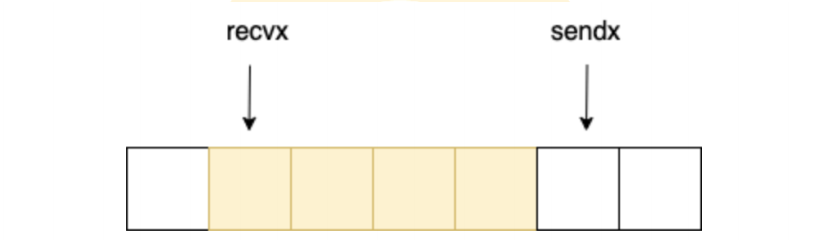
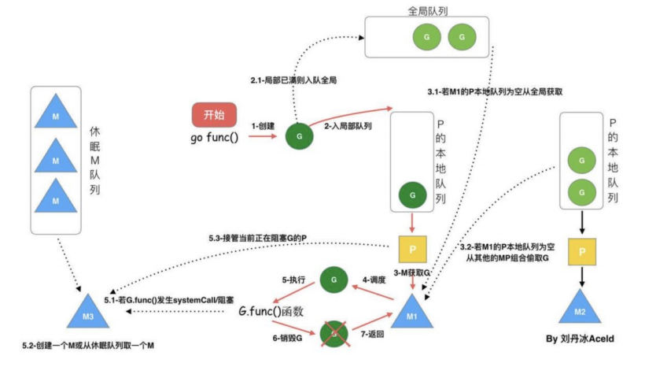
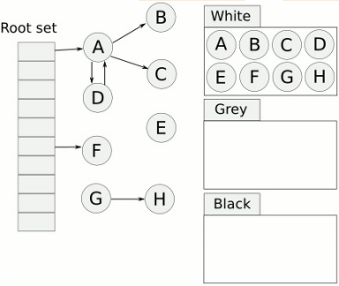
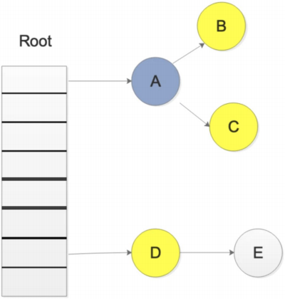
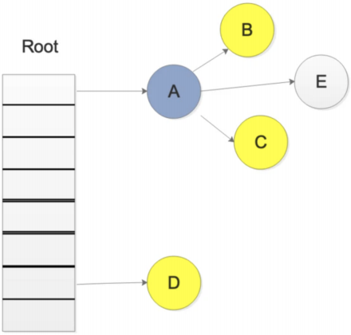

## 基础类

### 与其他语言相比，使用 Go 有什么好处？

* 与其他作为学术实验开始的语言不同，Go 代码的设计是务实的。每个功能和语法决策都旨在让程序员的生活更轻松。
* Golang 针对并发进行了优化，并且在规模上运行良好。
* 由于单一的标准代码格式，Golang 通常被认为比其他语言更具可读性。
* 自动垃圾收集明显比 Java 或 Python 更有效，因为它与程序同时执行。

### Golang 使用什么数据类型？

Golang 使用以下类型：

* Method
* Boolean
* Numeric
* String
* Array
* Slice
* Struct
* Pointer
* Function
* Interface
* Map
* Channel

### Go 程序中的包是什么？

包 (pkg) 是 Go 工作区中包含 Go 源文件或其他包的目录。源文件中的每个函数、变量和类型都存储在链接包中。每个 Go 源文件都属于一个包，该包在文件顶部使用以下命令声明：

```go
package <packagename>
```

您可以使用以下方法导入和导出包以重用导出的函数或类型：

```go
import <packagename>
```

Golang 的标准包是 fmt，其中包含格式化和打印功能，如 `Println()`.

### Go 支持什么形式的类型转换？将整数转换为浮点数。

Go 支持显式类型转换以满足其严格的类型要求。

```go
i := 55 // int
j := 67.8 // float64
sum := i + int(j) // j is converted to int
```

### 什么是 Goroutine？你如何停止它？

一个 Goroutine 是一个函数或方法执行同时旁边其他任何够程采用了特殊的 Goroutine 线程。Goroutine 线程比标准线程更轻量级，大多数 Golang 程序同时使用数千个 g、Goroutine。 要创建 Goroutine，请 go 在函数声明之前添加关键字。

```go
go f(x, y, z)
```

您可以通过向 Goroutine 发送一个信号通道来停止它。Goroutines 只能在被告知检查时响应信号，因此您需要在逻辑位置（例如 `for` 循环顶部）包含检查。

```go
package main

func main() {
	quit := make(chan bool)
	go func() {
		for {
			select {
			case <-quit:
				return
			default:
				// …
			}
		}
	}()
	// …
	quit <- true
}
```

### 如何在运行时检查变量类型？

类型开关是在运行时检查变量类型的最佳方式。类型开关按类型而不是值来评估变量。每个 Switch 至少包含一个 case，用作条件语句，和一个 defaultcase，如果没有一个 case 为真，则执行。

### Go 两个接口之间可以存在什么关系？

如果两个接口有相同的方法列表，那么他们就是等价的，可以相互赋值。如果接口 A 的方法列表是接口 B 的方法列表的自己，那么接口 B 可以赋值给接口 A。接口查询是否成功，要在运行期才能够确定。

### Go 当中同步锁有什么特点？作用是什么

当一个 Goroutine（协程）获得了 Mutex 后，其他 Goroutine（协程）就只能乖乖的等待，除非该 Goroutine 释放了该 Mutex RWMutex 在读锁占用的情况下，会阻止写，但不阻止读 RWMutex 在写锁占用情况下，会阻止任何其他 Goroutine（无论读和写）进来，整个锁相当于由该 Goroutine 独占同步锁的作用是保证资源在使用时的独有性，不会因为并发而导致数据错乱，保证系统的稳定性。

### Go 语言当中 Channel（通道）有什么特点，需要注意什么？

如果给一个 nil 的 channel 发送数据，会造成永远阻塞如果从一个 nil 的 channel 中接收数据，也会造成永久爱阻塞给一个已经关闭的 channel 发送数据， 会引起 pannic 从一个已经关闭的 channel 接收数据， 如果缓冲区中为空，则返回一个零值。

### Go 语言当中 Channel 缓冲有什么特点？

无缓冲的 channel 是同步的，而有缓冲的 channel 是非同步的。

### Go 语言中 cap 函数可以作用于那些内容？

cap 函数在讲引用的问题中已经提到，可以作用于的类型有：

* array(数组)
* slice(切片)
* channel(通道)

### go convey 是什么？一般用来做什么？

* go convey 是一个支持 golang 的单元测试框架
* go convey 能够自动监控文件修改并启动测试，并可以将测试结果实时输出到 Web 界面
* go convey 提供了丰富的断言简化测试用例的编写

### Go 语言当中 new 和 make 有什么区别吗？

new 的作用是初始化一个纸箱类型的指针 new 函数是内建函数，函数定义：

```go
func new(Type) *Type
```

* 使用 new 函数来分配空间
* 传递给 new 函数的是一个类型，而不是一个值
* 返回值是指向这个新非配的地址的指针

### Go 语言中 make 的作用是什么？

`make` 的作用是为 `slice, map or chan` 的初始化 然后返回引用 `make` 函数是内建函数，函数定义：

```go
func make(Type, size IntegerType) Type
```

`make(T, args)` 函数的目的和 `new(T)` 不同仅仅用于创建 `slice, map, channel` 而且返回类西行是实例

### Printf(), Sprintf(), FprintF() 都是格式化输出，有什么不同？

虽然这三个函数，都是格式化输出，但是输出的目标不一样

* `Printf()` 是标准输出，一般是屏幕，也可以重定向。
* `Sprintf()` 是把格式化字符串输出到指定的字符串中。
* `Fprintf()` 是吧格式化字符串输出到文件中。

### Go 语言当中数组和切片的区别是什么？

数组：数组固定长度数组长度是数组类型的一部分，所以[3]int 和[4]int 是两种不同的数组类型数组需要指定大小，不指定也会根据处初始化对的自动推算出大小，不可改变数组是通过值传递的。

切片：切片可以改变长度切片是轻量级的数据结构，三个属性，指针，长度，容量不需要指定大小切片是地址传递（引用传递）可以通过数组来初始化，也可以通过内置函数 `make()`来初始化，初始化的时候 `len=cap`，然后进行扩容。

### Go 语言当中值传递和地址传递（引用传递）如何运用？有什么区别？举例说明

1. 值传递只会把参数的值复制一份放进对应的函数，两个变量的地址不同，不可相互修改。
2. 地址传递(引用传递)会将变量本身传入对应的函数，在函数中可以对该变量进行值内容的修改。

### Go 语言当中数组和切片在传递的时候的区别是什么？

1. 数组是值传递
2. 切片是引用传递

### Go 语言是如何实现切片扩容的？

```go
package main

import "fmt"

func main() {
	arr := make([]int, 0)
	for i := 0; i < 2000; i++ {
		fmt.Println("len 为", len(arr), "cap 为", cap(arr))
		arr = append(arr, i)
	}
}
```

我们可以看下结果，依次是：0,1,2,4,8,16,32,64,128,256,512,1024

但到了 1024 之后,就变成了 1024,1280,1696,2304 每次都是扩容了四分之一左右

### 看下面代码的 defer 的执行顺序是什么？ defer 的作用和特点是什么？

**defer 的作用是：**

你只需要在调用普通函数或方法前加上关键字 defer，就完成了 defer 所需要的语法。当 defer 语句被执行时，跟在 defer 后面的函数会被延迟执行。直到包含该 defer 语句的函数执行完毕时，defer 后的函数才会被执行，不论包含 defer 语句的函数是通过 return 正常结束，还是由于 panic 导致的异常结束。 你可以在一个函数中执行多条 defer 语句，它们的执行顺序与声明顺序相反。

**defer 的常用场景：**

* defer 语句经常被用于处理成对的操作，如打开、关闭、连接、断开连接、加锁、释放锁。
* 通过 defer 机制，不论函数逻辑多复杂，都能保证在任何执行路径下，资源被释放。
* 释放资源的 defer 应该直接跟在请求资源的语句后。

### Golang Slice 的底层实现

切片是基于数组实现的，它的底层是数组，它自己本身非常小，可以理解为对**底层数组的抽象**。因为基于数组实现，所以它的底层的**内存是连续分配**的，效率非常高，还可以通过**索引**获得数据，可以**迭代以及垃圾回收优化**。

切片本身并不是动态数组或者数组指针。它内部实现的数据结构通过指针引用底层数组，设定相关属性将数据读写操作限定在指定的区域内。切片本身是一个只读对象，其工作机制类似数组指针的一种封装。切片对象非常小，是因为它是只有 3 个字段的数据结构：

* 指向底层数组的指针
* 切片的长度
* 切片的容量

### Golang Slice 的扩容机制，有什么注意点？

Go 中切片扩容的策略是这样的： 

* 首先判断，如果新申请容量大于 2 倍的旧容量，最终容量就是新申请的容量
* 否则判断，如果旧切片的长度小于 1024，则最终容量就是旧容量的两倍
* 否则判断，如果旧切片长度大于等于 1024，则最终容量从旧容量开始循环增加原来的 1/4, 直到最终容量大于等于新申请的容量
* 如果最终容量计算值溢出，则最终容量就是新申请容量

### 扩容前后的 Slice 是否相同？

**情况一：**

原数组还有容量可以扩容（实际容量没有填充完），这种情况下，扩容以后的数组还是指向原来的数组，对一个切片的操作可能影响多个指针指向相同地址的 Slice。

**情况二：**

原来数组的容量已经达到了最大值，再想扩容， Go 默认会先开一片内存区域，把原来的值拷贝过来，然后再执行 append() 操作。这种情况丝毫不影响原数组。

要复制一个 Slice，最好使用 Copy 函数。

### Golang 的参数传递、引用类型

Go 语言中**所有的传参都是值传递**（传值），都是一个副本，一个拷贝。因为拷贝的内容有时候是非引用类型（int、string、struct 等这些），这样就在函数中就无法修改原内容数据；有的是**引用类型（指针、map、slice、chan 等这些）**，这样就可以修改原内容数据。

Golang 的引用类型包括 slice、map 和 channel。它们有复杂的内部结构，除了申请内存外，还需要初始化相关属性。内置函数 new 计算类型大小，为其分配零值内存，返回指针。而 make 会被编译器翻译成具体的创建函数，由其分配内存和初始化成员结构，返回对象而非指针。

### Golang Map 底层实现

Golang 中 map 的底层实现是一个散列表，因此实现 map 的过程实际上就是实现散表的过程。在这个散列表中，主要出现的结构体有两个，一个叫 hmap(a header for a go map)，一个叫 bmap(a bucket for a Go map，通常叫其 bucket)。

### Golang Map 如何扩容

**装载因子：**count/2^B

**触发条件：**

1. 装填因子是否大于 6.5
2. overflow bucket 是否太多

**解决方法：**

1. **双倍扩容：**扩容采取了一种称为“渐进式”地方式，原有的 key 并不会一次性搬迁完毕，每次最多只会搬迁 2 个 bucket
2. **等量扩容：**重新排列，极端情况下，重新排列也解决不了，map 成了链表，性能大大降低，此时哈希种子 hash0 的设置，可以降低此类极端场景的发生。

### Golang Map 查找

Go 语言中 map 采用的是哈希查找表，由一个 key 通过哈希函数得到哈希值，64 位系统中就生成一个 64bit 的哈希值，由这个哈希值将 key 对应到不同的桶（bucket）中，当有多个哈希映射到相同的的桶中时，使用链表解决哈希冲突。key 经过 hash 后共 64 位，根据 hmap 中 B 的值，计算它到底要落在哪个桶时，桶的数量为 2^B，如 B=5，那么用 64 位最后 5 位表示第几号桶，在用 hash 值的高 8 位确定在 bucket 中的存储位置，当前 bmap 中的 bucket 未找到，则查询对应的 overflow bucket，对应位置有数据则对比完整的哈希值，确定是否是要查找的数据。

如果两个不同的 key 落在的同一个桶上，hash 冲突使用链表法接近，遍历 bucket 中的 key 如果当前处于 map 进行了扩容，处于数据搬移状态，则优先从 oldbuckets 查找。

### 介绍一下 Channel

Go 语言中，不要通过共享内存来通信，而要通过通信来实现内存共享。Go 的 CSP(Communicating Sequential Process)并发模型，中文可以叫做通信顺序进程，是通过 goroutine 和 channel 来实现的。所以 channel 收发遵循先进先出 FIFO，分为有缓存和无缓存，channel 中大致有 buffer(当缓冲区大小部位 0 时，是个 ring buffer)、sendx 和 recvx 收发的位置(ring buffer 记录实现)、sendq、recvq 当前 channel 因为缓冲区不足而阻塞的队列、使用双向链表存储、还有一个 mutex 锁控制并发、其他原属等。

### Go 语言的 Channel 特性？

1. 给一个 nil channel 发送数据，造成永远阻塞
2. 从一个 nil channel 接收数据，造成永远阻塞
3. 给一个已经关闭的 channel 发送数据，引起 panic
4. 从一个已经关闭的 channel 接收数据，如果缓冲区中为空，则返回一个零值
5. 无缓冲的 channel 是同步的，而有缓冲的 channel 是非同步的
6. 关闭一个 nil channel 将会发生 panic

### Channel 的 ring buffer 实现

channel 中使用了 ring buffer(环形缓冲区) 来缓存写入的数据。ring buffer 有很多好处，而且非常适合用来实现 FIFO 式的固定长度队列。在 channel 中，ring buffer 的实现如下：



hchan 中有两个与 buffer 相关的变量:recvx 和 sendx。其中 sendx 表示 buffer 中可写的 index，recvx 表示 buffer 中可读的 index。 从 recvx 到 sendx 之间的元素，表示已正常存放入 buffer 中的数据。我们可以直接使用 buf[recvx]来读取到队列的第一个元素，使用 buf[sendx] = x 来将元素放到队尾。

## 并发编程

### Mutex 几种状态

* `mutexLocked` — 表示互斥锁的锁定状态；
* `mutexWoken` — 表示从正常模式被从唤醒；
* `mutexStarving` — 当前的互斥锁进入饥饿状态；
* `waitersCount` — 当前互斥锁上等待的 Goroutine 个数；

### Mutex 正常模式和饥饿模式

**正常模式(非公平锁)**

正常模式下，所有等待锁的 goroutine 按照 FIFO(先进先出)顺序等待。唤醒的 goroutine 不会直接拥有锁，而是会和新请求锁的 goroutine 竞争锁的拥有。新请求锁的 goroutine 具有优势：它正在 CPU 上执行，而且可能有好几个，所以刚刚唤醒的 goroutine 有很大可能在锁竞争中失败。在这种情况下，这个被唤醒的 goroutine 会加入到等待队列的前面。 如果一个等待的 goroutine 超过 1ms 没有获取锁，那么它将会把锁转变为饥饿模式。

**饥饿模式(公平锁)**

为了解决了等待 G 队列的长尾问题饥饿模式下，直接由 unlock 把锁交给等待队列中排在第一位的 G(队头)，同时，饥饿模式下，新进来的 G 不会参与抢锁也不会进入自旋状态，会直接进入等待队列的尾部,这样很好的解决了老的 g 一直抢不到锁的场景。

饥饿模式的触发条件，当一个 G 等待锁时间超过 1 毫秒时，或者当前队列只剩下一个 g 的时候，Mutex 切换到饥饿模式。

**总结**

对于两种模式，正常模式下的性能是最好的，goroutine 可以连续多次获取锁，饥饿模式解决了取锁公平的问题，但是性能会下降，其实是性能和公平的一个平衡模式。

### Mutex 允许自旋的条件

1 锁已被占用，并且锁不处于饥饿模式。
2 积累的自旋次数小于最大自旋次数（active_spin=4）。
3 cpu 核数大于 1。
4 有空闲的 P。
5 当前 goroutine 所挂载的 P 下，本地待运行队列为空。

### RWMutex 实现

通过记录 readerCount 读锁的数量来进行控制，当有一个写锁的时候，会将读锁数量设置为负数 1<<30。目的是让新进入的读锁等待写锁之后释放通知读锁。同样的写锁也会等等待之前的读锁都释放完毕，才会开始进行后续的操作。 而等写锁释放完之后，会将值重新加上 1<<30, 并通知刚才新进入的读锁(rw.readerSem)，两者互相限制。 

###  RWMutex 注意事项

* RWMutex 是单写多读锁，该锁可以加多个读锁或者一个写锁
* 读锁占用的情况下会阻止写，不会阻止读，多个 goroutine 可以同时获取读锁
* 写锁会阻止其他 goroutine（无论读和写）进来，整个锁由该 goroutine 独占
* 适用于读多写少的场景
* RWMutex 类型变量的零值是一个未锁定状态的互斥锁。
* RWMutex 在首次被使用之后就不能再被拷贝。
* RWMutex 的读锁或写锁在未锁定状态，解锁操作都会引发 panic。 
* RWMutex 的一个写锁 Lock 去锁定临界区的共享资源，如果临界区的共享资源已被（读锁或写锁）锁定，这个写锁操作的 goroutine 将被阻塞直到解锁。
* RWMutex 的读锁不要用于递归调用，比较容易产生死锁。
* RWMutex 的锁定状态与特定的 goroutine 没有关联。一个 goroutine 可 以 RLock（Lock），另一个 goroutine 可以 RUnlock（Unlock）。
* 写锁被解锁后，所有因操作锁定读锁而被阻塞的 goroutine 会被唤醒，并都可以成功锁定读锁。
* 读锁被解锁后，在没有被其他读锁锁定的前提下，所有因操作锁定写锁而被阻塞的 goroutine，其中等待时间最长的一个 goroutine 会被唤醒。

### Cond 是什么

Cond 实现了一种条件变量，可以使用在多个 Reader 等待共享资源 ready 的场景（如果只有一读一写，一个锁或者 channel 就搞定了）

每个 Cond 都会关联一个 Lock（*sync.Mutex or *sync.RWMutex），当修改条件或者调用 Wait 方法时，必须加锁，保护 condition。

### Broadcast 和 Signal 区别

```go
func (c *Cond) Broadcast()
```

Broadcast 会唤醒所有等待 c 的 goroutine。

调用 Broadcast 的时候，可以加锁，也可以不加锁。

```go
func (c *Cond) Signal()
```

Signal 只唤醒 1 个等待 c 的 goroutine。

调用 Signal 的时候，可以加锁，也可以不加锁。

### Cond 中 Wait 使用

```go
func (c *Cond) Wait()
```

`Wait()` 会自动释放 `c.L`，并挂起调用者的 goroutine。之后恢复执行，`Wait()` 会在返回时对 `c.L` 加锁。

除非被 Signal 或者 Broadcast 唤醒，否则 `Wait()` 不会返回。

由于 `Wait()` 第一次恢复时，`C.L` 并没有加锁，所以当 Wait 返回时，调用者通常并不能假设条件为真。

取而代之的是, 调用者应该在循环中调用 Wait。（简单来说，只要想使用 condition，就必须加锁。）

```go
c.L.Lock()
for !condition() {
    c.Wait()
}
... make use of condition ...
c.L.Unlock()
```

### WaitGroup 用法

一个 WaitGroup 对象可以等待一组协程结束。使用方法是：

1. main 协程通过调用 wg.Add(delta int) 设置 worker 协程的个数，然后创建 worker 协程；
2. worker 协程执行结束以后，都要调用 wg.Done()；
3. main 协程调用 wg.Wait() 且被 block，直到所有 worker 协程全部执行结束后返回。

### WaitGroup 实现原理

* WaitGroup 主要维护了 2 个计数器，一个是请求计数器 v，一个是等待计数器 w，二者组成一个 64bit 的值，请求计数器占高 32bit，等待计数器占低 32bit。 

* 每次 Add 执行，请求计数器 v 加 1，Done 方法执行，请求计数器减 1，v 为 0 时通过信号量唤醒 Wait()。

### 什么是 sync.Once

* Once 可以用来执行且仅仅执行一次动作，常常用于单例对象的初始化场景。
* Once 常常用来初始化单例资源，或者并发访问只需初始化一次的共享资源，或者在测试的时候初始化一次测试资源。
* sync.Once 只暴露了一个方法 Do，你可以多次调用 Do 方法，但是只有第一次调用 Do 方法时 f 参数才会执行，这里的 f 是一个无参数无返回值的函数。

### 什么操作叫做原子操作

一个或者多个操作在 CPU 执行过程中不被中断的特性，称为原子性(atomicity)。这些操作对外表现成一个不可分割的整体，他们要么都执行，要么都不执行，外界不会看到他们只执行到一半的状态。而在现实世界中，CPU 不可能不中断的执行一系列操作，但如果我们在执行多个操作时，能让他们的中间状态对外不可见，那我们就可以宣城他们拥有了“不可分割”的原子性。

在 Go 中，一条普通的赋值语句其实不是一个原子操作。列如，在 32 位机器上写 int64 类型的变量就会有中间状态，因为他会被拆成两次写操作(MOV)——写 低 32 位和写高 32 位。

### 原子操作和锁的区别

原子操作由**底层硬件**支持，而锁则由操作系统的**调度器**实现。锁应当用来保护一段逻辑，对于一个变量更新的保护，原子操作通常会更有效率，并且更能利用计算机多核的优势，如果要更新的是一个复合对象，则应当使用 `atomic.Value` 封装好的实现。

### 什么是 CAS

CAS 的全称为 Compare And Swap，直译就是比较交换。是一条 CPU 的原子指令，其作用是让 CPU 先进行比较两个值是否相等，然后原子地更新某个位置的值，其实现方式是给予硬件平台的汇编指令，在 intel 的 CPU 中，使用的 cmpxchg 指令，就是说 CAS 是靠硬件实现的，从而在硬件层面提升效率。

**简述过程是这样：**

假设包含 3 个参数内存位置(V)、预期原值(A)和新值(B)。V 表示要更新变量的值，E 表示预期值，N 表示新值。仅当 V 值等于 E 值时，才会将 V 的值设为 N，如果 V 值和 E 值不同，则说明已经有其他线程在做更新，则当前线程什么都不做，最后 CAS 返回当前 V 的真实值。CAS 操作时抱着乐观的态度进行的，它总是认为自己可以成功完成操作。基于这样的原理，CAS 操作即使没有锁，也可以发现其他线程对于当前线程的干扰。

### sync.Pool 有什么用

对于很多需要重复分配、回收内存的地方，`sync.Pool` 是一个很好的选择。频繁地分配、回收内存会给 GC 带来一定的负担，严重的时候会引起 CPU 的毛刺，而 `sync.Pool` 可以将暂时不用的对象缓存起来，待下次需要的时候直接使用，不用再次经过内存分配，复用对象的内存，减轻 GC 的压力，提升系统的性能。

## RUNTIME

### Goroutine 定义

Goroutine 是一个与其他 goroutines 并行运行在同一地址空间的 Go 函数或方法。一个运行的程序由一个或更多个 goroutine 组成。它与线程、协程、进程等不同。它是一个 goroutine” —— Rob Pike

Goroutines 在同一个用户地址空间里并行独立执行 functions，channels 则用于 goroutines 间的通信和同步访问控制。

### GMP 指的是什么

**G（Goroutine）**：我们所说的协程，为用户级的轻量级线程，每个 Goroutine 对象中的 sched 保存着其上下文信息.

**M（Machine）**：对内核级线程的封装，数量对应真实的 CPU 数（真正干活的对象）.

**P（Processor）**：即为 G 和 M 的调度对象，用来调度 G 和 M 之间的关联关系，其数量可通过 GOMAXPROCS() 来设置，默认为核心数。

### 1.0 之前 GM 调度模型

调度器把 G 都分配到 M 上，不同的 G 在不同的 M 并发运行时，都需要向系统申请资源，比如堆栈内存等，因为资源是全局的，就会因为资源竞争照成很多性能损耗。为了解决这一的问题 go 从 1.1 版本引入，在运行时系统的时候加入 p 对象，让 P 去管理这个 G 对象，M 想要运行 G，必须绑定 P，才能运行 P 所管理的 G。

1. 单一全局互斥锁(Sched.Lock)和集中状态存储
2. Goroutine 传递问题（M 经常在 M 之间传递”可运行”的 goroutine）
3. 每个 M 做内存缓存，导致内存占用过高，数据局部性较差
4. 频繁 syscall 调用，导致严重的线程阻塞/解锁，加剧额外的性能损耗。

### GMP 调度流程



* 每个 P 有个局部队列，局部队列保存待执行的 goroutine(流程 2)，当 M 绑定的 P 的的局部队列已经满了之后就会把 goroutine 放到全局队列(流程 2-1)
* 每个 P 和一个 M 绑定，M 是真正的执行 P 中 goroutine 的实体(流程 3)，M 从绑定的 P 中的局部队列获取 G 来执行
* 当 M 绑定的 P 的局部队列为空时，M 会从全局队列获取到本地队列来执行 G(流程 3.1)，当从全局队列中没有获取到可执行的 G 时候，M 会从其他 P 的局部队列中偷取 G 来执行(流程 3.2)，这种从其他 P 偷的方式称为 work stealing
* 当 G 因系统调用(syscall)阻塞时会阻塞 M，此时 P 会和 M 解绑即 hand off，并寻找新的 idle 的 M，若没有 idle 的 M 就会新建一个 M(流程 5.1)。
* 当 G 因 channel 或者 network I/O 阻塞时，不会阻塞 M，M 会寻找其他 runnable 的 G；当阻塞的 G 恢复后会重新进入 runnable 进入 P 队列等待执行(流程 5.3)

### GMP 中 work stealing 机制

存到 P 本地队列或者是全局队列。P 此时去唤醒一个 M。P 继续执行它的执行序。M 寻找是否有空闲的 P，如果有则将该 G 对象移动到它本身。接下来 M 执行一个调度循环(调用 G 对象->执行->清理线程→继续找新的 Goroutine 执行)。

### GMP 中 hand off 机制

当本线程 M 因为 G 进行的系统调用阻塞时，线程释放绑定的 P，把 P 转移给其他空闲的 M' 执行。当发生上线文切换时，需要对执行现场进行保护，以便下次被调度执行时进行现场恢复。Go 调度器 M 的栈保存在 G 对象上，只需要将 M 所需要的寄存器(SP、PC 等)保存到 G 对象上就可以实现现场保护。当这些寄存器数据被保护起来，就随时可以做上下文切换了，在中断之前把现场保存起来。如果此时 G 任务还没有执行完，M 可以将任务重新丢到 P 的任务队列，等待下一次被调度执行。当再次被调度执行时，M 通过访问 G 的 vdsoSP、vdsoPC 寄存器进行现场恢复(从上次中断位置继续执行)。

### 协作式的抢占式调度

在 1.14 版本之前，程序只能依靠 Goroutine 主动让出 CPU 资源才能触发调度，存在问题

* 某些 Goroutine 可以长时间占用线程，造成其它 Goroutine 的饥饿
* 垃圾回收需要暂停整个程序（Stop-the-world，STW），最长可能需要几分钟的时间，导致整个程序无法工作。 

### 基于信号的抢占式调度

在任何情况下，Go 运行时并行执行（注意，不是并发）的 goroutines 数量是小于等于 P 的数量的。为了提高系统的性能，P 的数量肯定不是越小越好，所以官方默认值就是 CPU 的核心数，设置的过小的话，如果一个持有 P 的 M，由于 P 当前执行的 G 调用了 syscall 而导致 M 被阻塞，那么此时关键点：GO 的调度器是迟钝的，它很可能什么都没做，直到 M 阻塞了相当长时间以后，才会发现有一个 P/M 被 syscall 阻塞了。然后，才会用空闲的 M 来强这个 P。通过 sysmon 监控实现的抢占式调度，最快在 20us，最慢在 10-20ms 才会发现有一个 M 持有 P 并阻塞了。操作系统在 1ms 内可以完成很多次线程调度（一般情况 1ms 可以完成几十次线程调度），Go 发起 IO/syscall 的时候执行该 G 的 M 会阻塞然后被 OS 调度走，P 什么也不干，sysmon 最慢要 10-20ms 才能发现这个阻塞，说不定那时候阻塞已经结束了，宝贵的 P 资源就这么被阻塞的 M 浪费了。

### GMP 调度过程中存在哪些阻塞

* I/O，select
* block on syscall
* channel
* 等待锁
* runtime.Gosched()

### sysmon 有什么作用

sysmon 也叫监控线程，变动的周期性检查，好处

* 释放闲置超过 5 分钟的 span 物理内存；
* 如果超过 2 分钟没有垃圾回收，强制执行；
* 将长时间未处理的 netpoll 添加到全局队列；
* 向长时间运行的 G 任务发出抢占调度(超过 10ms 的 g，会进行 retake)；
* 收回因 syscall 长时间阻塞的 P；

### 三色标记原理

我们首先看一张图，大概就会对 三色标记法有一个大致的了解：



**原理：**

首先把所有的对象都放到白色的集合中

* 从根节点开始遍历对象，遍历到的白色对象从白色集合中放到灰色集合中
* 遍历灰色集合中的对象，把灰色对象引用的白色集合的对象放入到灰色集合中，同时把遍历过的灰色集合中的对象放到黑色的集合中
* 循环步骤 3，知道灰色集合中没有对象
* 步骤 4 结束后，白色集合中的对象就是不可达对象，也就是垃圾，进行回收

### 插入写屏障

golang 的回收没有混合屏障之前，一直是插入写屏障，由于栈赋值没有 hook 的原因，所以栈中没有启用写屏障，所以有 STW。golang 的解决方法是：只是需要在结束时启动 STW 来重新扫描栈。这个自然就会导致整个进程的赋值器卡顿，所以后面 golang 是引用混合写屏障解决这个问题。混合写屏障之后，就没有 STW。

### 删除写屏障

goalng 没有这一步，golang 的内存写屏障是由插入写屏障到混合写屏障过渡的。简单介绍一下，一个对象即使被删除了最后一个指向它的指针也依旧可以活过这一轮，在下一轮 GC 中被清理掉。

### 写屏障

Go 在进行三色标记的时候并没有 STW，也就是说，此时的对象还是可以进行修改。

那么我们考虑一下，下面的情况。



我们在进行三色标记中扫描灰色集合中，扫描到了对象 A，并标记了对象 A 的所有引用，这时候，开始扫描对象 D 的引用，而此时，另一个 goroutine 修改了 D->E 的引用，变成了如下图所示



这样会不会导致 E 对象就扫描不到了，而被误认为 为白色对象，也就是垃圾写屏障就是为了解决这样的问题，引入写屏障后，在上述步骤后，E 会被认为是存活的，即使后面 E 被 A 对象抛弃，E 会被在下一轮的 GC 中进行回收，这一轮 GC 中是不会对对象 E 进行回收的。

### 混合写屏障

* 混合写屏障继承了插入写屏障的优点，起始无需 STW 打快照，直接并发扫描垃圾即可；
* 混合写屏障继承了删除写屏障的优点，赋值器是黑色赋值器，GC 期间，任何在栈上创建的新对象，均为黑色。扫描过一次就不需要扫描了，这样就消除了插入写屏障时期最后 STW 的重新扫描栈；
* 混合写屏障扫描精度继承了删除写屏障，比插入写屏障更低，随着带来的是 GC 过程全程无 STW；
* 混合写屏障扫描栈虽然没有 STW，但是扫描某一个具体的栈的时候，还是要停止这个 goroutine 赋值器的工作的哈（针对一个 goroutine 栈来说，是暂停扫的，要么全灰，要么全黑哈，原子状态切换）。

### GC 触发时机

**主动触发：**调用 runtime.GC 

**被动触发：**使用系统监控，该触发条件由 runtime.forcegcperiod 变量控制，默认为 2 分钟。当超过两分钟没有产生任何 GC 时，强制触发 GC。

使用步调（Pacing）算法，其核心思想是控制内存增长的比例。如 Go 的 GC 是一种比例 GC, 下一次 GC 结束时的堆大小和上一次 GC 存活堆大小成比例. 由 GOGC 控制, 默认 100, 即 2 倍的关系, 200 就是 3 倍, 当 Go 新创建的对象所占用的内存大小，除以上次 GC 结束后保留下来的对象占用内存大小。

### Go 语言中 GC 的流程是什么？

当前版本的 Go 以 STW 为界限，可以将 GC 划分为五个阶段：

阶段说明赋值器状态 GCMark 标记准备阶段，为并发标记做准备工作，启动写屏障 STWGCMark 扫描标记阶段，与赋值器并发执行，写屏障开启并发 GCMarkTermination 标记终止阶段，保证一个周期内标记任务完成，停止写屏障 STWGCoff 内存清扫阶段，将需要回收的内存归还到堆中，写屏障关闭并发 GCoff 内存归还阶段，将过多的内存归还给操作系统，写屏障关闭并发。

### GC 如何调优

通过 go tool pprof 和 go tool trace 等工具

* 控制内存分配的速度，限制 goroutine 的数量，从而提高赋值器对 CPU 的利用率。
* 减少并复用内存，例如使用 sync.Pool 来复用需要频繁创建临时对象，例如提前分配足够的内存来降低多余的拷贝。
* 需要时，增大 GOGC 的值，降低 GC 的运行频率。

## 快问快答

###  go 中除了加 Mutex 锁以外还有哪些方式安全读写共享变量？

Go 中 Goroutine 可以通过 Channel 进行安全读写共享变量。

### golang中new和make的区别？

用new还是make？到底该如何选择？

- make 仅用来分配及初始化类型为 slice、map、chan 的数据。
- new 可分配任意类型的数据，根据传入的类型申请一块内存，返回指向这块内存的指针，即类型 *Type。
- make 返回引用，即 Type，new 分配的空间被清零， make 分配空间后，会进行初始。

### Go中对nil的Slice和空Slice的处理是一致的吗?

首先Go的JSON 标准库对 nil slice 和 空 slice 的处理是不一致。

- slice := make([]int,0）：slice不为nil，但是slice没有值，slice的底层的空间是空的。
- slice := []int{} ：slice的值是nil，可用于需要返回slice的函数，当函数出现异常的时候，保证函数依然会有nil的返回值。

### 协程和线程和进程的区别？

并发掌握，goroutine和channel声明与使用！

- 进程: 进程是具有一定独立功能的程序，进程是系统资源分配和调度的最小单位。每个进程都有自己的独立内存空间，不同进程通过进程间通信来通信。由于进程比较重量，占据独立的内存，所以上下文进程间的切换开销（栈、寄存器、虚拟内存、文件句柄等）比较大，但相对比较稳定安全。
- 线程: 线程是进程的一个实体,线程是内核态,而且是CPU调度和分派的基本单位,它是比进程更小的能独立运行的基本单位。线程间通信主要通过共享内存，上下文切换很快，资源开销较少，但相比进程不够稳定容易丢失数据。
- 协程: 协程是一种用户态的轻量级线程，协程的调度完全是由用户来控制的。协程拥有自己的寄存器上下文和栈。协程调度切换时，将寄存器上下文和栈保存到其他地方，在切回来的时候，恢复先前保存的寄存器上下文和栈，直接操作栈则基本没有内核切换的开销，可以不加锁的访问全局变量，所以上下文的切换非常快。

### Golang的内存模型中为什么小对象多了会造成GC压力？

通常小对象过多会导致GC三色法消耗过多的GPU。优化思路是，减少对象分配。

### channel 为什么它可以做到线程安全？

Channel 可以理解是一个先进先出的队列，通过管道进行通信,发送一个数据到Channel和从Channel接收一个数据都是原子性的。不要通过共享内存来通信，而是通过通信来共享内存，前者就是传统的加锁，后者就是Channel。设计Channel的主要目的就是在多任务间传递数据的，本身就是安全的。

### GC 的触发条件？

主动触发(手动触发)，通过调用 runtime.GC 来触发GC，此调用阻塞式地等待当前GC运行完毕。
被动触发，分为两种方式：

- 使用步调（Pacing）算法，其核心思想是控制内存增长的比例,每次内存分配时检查当前内存分配量是否已达到阈值（环境变量GOGC）：默认100%，即当内存扩大一倍时启用GC。
- 使用系统监控，当超过两分钟没有产生任何GC时，强制触发 GC。

### 怎么查看Goroutine的数量？怎么限制Goroutine的数量？

- 在Golang中,GOMAXPROCS中控制的是未被阻塞的所有Goroutine,可以被 Multiplex 到多少个线程上运行,通过GOMAXPROCS可以查看Goroutine的数量。
- 使用通道。每次执行的go之前向通道写入值，直到通道满的时候就阻塞了。

### Channel是同步的还是异步的？

Channel是异步进行的, channel存在3种状态：

- nil，未初始化的状态，只进行了声明，或者手动赋值为nil
- active，正常的channel，可读或者可写
- closed，已关闭，千万不要误认为关闭channel后，channel的值是nil

| 操作     | 一个零值nil通道 | 一个非零值但已关闭的通道 | 一个非零值且尚未关闭的通道 |
| :------- | :-------------- | :----------------------- | :------------------------- |
| 关闭     | 产生恐慌        | 产生恐慌                 | 成功关闭                   |
| 发送数据 | 永久阻塞        | 产生恐慌                 | 阻塞或者成功发送           |
| 接收数据 | 永久阻塞        | 永不阻塞                 | 阻塞或者成功接收           |

### Goroutine和线程的区别？

- 一个线程可以有多个协程
- 线程、进程都是同步机制，而协程是异步
- 协程可以保留上一次调用时的状态，当过程重入时，相当于进入了上一次的调用状态
- 协程是需要线程来承载运行的，所以协程并不能取代线程，「线程是被分割的CPU资源，协程是组织好的代码流程」

### Go的Struct能不能比较？

- 相同struct类型的可以比较
- 不同struct类型的不可以比较,编译都不过，类型不匹配

### Go主协程如何等其余协程完再操作？

使用sync.WaitGroup。WaitGroup，就是用来等待一组操作完成的。WaitGroup内部实现了一个计数器，用来记录未完成的操作个数。Add()用来添加计数；Done()用来在操作结束时调用，使计数减一；Wait()用来等待所有的操作结束，即计数变为0，该函数会在计数不为0时等待，在计数为0时立即返回。

### Go的Slice如何扩容？

**slice 实现原理**

在使用 append 向 slice 追加元素时，若 slice 空间不足则会发生扩容，扩容会重新分配一块更大的内存，将原 slice 拷贝到新 slice ，然后返回新 slice。扩容后再将数据追加进去。

扩容操作只对容量，扩容后的 slice 长度不变，容量变化规则如下：

- 若 slice 容量小于1024个元素，那么扩容的时候slice的cap就翻番，乘以2；一旦元素个数超过1024个元素，增长因子就变成1.25，即每次增加原来容量的四分之一。
- 若 slice 容量够用，则将新元素追加进去，slice.len++，返回原 slice
- 若 slice 容量不够用，将 slice 先扩容，扩容得到新 slice，将新元素追加进新 slice，slice.len++，返回新 slice。

### Go中的map如何实现顺序读取？

Go中map如果要实现顺序读取的话，可以先把map中的key，通过sort包排序。

### Go值接收者和指针接收者的区别？

**究竟在什么情况下才使用指针？**

**参数传递中，值、引用及指针之间的区别！**

方法的接收者:

- 值类型，既可以调用值接收者的方法，也可以调用指针接收者的方法；
- 指针类型，既可以调用指针接收者的方法，也可以调用值接收者的方法。

但是接口的实现，值类型接收者和指针类型接收者不一样：

- 以值类型接收者实现接口，类型本身和该类型的指针类型，都实现了该接口；
- 以指针类型接收者实现接口，只有对应的指针类型才被认为实现了接口。

通常我们使用指针作为方法的接收者的理由：

- 使用指针方法能够修改接收者指向的值。
- 可以避免在每次调用方法时复制该值，在值的类型为大型结构体时，这样做会更加高效。

### 在Go函数中为什么会发生内存泄露？

Goroutine 需要维护执行用户代码的上下文信息，在运行过程中需要消耗一定的内存来保存这类信息，如果一个程序持续不断地产生新的 goroutine，且不结束已经创建的 goroutine 并复用这部分内存，就会造成内存泄漏的现象。

### Goroutine发生了泄漏如何检测？

可以通过Go自带的工具pprof或者使用Gops去检测诊断当前在系统上运行的Go进程的占用的资源。

### Go中两个Nil可能不相等吗？

Go中两个Nil可能不相等。

接口(interface) 是对非接口值(例如指针，struct等)的封装，内部实现包含 2 个字段，类型 T 和 值 V。一个接口等于 nil，当且仅当 T 和 V 处于 unset 状态（T=nil，V is unset）。

两个接口值比较时，会先比较 T，再比较 V。接口值与非接口值比较时，会先将非接口值尝试转换为接口值，再比较。

```
func main() {
 var p *int = nil
 var i interface{} = p
 fmt.Println(i == p) // true
 fmt.Println(p == nil) // true
 fmt.Println(i == nil) // false
}
```

- 例子中，将一个nil非接口值p赋值给接口i，此时,i的内部字段为(T=*int, V=nil)，i与p作比较时，将 p 转换为接口后再比较，因此 i == p，p 与 nil 比较，直接比较值，所以 p == nil。
- 但是当 i 与nil比较时，会将nil转换为接口(T=nil, V=nil),与i(T=*int, V=nil)不相等，因此 i != nil。因此 V 为 nil ，但 T 不为 nil 的接口不等于 nil。

### Go语言函数传参是值类型还是引用类型？

- 在Go语言中只存在值传递，要么是值的副本，要么是指针的副本。无论是值类型的变量还是引用类型的变量亦或是指针类型的变量作为参数传递都会发生值拷贝，开辟新的内存空间。
- 另外值传递、引用传递和值类型、引用类型是两个不同的概念，不要混淆了。引用类型作为变量传递可以影响到函数外部是因为发生值拷贝后新旧变量指向了相同的内存地址。

### Go语言中的内存对齐了解吗？

CPU 访问内存时，并不是逐个字节访问，而是以字长（word size）为单位访问。比如 32 位的 CPU ，字长为 4 字节，那么 CPU 访问内存的单位也是 4 字节。

CPU 始终以字长访问内存，如果不进行内存对齐，很可能增加 CPU 访问内存的次数，例如：


变量 a、b 各占据 3 字节的空间，内存对齐后，a、b 占据 4 字节空间，CPU 读取 b 变量的值只需要进行一次内存访问。如果不进行内存对齐，CPU 读取 b 变量的值需要进行 2 次内存访问。第一次访问得到 b 变量的第 1 个字节，第二次访问得到 b 变量的后两个字节。

也可以看到，内存对齐对实现变量的原子性操作也是有好处的，每次内存访问是原子的，如果变量的大小不超过字长，那么内存对齐后，对该变量的访问就是原子的，这个特性在并发场景下至关重要。

简言之：合理的内存对齐可以提高内存读写的性能，并且便于实现变量操作的原子性。

### 两个 interface 可以比较吗？

- 判断类型是否一样

reflect.TypeOf(a).Kind() == reflect.TypeOf(b).Kind()

- 判断两个interface{}是否相等

reflect.DeepEqual(a, b interface{})

- 将一个interface{}赋值给另一个interface{}

reflect.ValueOf(a).Elem().Set(reflect.ValueOf(b))

### go 打印时 %v %+v %#v 的区别？

- %v 只输出所有的值；
- %+v 先输出字段名字，再输出该字段的值；
- %#v 先输出结构体名字值，再输出结构体（字段名字+字段的值）；

```
package main
import "fmt"

type student struct {
 id   int32
 name string
}

func main() {
 a := &student{id: 1, name: "微客鸟窝"}

 fmt.Printf("a=%v \n", a) // a=&{1 微客鸟窝} 
 fmt.Printf("a=%+v \n", a) // a=&{id:1 name:微客鸟窝} 
 fmt.Printf("a=%#v \n", a) // a=&main.student{id:1, name:"微客鸟窝"}
}
```

### 什么是 rune 类型？

Go语言的字符有以下两种：

- uint8 类型，或者叫 byte 型，代表了 ASCII 码的一个字符。
- rune 类型，代表一个 UTF-8 字符，当需要处理中文、日文或者其他复合字符时，则需要用到 rune 类型。rune 类型等价于 int32 类型。

```
package main
import "fmt"

func main() {
    var str = "hello 你好" //思考下 len(str) 的长度是多少？

    //golang中string底层是通过byte数组实现的，直接求len 实际是在按字节长度计算  
    //所以一个汉字占3个字节算了3个长度
    fmt.Println("len(str):", len(str))  // len(str): 12

    //通过rune类型处理unicode字符
    fmt.Println("rune:", len([]rune(str))) //rune: 8
}
```

### 空 struct{} 占用空间么？

可以使用 unsafe.Sizeof 计算出一个数据类型实例需要占用的字节数:

```
package main

import (
 "fmt"
 "unsafe"
)

func main() {
 fmt.Println(unsafe.Sizeof(struct{}{}))  //0
}
```

空结构体 struct{} 实例不占据任何的内存空间。

### 空 struct{} 的用途？

因为空结构体不占据内存空间，因此被广泛作为各种场景下的占位符使用。

1. 将 map 作为集合(Set)使用时，可以将值类型定义为空结构体，仅作为占位符使用即可。

```
type Set map[string]struct{}

func (s Set) Has(key string) bool {
 _, ok := s[key]
 return ok
}

func (s Set) Add(key string) {
 s[key] = struct{}{}
}

func (s Set) Delete(key string) {
 delete(s, key)
}

func main() {
 s := make(Set)
 s.Add("Tom")
 s.Add("Sam")
 fmt.Println(s.Has("Tom"))
 fmt.Println(s.Has("Jack"))
}
```

1. 不发送数据的信道(channel)
   使用 channel 不需要发送任何的数据，只用来通知子协程(goroutine)执行任务，或只用来控制协程并发度。

```
func worker(ch chan struct{}) {
 <-ch
 fmt.Println("do something")
 close(ch)
}

func main() {
 ch := make(chan struct{})
 go worker(ch)
 ch <- struct{}{}
}
```

1. 结构体只包含方法，不包含任何的字段

```
type Door struct{}

func (d Door) Open() {
 fmt.Println("Open the door")
}

func (d Door) Close() {
 fmt.Println("Close the door")
}
```

### 知道golang的内存逃逸吗？什么情况下会发生内存逃逸？

**怎么答**

`golang程序变量`会携带有一组校验数据，用来证明它的整个生命周期是否在运行时完全可知。如果变量通过了这些校验，它就可以在`栈上`分配。否则就说它 `逃逸` 了，必须在`堆上分配`。

能引起变量逃逸到堆上的**典型情况**：

- **在方法内把局部变量指针返回** 局部变量原本应该在栈中分配，在栈中回收。但是由于返回时被外部引用，因此其生命周期大于栈，则溢出。
- **发送指针或带有指针的值到 channel 中。** 在编译时，是没有办法知道哪个 goroutine 会在 channel 上接收数据。所以编译器没法知道变量什么时候才会被释放。
- **在一个切片上存储指针或带指针的值。** 一个典型的例子就是 []*string 。这会导致切片的内容逃逸。尽管其后面的数组可能是在栈上分配的，但其引用的值一定是在堆上。
- **slice 的背后数组被重新分配了，因为 append 时可能会超出其容量( cap )。** slice 初始化的地方在编译时是可以知道的，它最开始会在栈上分配。如果切片背后的存储要基于运行时的数据进行扩充，就会在堆上分配。
- **在 interface 类型上调用方法。** 在 interface 类型上调用方法都是动态调度的 —— 方法的真正实现只能在运行时知道。想像一个 io.Reader 类型的变量 r , 调用 r.Read(b) 会使得 r 的值和切片b 的背后存储都逃逸掉，所以会在堆上分配。

**举例**

- 通过一个例子加深理解，接下来尝试下怎么通过 `go build -gcflags=-m` 查看逃逸的情况。

```go
package main
import "fmt"
type A struct {
 s string
}
// 这是上面提到的 "在方法内把局部变量指针返回" 的情况
func foo(s string) *A {
 a := new(A) 
 a.s = s
 return a //返回局部变量a,在C语言中妥妥野指针，但在go则ok，但a会逃逸到堆
}
func main() {
 a := foo("hello")
 b := a.s + " world"
 c := b + "!"
 fmt.Println(c)
}
```

执行`go build -gcflags=-m main.go`

```go
go build -gcflags=-m main.go
# command-line-arguments
./main.go:7:6: can inline foo
./main.go:13:10: inlining call to foo
./main.go:16:13: inlining call to fmt.Println
/var/folders/45/qx9lfw2s2zzgvhzg3mtzkwzc0000gn/T/go-build409982591/b001/_gomod_.go:6:6: can inline init.0
./main.go:7:10: leaking param: s
./main.go:8:10: new(A) escapes to heap
./main.go:16:13: io.Writer(os.Stdout) escapes to heap
./main.go:16:13: c escapes to heap
./main.go:15:9: b + "!" escapes to heap
./main.go:13:10: main new(A) does not escape
./main.go:14:11: main a.s + " world" does not escape
./main.go:16:13: main []interface {} literal does not escape
<autogenerated>:1: os.(*File).close .this does not escape
```

- `./main.go:8:10: new(A) escapes to heap` 说明 `new(A)` 逃逸了,符合上述提到的常见情况中的第一种。
- `./main.go:14:11: main a.s + " world" does not escape` 说明 `b` 变量没有逃逸，因为它只在方法内存在，会在方法结束时被回收。
- `./main.go:15:9: b + "!" escapes to heap` 说明 `c` 变量逃逸，通过`fmt.Println(a ...interface{})`打印的变量，都会发生逃逸，感兴趣的朋友可以去查查为什么。
- 以上操作其实就叫**逃逸分析**。

### 竞态、内存逃逸

并发控制，同步原语 sync 包

**竞态**

资源竞争，就是在程序中，同一块内存同时被多个 goroutine 访问。我们使用 go build、go run、go test 命令时，添加 -race 标识可以检查代码中是否存在资源竞争。

解决这个问题，我们可以给资源进行加锁，让其在同一时刻只能被一个协程来操作。

- sync.Mutex
- sync.RWMutex

**逃逸分析**

「逃逸分析」就是程序运行时内存的分配位置(栈或堆)，是由编译器来确定的。堆适合不可预知大小的内存分配。但是为此付出的代价是分配速度较慢，而且会形成内存碎片。

逃逸场景：

- 指针逃逸
- 栈空间不足逃逸
- 动态类型逃逸
- 闭包引用对象逃逸
