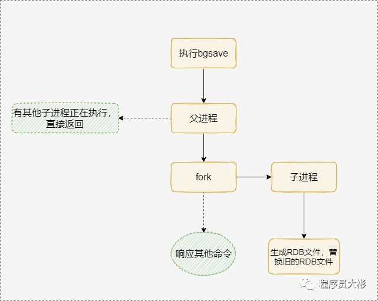
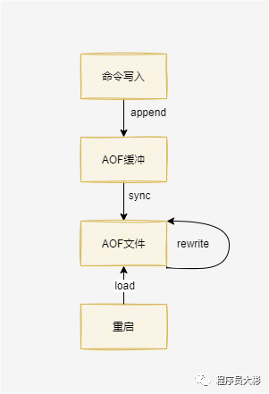
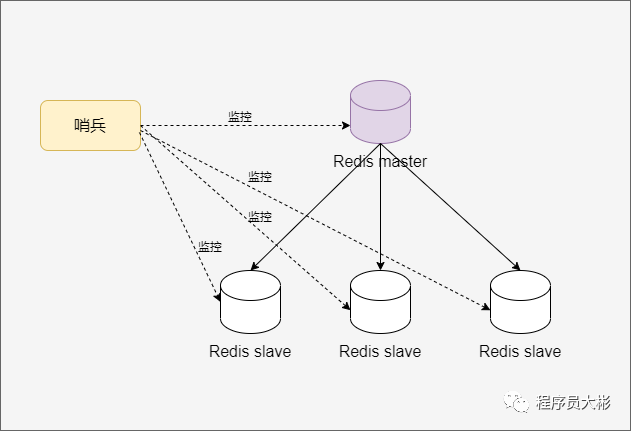
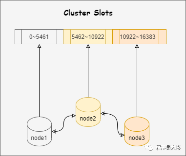
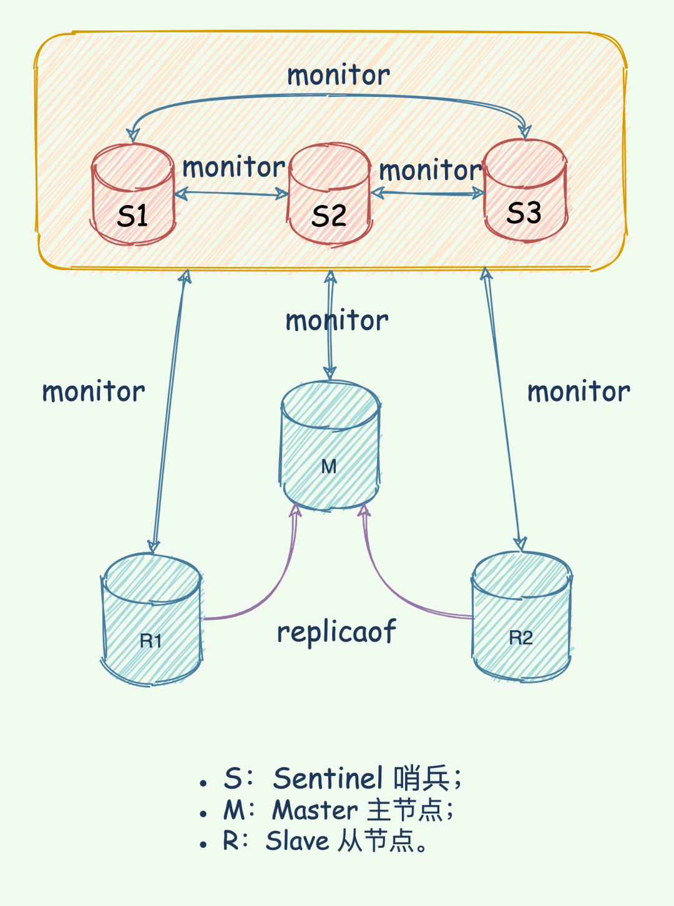
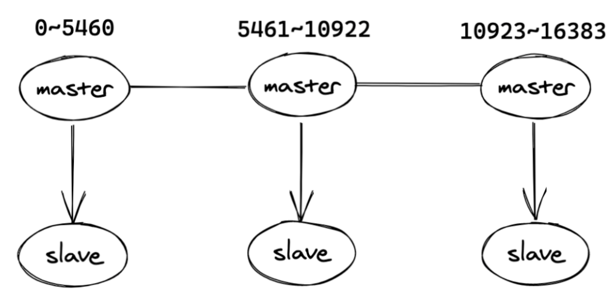

## Redis 是什么？

Redis（`Remote Dictionary Server`）是一个使用 C 语言编写的，高性能非关系型的键值对数据库。与传统数据库不同的是，Redis 的数据是存在内存中的，所以读写速度非常快，被广泛应用于缓存方向。Redis可以将数据写入磁盘中，保证了数据的安全不丢失，而且Redis的操作是原子性的。

## Redis 的优点？

1. **基于内存操作**，内存读写速度快。
2. Redis是**单线程**的，避免线程切换开销及多线程的竞争问题。单线程是指网络请求使用一个线程来处理，即一个线程处理所有网络请求，Redis 运行时不止有一个线程，比如数据持久化的过程会另起线程。
3. **支持多种数据类型**，包括String、Hash、List、Set、ZSet等。
4. **支持持久化**。Redis支持RDB和AOF两种持久化机制，持久化功能可以有效地避免数据丢失问题。
5. **支持事务**。Redis的所有操作都是原子性的，同时Redis还支持对几个操作合并后的原子性执行。
6. **支持主从复制**。主节点会自动将数据同步到从节点，可以进行读写分离。

## Redis 为什么这么快？

- **基于内存**：Redis是使用内存存储，没有磁盘IO上的开销。数据存在内存中，读写速度快。
- **单线程实现**（ Redis 6.0以前）：Redis使用单个线程处理请求，避免了多个线程之间线程切换和锁资源争用的开销。
- **IO多路复用模型**：Redis 采用 IO 多路复用技术。Redis 使用单线程来轮询描述符，将数据库的操作都转换成了事件，不在网络I/O上浪费过多的时间。
- **高效的数据结构**：Redis 每种数据类型底层都做了优化，目的就是为了追求更快的速度。

## Redis 为何选择单线程？

- 避免过多的**上下文切换开销**。程序始终运行在进程中单个线程内，没有多线程切换的场景。
- **避免同步机制的开销**：如果 Redis选择多线程模型，需要考虑数据同步的问题，则必然会引入某些同步机制，会导致在操作数据过程中带来更多的开销，增加程序复杂度的同时还会降低性能。
- **实现简单，方便维护**：如果 Redis使用多线程模式，那么所有的底层数据结构的设计都必须考虑线程安全问题，那么 Redis 的实现将会变得更加复杂。

## Redis 应用场景有哪些？

1. **缓存热点数据**，缓解数据库的压力。
2. 利用 Redis 原子性的自增操作，可以实现**计数器**的功能，比如统计用户点赞数、用户访问数等。
3. **简单的消息队列**，可以使用Redis自身的发布/订阅模式或者List来实现简单的消息队列，实现异步操作。
4. **限速器**，可用于限制某个用户访问某个接口的频率，比如秒杀场景用于防止用户快速点击带来不必要的压力。
5. **好友关系**，利用集合的一些命令，比如交集、并集、差集等，实现共同好友、共同爱好之类的功能。

## Redis 和 Memcached 的区别？

1. Redis 只使用**单核**，而 Memcached 可以使用多核。
2. Memcached 数据结构单一，仅用来缓存数据，而 **Redis 支持多种数据类型**。
3. Memcached 不支持数据持久化，重启后数据会消失。**Redis 支持数据持久化**。
4. **Redis 提供主从同步机制和 cluster 集群部署能力**，能够提供高可用服务。Memcached 没有提供原生的集群模式，需要依靠客户端实现往集群中分片写入数据。
5. Redis 的速度比 Memcached 快很多。
6. Redis 使用**单线程的多路 IO 复用模型**，Memcached使用多线程的非阻塞 IO 模型。

## Redis 数据类型有哪些？

**基本数据类型**：

1、**String**：最常用的一种数据类型，String类型的值可以是字符串、数字或者二进制，但值最大不能超过512MB。

2、**Hash**：Hash 是一个键值对集合。

3、**Set**：无序去重的集合。Set 提供了交集、并集等方法，对于实现共同好友、共同关注等功能特别方便。

4、**List**：有序可重复的集合，底层是依赖双向链表实现的。

5、**SortedSet**：有序Set。内部维护了一个`score`的参数来实现。适用于排行榜和带权重的消息队列等场景。

**特殊的数据类型**：

1、**Bitmap**：位图，可以认为是一个以位为单位数组，数组中的每个单元只能存0或者1，数组的下标在 Bitmap 中叫做偏移量。Bitmap的长度与集合中元素个数无关，而是与基数的上限有关。

2、**Hyperloglog**。HyperLogLog 是用来做基数统计的算法，其优点是，在输入元素的数量或者体积非常非常大时，计算基数所需的空间总是固定的、并且是很小的。典型的使用场景是统计独立访客。

3、**Geospatial** ：主要用于存储地理位置信息，并对存储的信息进行操作，适用场景如定位、附近的人等。

## Redis 事务

事务的原理是将一个事务范围内的若干命令发送给 Redis，然后再让 Redis 依次执行这些命令。

事务的生命周期：

1. 使用`MULTI`开启一个事务；
2. 在开启事务的时候，每次操作的命令将会被插入到一个队列中，同时这个命令并不会被真正执行；
3. `EXEC`命令进行提交事务。

一个事务范围内某个命令出错不会影响其他命令的执行，不保证原子性：

```
127.0.0.1:6379> multi
OK
127.0.0.1:6379> set a 1
QUEUED
127.0.0.1:6379> set b 1 2
QUEUED
127.0.0.1:6379> set c 3
QUEUED
127.0.0.1:6379> exec
1) OK
2) (error) ERR syntax error
3) OK
```

**WATCH命令**

`WATCH` 命令可以监控一个或多个键，一旦其中有一个键被修改，之后的事务就不会执行（类似于乐观锁）。执行`EXEC`命令之后，就会自动取消监控。

```
127.0.0.1:6379> watch name
OK
127.0.0.1:6379> set name 1
OK
127.0.0.1:6379> multi
OK
127.0.0.1:6379> set name 2
QUEUED
127.0.0.1:6379> set gender 1
QUEUED
127.0.0.1:6379> exec
(nil)
127.0.0.1:6379> get gender
(nil)
```

比如上面的代码中：

1. `watch name`开启了对`name`这个`key`的监控
2. 修改`name`的值
3. 开启事务a
4. 在事务a中设置了`name`和`gender`的值
5. 使用`EXEC`命令进提交事务
6. 使用命令`get gender`发现不存在，即事务a没有执行

使用`UNWATCH`可以取消`WATCH`命令对`key`的监控，所有监控锁将会被取消。

## 持久化机制

持久化就是把**内存的数据写到磁盘中**，防止服务宕机导致内存数据丢失。

Redis支持两种方式的持久化，一种是`RDB`的方式，一种是`AOF`的方式。**前者会根据指定的规则定时将内存中的数据存储在硬盘上**，而**后者在每次执行完命令后将命令记录下来**。一般将两者结合使用。

### RDB方式

`RDB` 是 Redis 默认的持久化方案。RDB持久化时会将内存中的数据写入到磁盘中，在指定目录下生成一个 `dump.rdb` 文件。Redis 重启会加载 `dump.rdb` 文件恢复数据。

`bgsave` 是主流的触发 RDB 持久化的方式，执行过程如下：



- 执行 `BGSAVE` 命令
- Redis 父进程判断当前**是否存在正在执行的子进程**，如果存在，`BGSAVE` 命令直接返回。
- 父进程执行 `fork` 操作**创建子进程**，fork操作过程中父进程会阻塞。
- 父进程 `fork` 完成后，**父进程继续接收并处理客户端的请求**，而**子进程开始将内存中的数据写进硬盘的临时文件**；
- 当子进程写完所有数据后会**用该临时文件替换旧的 RDB 文件**。

Redis 启动时会读取 RDB 快照文件，将数据从硬盘载入内存。通过 RDB 方式的持久化，一旦Redis异常退出，就会丢失最近一次持久化以后更改的数据。

触发 RDB 持久化的方式：

1. **手动触发**：用户执行 `SAVE` 或 `BGSAVE` 命令。`SAVE` 命令执行快照的过程会阻塞所有客户端的请求，应避免在生产环境使用此命令。`BGSAVE` 命令可以在后台异步进行快照操作，快照的同时服务器还可以继续响应客户端的请求，因此需要手动执行快照时推荐使用`BGSAVE` 命令。

2. **被动触发**：

3. - 根据配置规则进行自动快照，如 `SAVE 100 10`，100 秒内至少有 10 个键被修改则进行快照。
   - 如果从节点执行全量复制操作，主节点会自动执行 `BGSAVE` 生成 RDB 文件并发送给从节点。
   - 默认情况下执行 `shutdown` 命令时，如果没有开启 AOF 持久化功能则自动执行 `BGSAVE`。

**优点**：

1. **Redis 加载 RDB 恢复数据远远快于 AOF 的方式**。
2. 使用单独子进程来进行持久化，主进程不会进行任何 IO 操作，**保证了 Redis 的高性能**。

**缺点**：

1. **RDB方式数据无法做到实时持久化**。因为 `BGSAVE` 每次运行都要执行 `fork` 操作创建子进程，属于重量级操作，频繁执行成本比较高。
2. RDB 文件使用特定二进制格式保存，Redis 版本升级过程中有多个格式的 RDB 版本，**存在老版本 Redis 无法兼容新版 RDB 格式的问题**。

### AOF方式

AOF（append only file）持久化：以独立日志的方式记录每次写命令，Redis重启时会重新执行AOF文件中的命令达到恢复数据的目的。AOF的主要作用是**解决了数据持久化的实时性**，AOF 是Redis持久化的主流方式。

默认情况下 Redis 没有开启 AOF 方式的持久化，可以通过 `appendonly` 参数启用：`appendonly yes`。开启 AOF 方式持久化后每执行一条写命令，Redis 就会将该命令写进 `aof_buf` 缓冲区，AOF 缓冲区根据对应的策略向硬盘做同步操作。

默认情况下系统**每 30 秒**会执行一次同步操作。为了防止缓冲区数据丢失，可以在 Redis 写入 AOF 文件后主动要求系统将缓冲区数据同步到硬盘上。可以通过 `appendfsync` 参数设置同步的时机。

```
appendfsync always //每次写入aof文件都会执行同步，最安全最慢，不建议配置
appendfsync everysec  //既保证性能也保证安全，建议配置
appendfsync no //由操作系统决定何时进行同步操作
```

接下来看一下 AOF 持久化执行流程：



1. 所有的写入命令会追加到 AOP 缓冲区中。
2. AOF 缓冲区根据对应的策略向硬盘同步。
3. 随着 AOF 文件越来越大，需要定期对 AOF 文件进行重写，达到压缩文件体积的目的。AOF文件重写是把Redis进程内的数据转化为写命令同步到新AOF文件的过程。
4. 当 Redis 服务器重启时，可以加载 AOF 文件进行数据恢复。

**优点**：

1. AOF可以更好的保护数据不丢失，可以配置 AOF 每秒执行一次`fsync`操作，如果Redis进程挂掉，最多丢失1秒的数据。
2. AOF以`append-only`的模式写入，所以没有磁盘寻址的开销，写入性能非常高。

**缺点**：

1. 对于同一份文件AOF文件比RDB数据快照要大。
2. 数据恢复比较慢。

## 主从复制

Redis 的复制功能是支持多个数据库之间的数据同步。主数据库可以进行读写操作，当主数据库的数据发生变化时会自动将数据同步到从数据库。从数据库一般是只读的，它会接收主数据库同步过来的数据。一个主数据库可以有多个从数据库，而一个从数据库只能有一个主数据库。

```
redis-server //启动Redis实例作为主数据库 
redis-server --port 6380 --slaveof  127.0.0.1 6379  //启动另一个实例作为从数据库 
slaveof 127.0.0.1 6379
SLAVEOF NO ONE //停止接收其他数据库的同步并转化为主数据库。
```

**主从复制的原理？**

1. 当启动一个从节点时，它会发送一个 `PSYNC` 命令给主节点；
2. 如果是从节点初次连接到主节点，那么会触发一次全量复制。此时主节点会启动一个后台线程，开始生成一份 `RDB` 快照文件；
3. 同时还会将从客户端 client 新收到的所有写命令缓存在内存中。`RDB` 文件生成完毕后， 主节点会将 `RDB` 文件发送给从节点，从节点会先将 `RDB` 文件**写入本地磁盘，然后再从本地磁盘加载到内存中**；
4. 接着主节点会将内存中缓存的写命令发送到从节点，从节点同步这些数据；
5. 如果从节点跟主节点之间网络出现故障，连接断开了，会自动重连，连接之后主节点仅会将部分缺失的数据同步给从节点。

## 哨兵 Sentinel

主从复制存在不能自动故障转移、达不到高可用的问题。哨兵模式解决了这些问题。通过哨兵机制可以自动切换主从节点。

客户端连接Redis的时候，先连接哨兵，哨兵会告诉客户端Redis主节点的地址，然后客户端连接上Redis并进行后续的操作。当主节点宕机的时候，哨兵监测到主节点宕机，会重新推选出某个表现良好的从节点成为新的主节点，然后通过发布订阅模式通知其他的从服务器，让它们切换主机。



**工作原理**

- 每个 `Sentinel` 以每秒钟一次的频率向它所知道的 `Master`，`Slave` 以及其他 `Sentinel` 实例发送一个 `PING` 命令。
- 如果一个实例距离最后一次有效回复 `PING` 命令的时间超过指定值， 则这个实例会被 `Sentine` 标记为主观下线。
- 如果一个 `Master` 被标记为主观下线，则正在监视这个 `Master` 的所有 `Sentinel` 要以每秒一次的频率确认 `Master` 是否真正进入主观下线状态。
- 当有足够数量的 `Sentinel`（大于等于配置文件指定值）在指定的时间范围内确认 `Master` 的确进入了主观下线状态， 则 `Master` 会被标记为客观下线 。若没有足够数量的 `Sentinel` 同意 `Master` 已经下线， `Master` 的客观下线状态就会被解除。若 `Master` 重新向 `Sentinel` 的 `PING` 命令返回有效回复， `Master` 的主观下线状态就会被移除。
- 哨兵节点会选举出哨兵 leader，负责故障转移的工作。
- 哨兵 leader 会推选出某个表现良好的从节点成为新的主节点，然后通知其他从节点更新主节点信息。

## Redis cluster

哨兵模式解决了主从复制不能自动故障转移、达不到高可用的问题，但还是存在主节点的写能力、容量受限于单机配置的问题。而cluster模式实现了Redis的分布式存储，每个节点存储不同的内容，解决主节点的写能力、容量受限于单机配置的问题。

Redis cluster集群节点最小配置6个节点以上（3主3从），其中主节点提供读写操作，从节点作为备用节点，不提供请求，只作为故障转移使用。

Redis cluster采用**虚拟槽分区**，所有的键根据哈希函数映射到0～16383个整数槽内，每个节点负责维护一部分槽以及槽所映射的键值数据。



**哈希槽是如何映射到 Redis 实例上的？**

1. 对键值对的`key`使用 `crc16` 算法计算一个结果
2. 将结果对 16384 取余，得到的值表示 `key` 对应的哈希槽
3. 根据该槽信息定位到对应的实例

**优点：**

- 无中心架构，**支持动态扩**容；
- 数据按照`slot`存储分布在多个节点，节点间数据共享，**可动态调整数据分布**；
- **高可用性**。部分节点不可用时，集群仍可用。集群模式能够实现自动故障转移（failover），节点之间通过`gossip`协议交换状态信息，用投票机制完成`Slave`到`Master`的角色转换。

**缺点：**

- **不支持批量操作**（pipeline）。
- 数据通过异步复制，**不保证数据的强一致性**。
- **事务操作支持有限**，只支持多`key`在同一节点上的事务操作，当多个`key`分布于不同的节点上时无法使用事务功能。
- `key`作为数据分区的最小粒度，不能将一个很大的键值对象如`hash`、`list`等映射到不同的节点。
- **不支持多数据库空间**，单机下的Redis可以支持到16个数据库，集群模式下只能使用1个数据库空间。

## 过期键的删除策略？

1、**被动删除**。在访问key时，如果发现key已经过期，那么会将key删除。

2、**主动删除**。定时清理key，每次清理会依次遍历所有DB，从db随机取出20个key，如果过期就删除，如果其中有5个key过期，那么就继续对这个db进行清理，否则开始清理下一个db。

3、**内存不够时清理**。Redis有最大内存的限制，通过maxmemory参数可以设置最大内存，当使用的内存超过了设置的最大内存，就要进行内存释放， 在进行内存释放的时候，会按照配置的淘汰策略清理内存。

## 内存淘汰策略有哪些？

当Redis的内存超过最大允许的内存之后，Redis 会触发内存淘汰策略，删除一些不常用的数据，以保证Redis服务器正常运行。

**Redisv4.0前提供 6 种数据淘汰策略**：

- **volatile-lru**：LRU（`Least Recently Used`），最近使用。利用LRU算法移除设置了过期时间的key
- **allkeys-lru**：当内存不足以容纳新写入数据时，从数据集中移除最近最少使用的key
- **volatile-ttl**：从已设置过期时间的数据集中挑选将要过期的数据淘汰
- **volatile-random**：从已设置过期时间的数据集中任意选择数据淘汰
- **allkeys-random**：从数据集中任意选择数据淘汰
- **no-eviction**：禁止删除数据，当内存不足以容纳新写入数据时，新写入操作会报错

**Redisv4.0后增加以下两种**：

- **volatile-lfu**：LFU，Least Frequently Used，最少使用，从已设置过期时间的数据集中挑选最不经常使用的数据淘汰。
- **allkeys-lfu**：当内存不足以容纳新写入数据时，从数据集中移除最不经常使用的key。

**内存淘汰策略可以通过配置文件来修改**，相应的配置项是`maxmemory-policy`，默认配置是`noeviction`。

## 如何保证缓存与数据库双写时的数据一致性？

**1、先删除缓存再更新数据库**

进行更新操作时，先删除缓存，然后更新数据库，后续的请求再次读取时，会从数据库读取后再将新数据更新到缓存。

存在的问题：删除缓存数据之后，更新数据库完成之前，这个时间段内如果有新的读请求过来，就会从数据库读取旧数据重新写到缓存中，再次造成不一致，并且后续读的都是旧数据。

**2、先更新数据库再删除缓存**

进行更新操作时，先更新MySQL，成功之后，删除缓存，后续读取请求时再将新数据回写缓存。

存在的问题：更新MySQL和删除缓存这段时间内，请求读取的还是缓存的旧数据，不过等数据库更新完成，就会恢复一致，影响相对比较小。

**3、异步更新缓存**

数据库的更新操作完成后不直接操作缓存，而是把这个操作命令封装成消息扔到消息队列中，然后由Redis自己去消费更新数据，消息队列可以保证数据操作顺序一致性，确保缓存系统的数据正常。

## 缓存穿透

缓存穿透是指查询一个**不存在的数据**，由于缓存是不命中时被动写的，如果从DB查不到数据则不写入缓存，这将导致这个不存在的数据每次请求都要到DB去查询，失去了缓存的意义。在流量大时，可能DB就挂掉了。

1. **缓存空值**，不会查数据库。
2. 采用**布隆过滤器**，将所有可能存在的数据哈希到一个足够大的 `bitmap` 中，查询不存在的数据会被这个 `bitmap` 拦截掉，从而避免了对 `DB` 的查询压力。

布隆过滤器的原理：当一个元素被加入集合时，通过K个散列函数将这个元素映射成一个位数组中的K个点，把它们置为1。查询时，将元素通过散列函数映射之后会得到k个点，如果这些点有任何一个0，则被检元素一定不在，直接返回；如果都是1，则查询元素很可能存在，就会去查询Redis和数据库。

## 缓存雪崩

缓存雪崩是指在我们设置缓存时采用了相同的过期时间，**导致缓存在某一时刻同时失效**，请求全部转发到DB，DB瞬时压力过重挂掉。

解决方法：在原有的失效时间基础上**增加一个随机值**，使得过期时间分散一些。

## 缓存击穿

缓存击穿：大量的请求同时查询一个 key 时，此时这个 key 正好失效了，就会导致大量的请求都落到数据库。**缓存击穿是查询缓存中失效的 key，而缓存穿透是查询不存在的 key。**

解决方法：加分布式锁，第一个请求的线程可以拿到锁，拿到锁的线程查询到了数据之后设置缓存，其他的线程获取锁失败会等待50ms然后重新到缓存取数据，这样便可以避免大量的请求落到数据库。

```
public String get(String key) {
    String value = redis.get(key);
    if (value == null) { //缓存值过期
        String unique_key = systemId + ":" + key;
        //设置30s的超时
        if (redis.set(unique_key, 1, 'NX', 'PX', 30000) == 1) {  //设置成功
            value = db.get(key);
            redis.set(key, value, expire_secs);
            redis.del(unique_key);
        } else {  //其他线程已经到数据库取值并回写到缓存了，可以重试获取缓存值
            sleep(50);
            get(key);  //重试
        }
    } else {
        return value;
    }
}
```

## pipeline 的作用？

redis 客户端执行一条命令分4个过程：发送命令、命令排队、命令执行、返回结果。使用 `pipeline` 可以批量请求，批量返回结果，执行速度比逐条执行要快。

使用 `pipeline` 组装的命令个数不能太多，不然数据量过大，增加客户端的等待时间，还可能造成网络阻塞，可以将大量命令的拆分多个小的 `pipeline` 命令完成。

原生批命令（mset和mget）与`pipeline`对比：

1. 原生批命令是原子性，`pipeline`是**非原子性**。pipeline命令中途异常退出，之前执行成功的命令**不会回滚**。
2. 原生批命令只有一个命令，但`pipeline`**支持多命令**。

## LUA 脚本

Redis 通过 LUA 脚本创建具有原子性的命令：当lua脚本命令正在运行的时候，不会有其他脚本或 Redis 命令被执行，实现组合命令的原子操作。

在Redis中执行Lua脚本有两种方法：`eval`和`evalsha`。`eval`命令使用内置的 Lua 解释器，对 Lua 脚本进行求值。

```
//第一个参数是lua脚本，第二个参数是键名参数个数，剩下的是键名参数和附加参数
> eval "return {KEYS[1],KEYS[2],ARGV[1],ARGV[2]}" 2 key1 key2 first second
1) "key1"
2) "key2"
3) "first"
4) "second"
```

**lua脚本作用**

1、Lua脚本在Redis中是原子执行的，执行过程中间不会插入其他命令。

2、Lua脚本可以将多条命令一次性打包，有效地减少网络开销。

**应用场景**

举例：限制接口访问频率。

在Redis维护一个接口访问次数的键值对，`key`是接口名称，`value`是访问次数。每次访问接口时，会执行以下操作：

- 通过`aop`拦截接口的请求，对接口请求进行计数，每次进来一个请求，相应的接口访问次数`count`加1，存入redis。
- 如果是第一次请求，则会设置`count=1`，并设置过期时间。因为这里`set()`和`expire()`组合操作不是原子操作，所以引入`lua`脚本，实现原子操作，避免并发访问问题。
- 如果给定时间范围内超过最大访问次数，则会抛出异常。

```
private String buildLuaScript() {
    return "local c" +
        "\nc = redis.call('get',KEYS[1])" +
        "\nif c and tonumber(c) > tonumber(ARGV[1]) then" +
        "\nreturn c;" +
        "\nend" +
        "\nc = redis.call('incr',KEYS[1])" +
        "\nif tonumber(c) == 1 then" +
        "\nredis.call('expire',KEYS[1],ARGV[2])" +
        "\nend" +
        "\nreturn c;";
}

String luaScript = buildLuaScript();
RedisScript<Number> redisScript = new DefaultRedisScript<>(luaScript, Number.class);
Number count = redisTemplate.execute(redisScript, keys, limit.count(), limit.period());
```

PS：这种接口限流的实现方式比较简单，问题也比较多，一般不会使用，接口限流用的比较多的是令牌桶算法和漏桶算法。

## Redis 常见性能问题和解决方案

* Master 最好不要写内存快照，如果 Master 写内存快照，save 命令调度 rdbSave 函数，会阻塞主线程的工作，当快照比较大时对性能影响是非常大的，会间断性暂停服务
* 如果数据比较重要，某个 Slave 开启 AOF 备份数据，策略设置为每秒同步一次
* 为了主从复制的速度和连接的稳定性，Master 和 Slave 最好在同一个局域网
* 尽量避免在压力很大的主库上增加从
* 主从复制不要用图状结构，用单向链表结构更为稳定，即：Master <- Slave1<- Slave2 <- Slave3… 这样的结构方便解决单点故障问题，实现 Slave 对 Master 的替换。如果 Master 挂了，可以立刻启用 Slave1 做 Master，其他不变。

## Redis 的同步机制了解么？

Redis 可以使用主从同步，从从同步。第一次同步时，主节点做一次 bgsave，并同时将后续修改操作记录到内存 buffer，待完成后将 rdb 文件全量同步到复制节点，复制节点接受完成后将 rdb 镜像加载到内存。加载完成后，再通知主节点将期间修改的操作记录同步到复制节点进行重放就完成了同步过程。

## Redis 如何做内存优化？

尽可能使用散列表（hashes），散列表（是说散列表里面存储的数少）使用的内存非常小，所以你应该尽可能的将你的数据模型抽象到一个散列表里面。比如你的 web 系统中有一个用户对象，不要为这个用户的名称，姓氏，邮箱，密码设置单独的 key，而是应该把这个用户的所有信息存储到一张散列表里面。

## Redis 回收进程如何工作的？

一个客户端运行了新的命令，添加了新的数据。Redi 检查内存使用情况， 如果大于 maxmemory 的限制, 则根据设定好的策略进行回收。一个新的命令被执行，等等。所以我们不断地穿越内存限制的边界，通过不断达到边界然后不断地回收回到边界以下。如果一个命令的结果导致大量内存被使用（例如很大的集合的交集保存到一个新的键），不用多久内存限制就会被这个内存使用量超越。

## Redis 的内存用完了会发生什么？

如果达到设置的上限，Redis 的写命令会返回错误信息（但是读命令还可以正常返回。）或者你可以将 Redis 当缓存来使用配置淘汰机制，当 Redis 达到内存上限时会冲刷掉旧的内容。

## 使用 Redis 做过异步队列吗，是如何实现的

使用 list 类型保存数据信息，rpush 生产消息，lpop 消费消息，当 lpop 没有消息时，可以 sleep 一段时间，然后再检查有没有信息，如果不想 sleep 的话，可以使用 blpop, 在没有信息的时候，会一直阻塞，直到信息的到来。redis 可以通过 pub/sub 主题订阅模式实现一个生产者，多个消费者，当然也存在一定的缺点，当消费者下线时，生产的消息会丢失。

## Redis 有哪些常见的功能？

1. 数据缓存功能
2. 分布式锁的功能
3. 支持数据持久化
4. 支持事务
5. 支持消息队列

## 怎么保证缓存和数据库数据的一致性？

1. 从理论上说，只要我们设置了合理的键的过期时间，我们就能保证缓存和数据库的数据最终是一致的。因为只要缓存数据过期了，就会被删除。随后读的时候，因为缓存里没有，就可以查数据库的数据，然后将数据库查出来的数据写入到缓存中。除了设置过期时间，我们还需要做更多的措施来尽量避免数据库与缓存处于不一致的情况发生。
2. 新增、更改、删除数据库操作时同步更新 Redis，可以使用事物机制来保证数据的一致性。

## 你知道哨兵集群原理么？

哨兵是 Redis 的一种运行模式，它专注于**对 Redis 实例（主节点、从节点）运行状态的监控，并能够在主节点发生故障时通过一系列的机制实现选主及主从切换，实现故障转移，确保整个 Redis 系统的可用性**。

他的架构图如下：



Redis 哨兵具备的能力有如下几个：

- **监控**：持续监控 master 、slave 是否处于预期工作状态。
- **自动切换主库**：当 Master 运行故障，哨兵启动自动故障恢复流程：从 slave 中选择一台作为新 master。
- **通知**：让 slave 执行 replicaof ，与新的 master 同步；并且通知客户端与新 master 建立连接。

## Redis 有哪些部署方式？

- 单机模式:这也是最基本的部署方式,只需要一台机器,负责读写,一般只用于开发人员自己测试
- 哨兵模式:哨兵模式是一种特殊的模式，首先Redis提供了哨兵的命令，哨兵是一个独立的进程，作为进程，它会独立运行。其原理是哨兵通过发送命令，等待Redis服务器响应，从而监控运行的多个Redis实例。它具备**自动故障转移、集群监控、消息通知**等功能。
- cluster集群模式:在redis3.0版本中支持了cluster集群部署的方式，这种集群部署的方式能**自动将数据进行分片**，每个master上放一部分数据，提供了内置的高可用服务，即使某个master挂了，服务还可以正常地提供。
- 主从复制:在主从复制这种集群部署模式中，我们会将数据库分为两类，第一种称为主数据库(master)，另一种称为从数据库(slave)。主数据库会负责我们整个系统中的读写操作，从数据库会负责我们整个数据库中的读操作。其中在职场开发中的真实情况是，我们会让主数据库只负责写操作，让从数据库只负责读操作，就是为了**读写分离**，减轻服务器的压力。

## 哨兵有哪些作用？

- 1.监控整个主数据库和从数据库，观察它们是否正常运行
- 2.当主数据库发生异常时，自动的将从数据库升级为主数据库，继续保证整个服务的稳定

## 哨兵选举过程是怎么样的？

- 1.第一个发现该master挂了的哨兵，向每个哨兵发送命令，让对方选举自己成为领头哨兵
- 2.其他哨兵如果没有选举过他人，就会将这一票投给第一个发现该master挂了的哨兵
- 3.第一个发现该master挂了的哨兵如果发现由超过一半哨兵投给自己，并且其数量也超过了设定的quoram参数，那么该哨兵就成了领头哨兵
- 4.如果多个哨兵同时参与这个选举，那么就会重复该过程，知道选出一个领头哨兵

选出领头哨兵后，就开始了故障修复，会从选出一个从数据库作为新的master

## cluster 集群模式是怎么存放数据的？

一个cluster集群中总共有16384个节点，集群会**将这16384个节点平均分配给每个节点**，当然，我这里的节点指的是每个主节点，就如同下图：



## cluster 的故障恢复是怎么做的？

判断故障的逻辑其实与哨兵模式有点类似，在集群中，每个节点都会**定期的向其他节点发送ping命令**，通过有没有收到回复来判断其他节点是否已经下线。

如果**长时间没有回复，那么发起ping命令的节点就会认为目标节点疑似下线**，也可以和哨兵一样称作主观下线，当然也需要集群中一定数量的节点都认为该节点下线才可以，我们来说说具体过程：

- 1.当A节点发现目标节点疑似下线，就会向集群中的其他节点散播消息，其他节点就会向目标节点发送命令，判断目标节点是否下线
- 2.如果集群中半数以上的节点都认为目标节点下线，就会对目标节点标记为下线，从而告诉其他节点，让目标节点在整个集群中都下线

## 主从同步原理是怎样的？

- 1.当一个从数据库启动时，它会向**主数据库发送一个SYNC命令**，master收到后，在后台保存快照，也就是我们说的RDB持久化，当然保存快照是需要消耗时间的，并且redis是单线程的，在保存快照期间redis受到的命令会缓存起来
- 2.快照完成后会**将缓存的命令以及快照一起打包发给slave节点**，从而保证主从数据库的一致性。
- 3.从数据库接受到快照以及缓存的命令后会将这部分数据**写入到硬盘上的临时文件当中**，写入完成后会用这份文件去替换掉RDB快照文件，当然，这个操作是不会阻塞的，可以继续接收命令执行，具体原因其实就是fork了一个子进程，用子进程去完成了这些功能。

因为不会阻塞，所以，这部分初始化完成后，当主数据库执行了改变数据的命令后，会异步的给slave，这也就是我们说的复制同步阶段，这个阶段会贯穿在整个中从同步的过程中，直到主从同步结束后，复制同步才会终止
