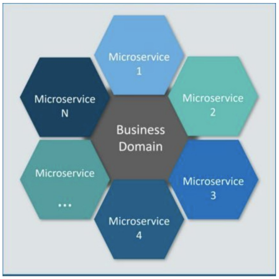
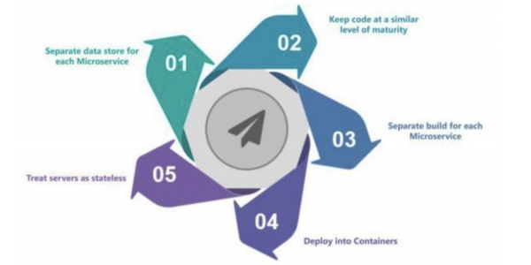
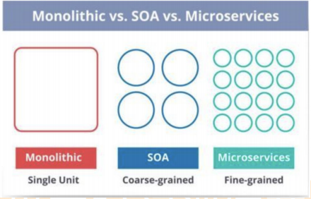
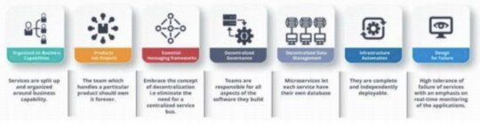
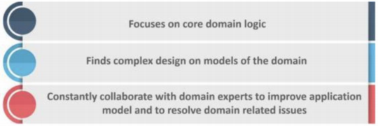
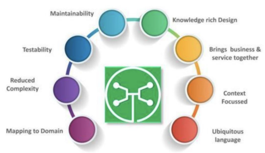

## 您对微服务有何了解？

微服务，又称微服务架构，是一种架构风格，它将应用程序构建为以业务领域为模型的小型自治服务集合。

通俗地说，你必须看到蜜蜂如何通过对齐六角形蜡细胞来构建它们的蜂窝状物。他们最初从使用各种材料的小部分开始，并继续从中构建一个大型蜂箱。这些细胞形成图案，产生坚固的结构，将蜂窝的特定部分固定在一起。

这里，每个细胞独立于另一个细胞，但它也与其他细胞相关。这意味着对一个细胞的损害不会损害其他细胞，因此，蜜蜂可以在不影响完整蜂箱的情况下重建这些细胞。

请参考上图。这里，每个六边形形状代表单独的服务组件。与蜜蜂的工作类似，每个敏捷团队都使用可用的框架和所选的技术堆栈构建单独的服务组件。就像在蜂箱中一样，每个服务组件形成一个强大的微服务架构，以提供更好的可扩展性。此外，敏捷团队可以单独处理每个服务组件的问题，而对整个应用程序没有影响或影响最小。

## 说说微服务架构的优势

| 优势       | 说明                                                 |
| ---------- | ---------------------------------------------------- |
| 独立开发   | 所有微服务都可以根据各自的功能轻松开发               |
| 独立部署   | 根据他们所提供的服务，可以在任何应用中单独部署       |
| 故障隔离   | 即使应用中的一个服务不起作用，系统仍然继续运行       |
| 混合技术栈 | 可以用不同的语言和技术来构建同一应用程序的不同服务   |
| 粒度缩放   | 各个组件可根据需要进行扩展，无需将所有组件融合到一起 |

## 微服务有哪些特点？

* 解耦—系统内的服务很大程度上是分离的。因此，整个应用程序可以轻松构建，更改和扩展
* 组件化—微服务被视为可以轻松更换和升级的独立组件
* 业务能力—微服务非常简单，专注于单一功能
* 自治—开发人员和团队可以彼此独立工作，从而提高速度
* 持续交付—通过软件创建，测试和批准的系统自动化，允许频繁发布软件
* 责任—微服务不关注应用程序作为项目。相反，他们将应用程序视为他们负责的产品
* 分散治理—重点是使用正确的工具来做正确的工作。这意味着没有标准化模式或任何技术模式。开发人员可以自由选择最有用的工具来解决他们的问题
* 敏捷—微服务支持敏捷开发。任何新功能都可以快速开发并再次丢弃

## 设计微服务的最佳实践是什么？

以下是设计微服务的最佳实践：

## 微服务架构如何运作？

微服务架构具有以下组件： 

* 客户端 – 来自不同设备的不同用户发送请求。
* 身份提供商 – 验证用户或客户身份并颁发安全令牌。
* API 网关 – 处理客户端请求。
* 静态内容 – 容纳系统的所有内容。
* 管理 – 在节点上平衡服务并识别故障。
* 服务发现 – 查找微服务之间通信路径的指南。
* 内容交付网络 – 代理服务器及其数据中心的分布式网络。
* 远程服务 – 启用驻留在 IT 设备网络上的远程访问信息。

## 微服务架构的优缺点是什么？

**微服务架构的优点：**

* 自由使用不同的技术
* 每个微服务都侧重于单一功能
* 支持单个可部署单元
* 允许经常发布软件
* 确保每项服务的安全性
* 多个服务是并行开发和部署的

**微服务架构的缺点：**

* 增加故障排除挑战
* 由于远程呼叫而增加延迟
* 增加了配置和其他操作的工作量
* 难以保持交易安全
* 艰难地跨越各种便捷跟踪数据
* 难以在服务之间进行编码

## 单片，SOA 和微服务架构有什么区别？

单片 SOA 和微服务之间的比较 – 微服务访谈问题

* 单片架构类似于大容器，其中应用程序的所有软件组件组装在一起并紧密封装。
* 一个面向服务的架构是一种相互通信服务的集合。通信可以涉及简单的数据传递，也可以涉及两个或多个协调某些活动的服务。
* 微服务架构是一种架构风格，它将应用程序构建为以业务域为模型的小型自治服务集合。

## 在使用微服务架构时，您面临哪些挑战？

开发一些较小的微服务听起来很容易，但开发它们时经常遇到的挑战如下。

* 自动化组件：难以自动化，因为有许多较小的组件。因此，对于每个组件，我们必须遵循 Build，Deploy 和 Monitor 的各个阶段。
* 易感性：将大量组件维护在一起变得难以部署，维护，监控和识别问题。它需要在所有组件周围具有很好的感知能力。
* 配置管理：有时在各种环境中维护组件的配置变得困难。
* 调试：很难找到错误的每一项服务。维护集中式日志记录和仪表板以调试问题至关重要。

## SOA 和微服务架构之间的主要区别是什么？

SOA 和微服务之间的主要区别如下：

| SOA                                                   | 微服务                                              |
| ----------------------------------------------------- | --------------------------------------------------- |
| 遵循“尽可能多的共享”架构方法                          | 遵循“尽可能少分享”架构方法                          |
| 重要性在于“业务功能”重用                              | 重要性在于“有界背景”的概念                          |
| 它们有共同的治理和标准                                | 它们专注于人们的合作和其他选择的自由                |
| 使用企业服务总线（ESB）进行通信                       | 简单的消息系统                                      |
| 它们支持多种消息协议                                  | 它们使用轻量级协议，如 HTTP/REST 等                 |
| 多线程，有跟多的开销来处理 I/O                        | 单线程，通常使用 Event Loop 功能进行非锁定 I/O 处理 |
| 最大化应用程序服务可重用性                            | 专注于解耦                                          |
| 传统的关系数据库更常用                                | 现代关系数据库更常用                                |
| 系统的变化需要修改整体                                | 系统的变化是创造一种新的服务                        |
| DevOps/Continuous Delivery 正在变得流行，但还不是主流 | 专注于 DevOps/持续交付                              |

## 微服务有什么特点？

您可以列出微服务的特征，如下所示：

## 什么是领域驱动设计？

## 为什么需要域驱动设计（DDD）？

## 什么是无所不在的语言？

如果您必须定义泛在语言（UL），那么它是特定域的开发人员和用户使用的通用语言，通过该语言可以轻松解释域。

无处不在的语言必须非常清晰，以便它将所有团队成员放在同一页面上，并以机器可以理解的方式进行翻译。

## 什么是凝聚力？

模块内部元素所属的程度被认为是凝聚力。

## 什么是耦合？

组件之间依赖关系强度的度量被认为是耦合。一个好的设计总是被认为具有高内聚力和低耦合性。

## 什么是 REST / RESTful 以及它的用途是什么？

Representational State Transfer（REST）/ RESTful Web 服务是一种帮助计算机系统通过 Internet 进行通信的架构风格。这使得微服务更容易理解和实现。

微服务可以使用或不使用 RESTful API 实现，但使用 RESTful API 构建松散耦合的微服务总是更容易。

## 什么是不同类型的微服务测试？

在使用微服务时，由于有多个微服务协同工作，测试变得非常复杂。因此，测试分为不同的级别。

* 在底层，我们有面向技术的测试，如单元测试和性能测试。这些是完全自动化的。
* 在中间层面，我们进行了诸如压力测试和可用性测试之类的探索性测试。
* 在顶层， 我们的验收测试数量很少。这些验收测试有助于利益相关者理解和验证软件功能。