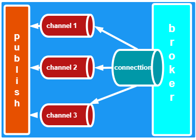
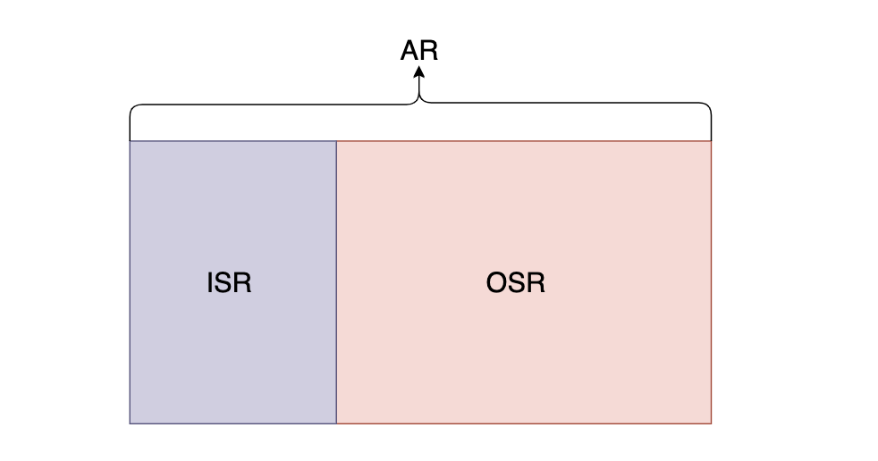
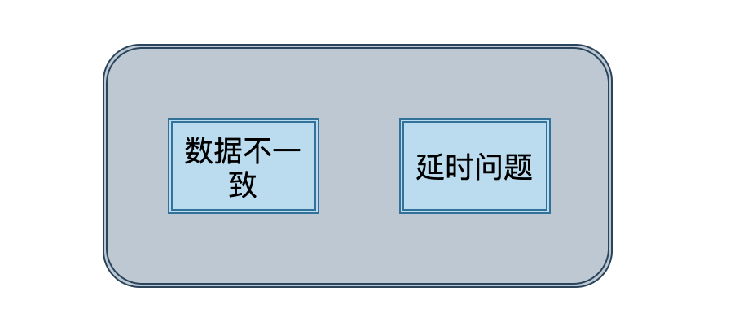
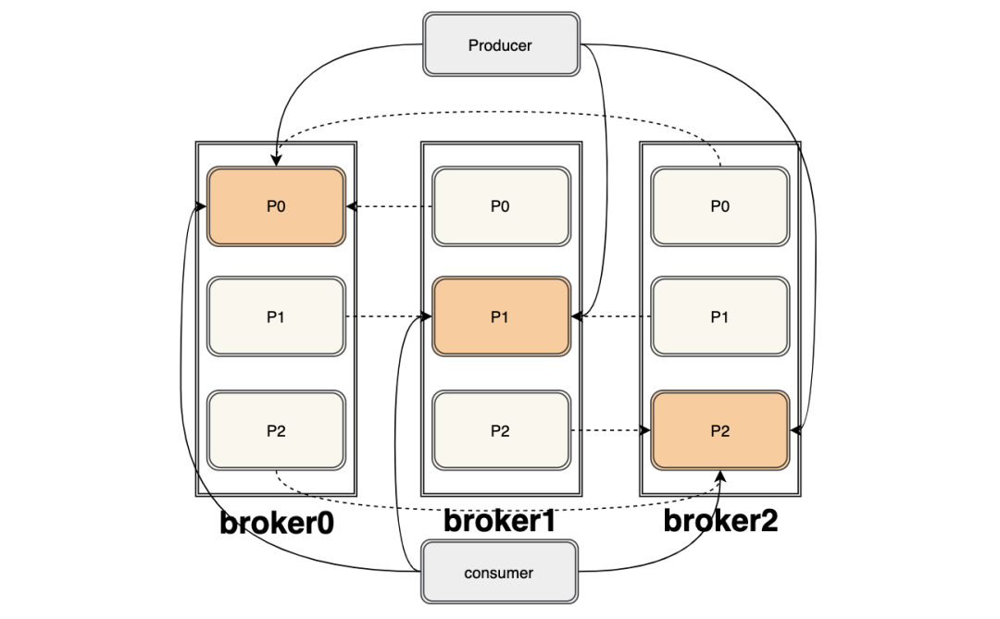
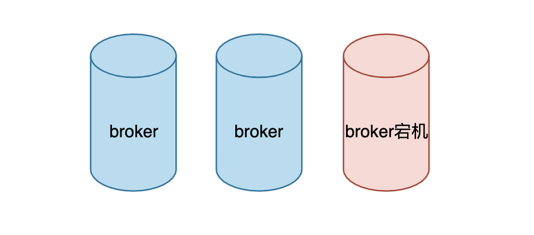
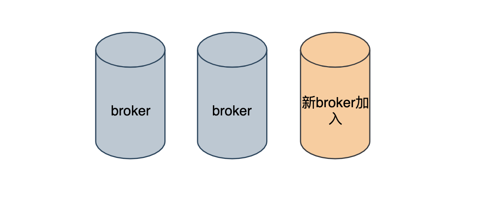
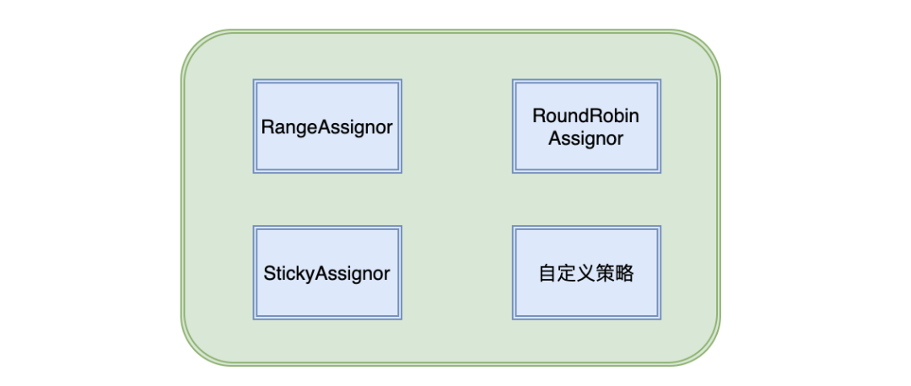
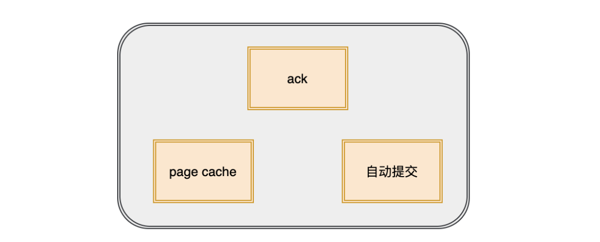

## 1.RabbitMQ是什么？

RabbitMQ是实现了高级消息队列协议（`AMQP`）的开源消息代理软件（亦称面向消息的中间件）。RabbitMQ服务器是用Erlang语言编写的，而群集和故障转移是构建在开放电信平台框架上的。所有主要的编程语言均有与代理接口通讯的客户端库。

PS:也可能直接问什么是消息队列？消息队列就是一个使用队列来通信的组件

## 2.RabbitMQ特点?

**可靠性**: RabbitMQ使用一些机制来保证可靠性， 如持久化、传输确认及发布确认等。

**灵活的路由** : 在消息进入队列之前，通过交换器来路由消息。对于典型的路由功能， RabbitMQ 己经提供了一些内置的交换器来实现。针对更复杂的路由功能，可以将多个 交换器绑定在一起， 也可以通过插件机制来实现自己的交换器。

**扩展性**: 多个RabbitMQ节点可以组成一个集群，也可以根据实际业务情况动态地扩展 集群中节点。

**高可用性** : 队列可以在集群中的机器上设置镜像，使得在部分节点出现问题的情况下队 列仍然可用。

**多种协议**: RabbitMQ除了原生支持AMQP协议，还支持STOMP， MQTT等多种消息 中间件协议。

**多语言客户端** :RabbitMQ 几乎支持所有常用语言，比如 Java、 Python、 Ruby、 PHP、 C#、 JavaScript 等。

**管理界面** : RabbitMQ 提供了一个易用的用户界面，使得用户可以监控和管理消息、集 群中的节点等。

**令插件机制** : RabbitMQ 提供了许多插件 ， 以实现从多方面进行扩展，当然也可以编写自 己的插件。

## 3.AMQP是什么?

RabbitMQ就是 AMQP 协议的 `Erlang` 的实现(当然 RabbitMQ 还支持 `STOMP2`、 `MQTT3` 等协议 ) AMQP 的模型架构 和 RabbitMQ 的模型架构是一样的，生产者将消息发送给交换器，交换器和队列绑定 。

RabbitMQ 中的交换器、交换器类型、队列、绑定、路由键等都是遵循的 AMQP 协议中相 应的概念。目前 RabbitMQ 最新版本默认支持的是 AMQP 0-9-1。

## 4.AMQP协议3层？

**Module Layer**:协议最高层，主要定义了一些客户端调用的命令，客户端可以用这些命令实现自己的业务逻辑。

**Session Layer**:中间层，主要负责客户端命令发送给服务器，再将服务端应答返回客户端，提供可靠性同步机制和错误处理。

**TransportLayer**:最底层，主要传输二进制数据流，提供帧的处理、信道服用、错误检测和数据表示等。

## 5.AMQP模型的几大组件？

- 交换器 (Exchange)：消息代理服务器中用于把消息路由到队列的组件。
- 队列 ([Queue](https://so.csdn.net/so/search?q=Queue&spm=1001.2101.3001.7020))：用来存储消息的数据结构，位于硬盘或内存中。
- 绑定 (Binding)：一套规则，告知交换器消息应该将消息投递给哪个队列。

## 6.说说生产者Producer和消费者Consumer?

生产者

- 消息生产者，就是投递消息的一方。
- 消息一般包含两个部分：消息体（`payload`)和标签(`Label`)。

消费者

- 消费消息，也就是接收消息的一方。
- 消费者连接到RabbitMQ服务器，并订阅到队列上。消费消息时只消费消息体，丢弃标签。

## 7.为什么需要消息队列？

从本质上来说是因为互联网的快速发展，业务不断扩张，促使技术架构需要不断的演进。

从以前的单体架构到现在的微服务架构，成百上千的服务之间相互调用和依赖。从互联网初期一个服务器上有 100 个在线用户已经很了不得，到现在坐拥10亿日活的微信。此时，我们需要有一个「工具」来解耦服务之间的关系、控制资源合理合时的使用以及缓冲流量洪峰等等。因此，消息队列就应运而生了。

它常用来实现：`异步处理`、`服务解耦`、`流量控制（削峰）`。

## 8.说说Broker服务节点、Queue队列、Exchange交换器？

- Broker可以看做RabbitMQ的服务节点。一般请下一个Broker可以看做一个RabbitMQ服务器。
- Queue:RabbitMQ的内部对象，用于存储消息。多个消费者可以订阅同一队列，这时队列中的消息会被平摊（轮询）给多个消费者进行处理。
- Exchange:生产者将消息发送到交换器，由交换器将消息路由到一个或者多个队列中。当路由不到时，或返回给生产者或直接丢弃。

## 9.消息队列有什么优缺点

优点上面已经说了，就是在特殊场景下有其对应的好处，解耦、异步、削峰。缺点有以下几个：

- 系统可用性降低 系统引入的外部依赖越多，越容易挂掉。万一 MQ 挂了，MQ 一挂，整套系统崩 溃，你不就完了？
- 系统复杂度提高 硬生生加个 MQ 进来，你怎么保证消息没有重复消费？怎么处理消息丢失的情况？
- 怎么保证消息传递的顺序性？问题一大堆。
- 一致性问题 A 系统处理完了直接返回成功了，人都以为你这个请求就成功了；但是问题是，要是 BCD 三个系统那里，BD 两个系统写库成功了，结果 C 系统写库失败了，咋整？你这数据就不一致 了。

## 10.如何保证消息的可靠性？

消息到MQ的过程中搞丢，MQ自己搞丢，MQ到消费过程中搞丢。

`生产者到RabbitMQ`：事务机制和Confirm机制，注意：事务机制和 Confirm 机制是互斥的，两者不能共存，会导致 RabbitMQ 报错。

`RabbitMQ自身`：持久化、集群、普通模式、镜像模式。

`RabbitMQ到消费者`：basicAck机制、死信队列、消息补偿机制。

## 11.什么是RoutingKey路由键？

生产者将消息发送给交换器的时候，会指定一个`RoutingKey`,用来指定这个消息的路由规则，这个`RoutingKey`需要与交换器类型和绑定键(`BindingKey`)联合使用才能最终生效。

## 12.Binding绑定？

通过绑定将交换器和队列关联起来，一般会指定一个`BindingKey`,这样RabbitMq就知道如何正确路由消息到队列了。

## 13.交换器4种类型？

主要有以下4种。

- fanout:把所有发送到该交换器的消息路由到所有与该交换器绑定的队列中。
- direct:把消息路由到BindingKey和RoutingKey完全匹配的队列中。
- topic:
- 匹配规则：

```
RoutingKey` 为一个 点号'.': 分隔的字符串。比如: `java.xiaoka.show
```

`BindingKey`和`RoutingKey`一样也是点号“.“分隔的字符串。

`BindingKey`可使用 * 和 # 用于做模糊匹配，*匹配一个单词，#匹配多个或者0个

`headers`:不依赖路由键匹配规则路由消息。是根据发送消息内容中的`headers`属性进行匹配。性能差，基本用不到。

## 14.生产者消息运转？

1.`Producer`先连接到Broker,建立连接Connection,开启一个信道(Channel)。

2.`Producer`声明一个交换器并设置好相关属性。

3.`Producer`声明一个队列并设置好相关属性。

4.`Producer`通过路由键将交换器和队列绑定起来。

5.`Producer`发送消息到`Broker`,其中包含路由键、交换器等信息。

6.相应的交换器根据接收到的路由键查找匹配的队列。

7.如果找到，将消息存入对应的队列，如果没有找到，会根据生产者的配置丢弃或者退回给生产者。

8.关闭信道。

9.管理连接。

## 15.消费者接收消息过程？

1.`Producer`先连接到`Broker`,建立连接`Connection`,开启一个信道(`Channel`)。

2.向`Broker`请求消费响应的队列中消息，可能会设置响应的回调函数。

3.等待`Broker`回应并投递相应队列中的消息，接收消息。

4.消费者确认收到的消息,`ack`。

5.`RabbitMq`从队列中删除已经确定的消息。

6.关闭信道。

7.关闭连接。

### 16.交换器无法根据自身类型和路由键找到符合条件队列时，有哪些处理？

- mandatory ：true 返回消息给生产者。
- mandatory: false 直接丢弃。

## 17.死信队列？

DLX，全称为 `Dead-Letter-Exchange`，死信交换器，死信邮箱。当消息在一个队列中变成死信 (`dead message`) 之后，它能被重新被发送到另一个交换器中，这个交换器就是 DLX，绑定 DLX 的队列就称之为死信队列。

## 18.导致的死信的几种原因？

- 消息被拒（`Basic.Reject /Basic.Nack`) 且 `requeue = false`。
- 消息TTL过期。
- 队列满了，无法再添加。

## 19.延迟队列？

存储对应的延迟消息，指当消息被发送以后，并不想让消费者立刻拿到消息，而是等待特定时间后，消费者才能拿到这个消息进行消费。

## 20.优先级队列？

- 优先级高的队列会先被消费。
- 可以通过`x-max-priority`参数来实现。
- 当消费速度大于生产速度且Broker没有堆积的情况下，优先级显得没有意义。

## 21.事务机制？

RabbitMQ 客户端中与事务机制相关的方法有三个:

`channel.txSelect` 用于将当前的信道设置成事务模式。

`channel . txCommit` 用于提交事务 。

`channel . txRollback` 用于事务回滚,如果在事务提交执行之前由于 RabbitMQ 异常崩溃或者其他原因抛出异常,通过txRollback来回滚。

## 22.发送确认机制？

生产者把信道设置为`confirm`确认模式,设置后，所有再改信道发布的消息都会被指定一个唯一的ID，一旦消息被投递到所有匹配的队列之后，RabbitMQ就会发送一个确认（`Basic.Ack`)给生产者（包含消息的唯一ID)，这样生产者就知道消息到达对应的目的地了。

## 23.消费者获取消息的方式？

- 推
- 拉

## 24.消费者某些原因无法处理当前接受的消息如何来拒绝？

channel .basicNack channel .basicReject

## 25.消息传输保证层级？

`At most once`:最多一次。消息可能会丢失，但不会重复传输。

`At least once`：最少一次。消息绝不会丢失，但可能会重复传输。

`Exactly once`:  恰好一次，每条消息肯定仅传输一次。

## 26.了解Virtual Host吗?

每一个RabbitMQ服务器都能创建虚拟的消息服务器，也叫虚拟主机(virtual host)，简称vhost。

默认为“/”。

## 27.集群中的节点类型？

内存节点：ram,将变更写入内存。

磁盘节点：disc,磁盘写入操作。

RabbitMQ要求最少有一个磁盘节点。

## 28.队列结构？

通常由以下两部分组成？

`rabbit_amqqueue_process`:负责协议相关的消息处理，即接收生产者发布的消息、向消费者交付消息、处理消息的确认(包括生产端的 confirm 和消费端的 ack) 等。

`backing_queue`:是消息存储的具体形式和引擎，并向 rabbit a`mqqueue process`提供相关的接口以供调用。

## 29.RabbitMQ中消息可能有的几种状态?

`alpha`: 消息内容(包括消息体、属性和 headers) 和消息索引都存储在内存中 。

`beta`: 消息内容保存在磁盘中，消息索引保存在内存中。

`gamma`: 消息内容保存在磁盘中，消息索引在磁盘和内存中都有 。

`delta`: 消息内容和索引都在磁盘中 。

## 30.在何种场景下使用了消息中间件？

- 接口之间耦合比较严重
- 面对大流量并发时，容易被冲垮
- 存在性能问题

## 31.生产者如何将消息可靠投递到MQ？

1.Client发送消息给MQ

2.MQ将消息持久化后，发送Ack消息给Client，此处有可能因为网络问题导致Ack消息无法发送到Client，那么Client在等待超时后，会重传消息；

3.Client收到Ack消息后，认为消息已经投递成功。

## 32 . MQ如何将消息可靠投递到消费者？

1.MQ将消息push给Client（或Client来pull消息）

2.Client得到消息并做完业务逻辑

3.Client发送Ack消息给MQ，通知MQ删除该消息，此处有可能因为网络问题导致Ack失败，那么Client会重复消息，这里就引出消费幂等的问题；

4.MQ将已消费的消息删除

## 33.如何保证RabbitMQ消息队列的高可用?

RabbitMQ 有三种模式：`单机模式`，`普通集群模式`，`镜像集群模式`。

**单机模式**：就是demo级别的，一般就是你本地启动了玩玩儿的，没人生产用单机模式

**普通集群模式**：意思就是在多台机器上启动多个RabbitMQ实例，每个机器启动一个。

**镜像集群模式**：这种模式，才是所谓的RabbitMQ的高可用模式，跟普通集群模式不一样的是，你创建的queue，无论元数据(元数据指RabbitMQ的配置数据)还是queue里的消息都会存在于多个实例上，然后每次你写消息到queue的时候，都会自动把消息到多个实例的queue里进行消息同步。

## MQ 是什么？

MQ（Message Queue）消息队列

用队列机制来实现软件之间的通信，消费者可以到指定队列拉取消息，或者订阅相应的队列，由 MQ 服务端给其推送消息

## 什么是队列？

是一种数据结构，遵循 FIFO （先进先出）原则

## 凭啥要使用 MQ ， MQ 有啥优势？

- 异步通信

将以前也不中不必要的同步操作，优化成异步操作，提高性能

- 业务解耦

将原有 A 模块直接调用 B 模块的接口，优化成，A 模块的请求给到 MQ，A 模块的事情就做完了

MQ 会主动推给 B 模块，或者 B 模块自己来拉

- 流量削峰

当某一时间大量的流量打到服务器上，服务器一时间无法承受，会宕机

这个时候，若请求都是从消息队列里面出来，则能够保证这种大流量的情况下，服务器仍然能够有序的稳定的处理请求

## MQ 有啥劣势呢？

- 系统可用性降低，对外部有依赖了
- 需要考虑 MQ 消息丢失，重复消费的问题
- 需要花费精力保证消息的顺序性，一致性

## 常用 MQ 性能对比

|            | ActiveMQ         | RabbitMQ                 | RocketMQ                           | Kafka                    |
| ---------- | ---------------- | ------------------------ | ---------------------------------- | ------------------------ |
| 开发语言   | java             | erlang                   | java                               | scala                    |
| 单机吞吐量 | 万级             | 万级                     | 十万级                             | 十万级                   |
| 时效性     | ms 级            | us 级                    | ms 级                              | ms 级以内                |
| 可用性     | 高 主从架构      | 高 主从架构              | 非常高 分布式架构                  | 非常高 分布式架构        |
| 消息可靠性 | 较低概率丢失消息 | 基本不丢                 | 可以做到基本不丢                   | 可以做到基本不丢         |
| 功能支持   | 支持功能全       | 性能好 延时低 并发能力强 | MQ 功能较完善 支持分布式，扩展性好 | 主要用于大数据和日志采集 |

## MQ 如何避免消息堆积

- 提高消费速率（集群的方式）
- 消费者批量获取消息进行消费

## MQ 如何避免消费者重复消费（幂等性问题）

- 全局 ID（增加标志位） + 保证业务一致性

## MQ 如何保证消息不丢失

- 消息确认机制
- 持久化
- 消息 ACK

## MQ 如何保证消息顺序一致性

- 绑定同一个消费者和队列

## MQ 推与拉取架构模型是怎么样的？

- MQ 服务器与消费者建立长连接后，MQ 服务器会主动推数据给到消费者
- 当消费者第一次启动的时候，会去找 MQ 服务器拉数据

## mq 有哪些消费模式

- 推模式
  注册一个消费者后，RabbitMQ 会在消息可用时，自动将消息进行推送给消费者。这种方式效率最高最及时。
- 拉模式
  属于一种轮询模型，发送一次 get 请求，获得一个消息。如果此时 RabbitMQ 中没有消息，会获得一个表示空的回复。
- 自动确认

消费者消费消息的时候，将自动向 RabbitMQ 进行确认。

- 手动确认

消费者消费消息的时候，手动调用相应函数进行 ack 应答

- qos 预取模式

在确认消息被接收之前，消费者可以预先要求接收一定数量的消息，在处理完一定数量的消息后，批量进行确认

当然，如果消费者应用程序在确认消息之前崩溃，则所有未确认的消息将被重新发送给其他消费者

## `RabbitMQ` 中既然有了 `connections` 为什么还要有 `channel`？

connection 是什么

connection 是 生产者或消费者与 RabbitMQ Broker 建立的连接，是一个 TCP 连接

一旦 TCP 连接建立起来，客户端紧接着可以创建一个 AMQP 信道（Channel），每个信道都会被指派一个唯一的 ID

信道是建立在 Connection 之上的虚拟连接，多个信道复用一个 TCP 连接，可以减少性能开销，同时也便于管理

因为一个应用需要向 RabbitMQ 中生成或者消费消息的话，都要建一个 TCP 连接，TCP 连接开销非常大，如果遇到使用高峰，性能瓶颈也随之显现

**信道复用连接优势：**

- 复用 TCP 连接，减少性能开销，便于管理
- RabbitMQ 保障每一个信道的私密性



当每个信道的流量不是很大时，复用单一的 Connection 可以在产生性能瓶颈的情况下有效地节省 TCP 连接资源

信道本身的流量很大时，这时候多个信道复用一个 Connection 就会产生性能瓶颈，进而使整体的流量被限制了，此时就需要开辟多个 Connection，将这些信道均摊到这些 Connection 中

## `RabbitMQ` 的作用

- 削峰填谷
- 生产者和消费者业务解耦
- 服务间异步通信
- 定时任务
- 顺序消费

## 为什么选择 RabbitMQ

现在的市面上有很多 MQ 可以选择，比如 **ActiveMQ、ZeroMQ、Appche Qpid** 为什么要选择 **RabbitMQ**？

- 除了 Qpid，RabbitMQ 是唯一一个实现了 AMQP 标准的消息服务器
- 可靠性，RabbitMQ 的持久化支持，保证了消息的稳定性
- 高并发，RabbitMQ 使用了 Erlang 开发语言，Erlang 是为电话交换机开发的语言，天生自带高并发光环，和高可用特性
- 集群部署简单，正是应为 Erlang 使得 RabbitMQ 集群部署变的超级简单
- 社区活跃度高，根据网上资料来看，RabbitMQ 也是首选

## RabbitMQ 的特点是什么？

- **可靠**

  RabbitMQ 使用 如持久化、传输确认及发布确认等机制来保证可靠性

- **灵活的路由**

通过交换器来路由消息

对于典型的路由功能， RabbitMQ 己经提供了一些内置的交换器来实现

针对更复杂的路由功能，可以将多个 交换器绑定在一起，这个就需要通过插件来实现了

- **扩展性**

多个 RabbitMQ 节点可以组成一个集群，也可以根据实际业务情况动态地扩展集群中节点

- **高可用性**

队列可以在集群中的机器上设置镜像，使得在部分节点出现问题的情况下队列仍然可用

- **支持的协议多**

RabbitMQ 除了原生支持 AMQP 协议，还支持 STOMP， MQTT 等多种消息中间件协议

- **多语言客户端**

RabbitMQ 几乎支持所有常用语言，比如 GO、 Java、 Python、 Ruby、 PHP 等

- **WEB 管理界面**

RabbitMQ 提供了一个易用的用户界面，使得用户可以监控和管理消息、集群中的节点等

- **命令插件机制**

RabbitMQ 提供了许多插件 ， 以实现从多方面进行扩展，当然也可以编写自己的插件

## 生产者 Producer 和消费者 Consumer 有哪些知识点？

**生产者**

- 消息生产者，投递消息
- 消息一般包含两个部分：消息体（`payload`) 和标签 (`Label`)

**消费者**

- 消费消息，接收消息

- 消费者连接到 RabbitMQ 服务器，并订阅到队列

  消费消息时只消费消息体，丢弃标签

## RabbitMQ 消息持久化中的坑

默认情况下重启服务器会导致消息丢失，我们如何保证重启 RabbitMQ 不丢失数据？

那就是做持久化，持久化需要满足如下三个条件才可以恢复 RabbitMQ 的数据

- 投递消息的时候 durable 设置为 true，消息持久化
- 消息已经到达持久化交换器上
- 消息已经到达持久化的队列上

### 持久化的工作原理

Rabbit 会将持久化消息写入磁盘上的持久化日志文件，等消息被消费之后，Rabbit 会把这条消息标识为等待垃圾回收

### 持久化的优缺点

**优点**

- 数据持久化，数据不丢失

**缺点**

- 对性能有影响，写硬盘比写内存性能低，从而降低服务的吞吐量

## RabbitMQ ACK 应答机制

ACK 应答分为手动和自动，各有优劣

- 如果消息不太重要，丢失也没有影响，那么自动 ACK 会比较方便

- 如果消息非常重要，不容丢失。那么最好在消费完成后手动 ACK

  否则接收消息后就自动 ACK，RabbitMQ 就会把消息从队列中删除。若此时消费者宕机或处理业务失败，那么消息就丢失了

### ACK 机制的开发注意事项

如果忘记了 ACK，那么后果很严重

当 Consumer 退出时候，Message 会一直重新分发。然后 RabbitMQ 会占用越来越多的内容，由于 RabbitMQ 会长时间运行，这个” 内存泄漏” 是致命的

### 为什么需要限流，消费者流量控制

- 某一时刻，生产者在 RabbitMQ 队列中堆积了很多消息，此时有一个消费者启动，大量的消息会推送到消费者上面，这种瞬时大流量会把消费者打挂
- 生产者和消费者效率不平衡的情况，会导致消费者端性能下降，服务端卡顿或者崩溃

## RabbitMQ 的组成

- 生产者 producer
- 消费者 consumer
- 交换机 exchange

用于接受、分配消息

- 消息 message
- 队列 queue

用于存储生产者的消息

- 信道 channel AMQP

消息推送使用的通道

- 连接 connections

生成者或者消费者与 Rabbit 建立的 TCP 连接

- 路由键 routingKey

用于把生成者的数据分配到交换器上

- 绑定键 BindingKey

用于把交换器的消息绑定到队列上

- 连接管理器 ConnectionFactory

应用程序与 Rabbit 之间建立连接的管理器，程序代码中使用

- VHost

vhost 可以理解为虚拟 broker，即虚拟机

其内部均含有独立的 queue、exchange 和 binding 等

拥有独立的权限系统，做到资源隔离，资源高效利用

## RabbitMQ 的六种模式

- single

简单的生产者生产消息，放入队列，消费者消费消息

- work

当生产者生产消息的速度大于消费者消费的速度，就要考虑用 work 工作模式，这样能提高处理速度提高负载

work 模式与 single 模式类似， 只是 work 模式比 single 模式多了一些消费者

- publish

应用场景：简单消息队列的使用，一个生产者一个消费者

- routing

消息生产者将消息发送给交换机按照路由判断，路由是字符串 (info) 当前产生的消息携带路由字符 (对象的方法), 交换机根据路由的 key

只能匹配上路由 key 对应的消息队列，对应的消费者才能消费消息

- topic

话题模式，一个消息被多个消费者获取，消息的目标 queue 可用 BindingKey 以通配符

- rpc

通过远程过程调用的方式实现

## 存储机制

- 持久化消息

持久化的消息在到达队列时就被写入磁盘，持久化的消息也会在内存中保存一份备份，这样可以提高一定的性能，当内存吃紧的时候会从内存中清除

- 非持久化消息

一般只保存在内存中，在内存吃紧的时候会被换入到磁盘中，以节省内存空间

## RabbitMQ 中消息可能有的几种状态

- alpha

消息内容 (包括消息体、属性和 headers) 和消息索引都存储在内存中

- beta

  消息内容保存在磁盘中，消息索引保存在内存中

- gamma

消息内容保存在磁盘中，消息索引在磁盘和内存中都有

- delta

消息内容和索引都在磁盘中

## RabbitMQ 的队列结构？

- rabbit_amqqueue_process

负责协议相关的消息处理，即接收生产者发布的消息、向消费者交付消息、处理消息的确认等

- backing_queue

是消息存储的具体形式和引擎，并向 rabbit_amqqueue_process 提供相关的接口以供调用

## 交换器无法根据自身类型和路由键找到符合条件队列时，会如何处理？

我们对交换机设置参数的时候，有一个标志叫做 **mandatory**

- 当 mandatory 标志位设置为 true 时

如果 exchange 根据自身类型和消息 routingKey 无法找到一个合适的 queue 存储消息，那么 broker 就会调用 basic.return 方法将消息返还给生产者

- 当 mandatory 设置为 false 时

前置条件和上述保持一致，此时 broker 会直接将消息丢弃

## 如何保证消息可靠性嘞？

- 消息从生产者到 MQ

由事务机制，确认机制 来保障

- MQ 自身可靠性

由持久化、集群、普通模式、镜像模式来保证

- MQ 消息到消费者

由 basicAck 机制、死信队列、消息补偿等机制来保证

## 集群中的节点类型有哪些？

- 内存节点

ram，将变更写入内存。

- 磁盘节点

disc，磁盘写入操作

RabbitMQ 中 要求**最少有一个磁盘节点**

## 如何保证 RabbitMQ 消息队列的高可用？

RabbitMQ 中有三种模式来保证：

- **单机模式**

一般是本地启动，自己学习和测试使用，不会用在生产环境上

- **普通集群模式**

在多台机器上启动多个 RabbitMQ 实例，每个机器启动一个

- **镜像集群模式**

RabbitMQ 的高可用模式

跟普通集群模式不一样的是，创建的 queue，无论元数据 (元数据指 RabbitMQ 的配置数据) 还是 queue 里的消息都会存在于多个实例上，

然后每次写消息到 queue 的时候，都会自动把消息到多个实例的 queue 里进行消息同步

## 1.什么是消息中间件？

消息中间件是基于队列与消息传递技术，在网络环境中为应用系统提供**同步或异步、可靠的**消息传输的支撑性软件系统。

消息中间件利用**高效可靠**的消息传递机制进行平台无关的数据交流，并基于数据通信来进行分布式系统的集成。通过提供消息传递和消息排队模型，它可以在分布式环境下扩展进程间的通信。

## 2.kafka 是什么？有什么作用？

Kafka 是一个分布式的流式处理平台，它以高吞吐、可持久化、可水平扩展、支持流数据处理等多种特性而被广泛使用


主要功能体现于三点：

- **消息系统**：kafka与传统的消息中间件都具备**系统解耦、冗余存储、流量削峰、缓冲、异步通信、扩展性、可恢复性**等功能。与此同时，kafka还提供了大多数消息系统难以实现的消息顺序性保障及回溯性消费的功能。
- **存储系统**：kafka把**消息持久化到磁盘**，相比于其他基于内存存储的系统而言，有效的降低了消息丢失的风险。这得益于其消息持久化和多副本机制。也可以将kafka作为长期的存储系统来使用，只需要把对应的数据保留策略设置为“永久”或启用主题日志压缩功能。
- **流式处理平台**：kafka为流行的流式处理框架提供了可靠的数据来源，还提供了一个完整的流式处理框架，比如窗口、连接、变换和聚合等各类操作。

## 3.kafka 的架构是怎么样的？


一个典型的 kafka 体系架构包括若干 **Producer**、若干 **Consumer**、以及一个 **Zookeeper** 集群（在2.8.0版本中移，除了 Zookeeper,通过 **KRaft** 进行自己的集群管理）

Producer 将消息发送到 Broker，Broker 负责将受到的消息存储到磁盘中，而 Consumer 负责从 Broker 订阅并消费消息。

Kafka 基本概念：

- **Producer** ：生产者，负责将消息发送到 Broker
- **Consumer** ：消费者，从 Broker 接收消息
- **Consumer Group** ：消费者组，由**多个 Consumer 组成**。消费者组内每个消费者负责消费不同分区的数据，**一个分区只能由一个组内消费者消费**；消费者组之间互不影响。所有的消费者都属于某个消费者组，即消费者组是逻辑上的一个订阅者。
- **Broker** ：可以看做一个独立的 **Kafka 服务节点或 Kafka 服务实例**。如果一台服务器上只部署了一个 Kafka 实例，那么我们也可以将 Broker 看做一台 Kafka 服务器。
- **Topic** ：一个逻辑上的概念，包含很多 Partition，**同一个 Topic 下的 Partiton 的消息内容是不相同的**。
- **Partition** ：为了实现扩展性，一个非常大的 topic **可以分布到多个 broker 上，一个 topic 可以分为多个 partition**，每个 partition 是一个有序的队列。
- **Replica** ：副本，**同一分区的不同副本保存的是相同的消息**，为保证集群中的某个节点发生故障时，该节点上的 partition 数据不丢失，且 kafka 仍然能够继续工作，kafka 提供了副本机制，一个 topic 的每个分区都有若干个副本，一个 leader 和若干个 follower。
- **Leader** ：每个分区的多个副本中的"主副本"，**生产者以及消费者只与 Leader 交互**。
- **Follower** ：每个分区的多个副本中的"从副本"，**负责实时从 Leader 中同步数据，保持和 Leader 数据的同步**。Leader 发生故障时，从 Follower 副本中重新选举新的 Leader 副本对外提供服务。

## 4.Kafka Replicas是怎么管理的？



- AR:分区中的**所有 Replica 统称为 AR**
- ISR:所有与 Leader 副本**保持一定程度同步**的Replica(包括 Leader 副本在内)组成 ISR
- OSR:与 Leader 副本**同步滞后过多的** Replica 组成了 OSR

Leader 负责维护和跟踪 ISR 集合中所有 Follower 副本的滞后状态，当 Follower 副本落后过多时，就会将其放入 OSR 集合，当 Follower 副本追上了 Leader 的进度时，就会将其放入 ISR 集合。

默认情况下，**只有 ISR 中的副本才有资格晋升为 Leader**。

## 5.如何确定当前能读到哪一条消息？

分区相当于一个日志文件，我们先简单介绍几个概念


如上图是一个分区日志文件

- 标识**共有7条消息**，offset (消息偏移量)分别是0~6
- 0 代表这个日志文件的**开始**
- HW(High Watermark) 为4，0~3 代表这个日志文件**可以消费的区间**，消费者只能消费到这四条消息
- LEO 代表即将要写入消息的偏移量 offset

**分区 ISR 集合中的每个副本都会维护自己的 LEO，而 ISR 集合中最小的LEO 即为分区的 HW**


如上图: 三个分区副本都是 ISR集合当中的，最小的 LEO 为 3，就代表分区的 HW 为3，所以当前分区只能消费到 0~2 之间的三条数据，如下图


## 6.生产者发送消息有哪些模式？

总共有三种模式

- 1.**发后即忘**（fire-and-forget）

- - 它只管往 Kafka 里面发送消息，但是**不关心消息是否正确到达**，这种方式的效率最高，但是可靠性也最差，比如当发生某些不可充实异常的时候会造成消息的丢失

- 2.**同步**（sync）

- - producer.send()返回一个Future对象，调用get()方法变回进行同步等待，就知道消息是否发送成功，**发送一条消息需要等上个消息发送成功后才可以继续发送**

- 3.**异步**（async）

- - Kafka支持 producer.send() 传入一个回调函数，消息不管成功或者失败都会调用这个回调函数，这样就算是异步发送，我们也知道消息的发送情况，然后再回调函数中选择记录日志还是重试都取决于调用方

## 7.发送消息的分区策略有哪些？


- 1.轮询：**依次**将消息发送该topic下的所有分区，如果在创建消息的时候 key 为 null，Kafka 默认采用这种策略。
- 2.key 指定分区：在创建消息是 key 不为空，并且使用默认分区器，Kafka 会将 key 进行 hash，然后**根据hash值映射到指定的分区上**。这样的好处是 key 相同的消息会在一个分区下，Kafka 并不能保证全局有序，但是在每个分区下的消息是有序的，按照顺序存储，按照顺序消费。在保证同一个 key 的消息是有序的，这样基本能满足消息的顺序性的需求。但是**如果 partation 数量发生变化，那就很难保证 key 与分区之间的映射关系了**。
- 3.自定义策略：实现 Partitioner 接口就能自定义分区策略。
- 4.指定 Partiton 发送

## 8.Kafka 支持读写分离吗？为什么？

Kafka 是**不支持读写分离**的，那么读写分离的好处是什么？主要就是让一个节点去承担另一个节点的负载压力，也就是能做到一定程度的负载均衡，而且 Kafka 不通过读写分离也可以一定程度上去实现负载均衡。

但是对于 Kafka 的架构来说，读写分离有两个很大的**缺点**



- 1.数据不一致的问题:读写分离必然涉及到数据的同步，只要是**不同节点之间的数据同步**，必然**会有数据不一致的问题**存在。
- 2.延时问题:由于 Kafka 独特的数据处理方式，导致如果将数据从一个节点同步到另一个节点必然会经过**主节点磁盘和从节点磁盘**，对一些延时性要求较高的应用来说，并不太适用

## 9.那 Kafka 是怎么去实现负载均衡的？

Kafka 的负责均衡主要是**通过分区来实现**的，我们知道 Kafka 是**主写主读**的架构，如下图:



共三个 broker ，里面各有三个副本，总共有三个 partation， 深色的是 leader，浅色的是 follower，上下灰色分别代表生产者和消费者，虚线代表 follower 从 leader 拉取消息。

我们从这张图就可以很明显的看出来，**每个 broker 都有消费者拉取消息，每个 broker 也都有生产者发送消息，每个 broker 上的读写负载都是一样的**，这也说明了 kafka 独特的架构方式可以通过主写主读来实现负载均衡。

## 10.Kafka 的负责均衡会有什么问题呢？

kafka的负载均衡在绝对理想的状况下可以实现，但是会有某些情况出现一定程度上的负载不均衡

- 1.**broker 端分配不均**:当创建 topic 的时候可能会出现某些 broker 分配到的分区数多，而有些 broker 分配的分区少，这就导致了 leader 多副本不均。
- 2.**生产者写入消息不均**:生产者可能只对某些 broker 中的 leader 副本进行大量的写入操作，而对其他的 leader 副本不闻不问。
- 3.**消费者消费不均**:消费者可能只对某些 broker 中的 leader 副本进行大量的拉取操作，而对其他的 leader 副本不闻不问。
- 4.**leader 副本切换不均**：当主从副本切换或者分区副本进行了重分配后，可能会导致各个 broker 中的 leader 副本分配不均匀。

## 11.Kafka 的可靠性是怎么保证的？


**1.acks**

这个参数用来指定分区中有多少个副本收到这条消息，生产者才认为这条消息是写入成功的，这个参数有三个值：

- 1.acks = 1，默认为1。生产者发送消息，**只要 leader 副本成功写入消息，就代表成功**。这种方案的问题在于，当返回成功后，如果 leader 副本和 follower 副本还**没有来得及同步**，leader 就崩溃了，那么在选举后新的 leader 就没有这条**消息，也就丢失了**。
- 2.acks = 0。生产者发送消息后直接算写入成功，不需要等待响应。这个方案的问题很明显，**只要服务端写消息时出现任何问题，都会导致消息丢失**。
- 3.acks = -1 或 acks = all。生产者发送消息后，需要等待 ISR 中的所有副本都成功写入消息后才能收到服务端的响应。毫无疑问这种方案的**可靠性是最高**的，但是如果 ISR 中只有leader 副本，那么就和 acks = 1 毫无差别了。

**2.消息发送的方式**

第6问中我们提到了生产者发送消息有三种方式，发完即忘，同步和异步。我们可以**通过同步或者异步**获取响应结果，**失败做重试**来保证消息的可靠性。

**3.手动提交位移**

默认情况下，当消费者消费到消息后，就会自动提交位移。但是如果消费者消费出错，没有进入真正的业务处理，那么就可能会导致这条消息消费失败，从而丢失。我们可以开启手动提交位移，等待业务正常处理完成后，再提交offset。

**4.通过副本 LEO 来确定分区 HW**

可参考第五问

## 12.Kafka 的消息消费方式有哪些？

一般消息消费有两种模式，推和拉。Kafka的消费是属于**拉模式**的，而此模式的消息消费方式有**两种，点对点和发布订阅**。

- 1.**点对点**:如果所有消费者属于同一个消费组，那么所有的消息都会被均匀的投递给每一个消费者，**每条消息只会被其中一个消费者消费**。


- 2.**发布订阅**:如果所有消费者属于不同的消费组，那么所有的消息都会被投递给每一个消费者，**每个消费者都会收到该消息**。

## 13.分区再分配是做什么的？解决了什么问题？

分区再分配主要是用来**维护 kafka 集群的负载均衡**

既然是分区再分配，那么 kafka 分区有什么问题呢？



- 问题1:当集群中的一个节点下线了

- - 如果该节点的分区是单副本的,那么分区将会变得不可用
  - 如果是多副本的，就会进行 leader 选举，在其他机器上选举出新的 leader

**kafka 并不会将这些失效的分区迁移到其他可用的 broker 上**，这样就会影响集群的负载均衡，甚至也会影响服务的可靠性和可用性



- 问题2:当集群新增 broker 时，只有新的主题分区会分配在该 broker 上，而老的主题分区不会分配在该 broker 上，就造成了**老节点和新节点之间的负载不均衡**。

为了解决该问题就出现了分区再分配，它可以在集群扩容，broker 失效的场景下进行分区迁移。

**分区再分配的原理就是通化控制器给分区新增新的副本，然后通过网络把旧的副本数据复制到新的副本上，在复制完成后，将旧副本清除。** 当然，为了不影响集群正常的性能，在此复制期间还会有一些列保证性能的操作，比如**复制限流**。

## 14.副本 leader 是怎么选举的？

当分区 leader 节点崩溃时，其中一个 follower 节点会成为新的 leader 节点，这样会**导致集群的负载不均衡，从而影响服务的健壮性和稳定性**。

如下:

```
Topic: test Partation:0 Leader:1 Replicas:1,2,0 Isr:1,2,0
Topic: test Partation:1 Leader:2 Replicas:2,0,1 Isr:2,0,1
Topic: test Partation:2 Leader:0 Replicas:0,1,2 Isr:0,1,2
```

我们可以看到

- 0 分区 1 是 leader
- 1 分区 2 是 leader
- 2 分区 0 是 leader

如果此时中间的**节点重启**

```
Topic: test Partation:0 Leader:1 Replicas:1,2,0 Isr:1,0,2
Topic: test Partation:1 Leader:0 Replicas:2,0,1 Isr:0,1,2
Topic: test Partation:2 Leader:0 Replicas:0,1,2 Isr:0,1,2
```

我们又可以看到:

- 0 分区 1 是 leader
- 1 分区 0 是 leader
- 2 分区 0 是 leader

我们会发现，原本 1 分区有两个 ledaer，经过重启后 leader 都消失了，如此就**负载不均衡**了。

为了解决这种问题，就引入了优先副本的概念

优先副本就是说在 AR 集合中的第一个副本。比如分区 2 的 AR 为 0，1，2，那么分区 2 的优先副本就为0。理想情况下优先副本就是 leader 副本。优先副本选举就是促使优先副本成为 leader 副本，从而维护集群的负载均衡。

## 15.分区数越多越好吗？吞吐量就会越高吗？

一般类似于这种问题的答案，都是持否定态度的。

但是可以说，**在一定条件下，分区数的数量是和吞吐量成正比的，分区数和性能也是成正比的**。

那么为什么说超过了一定限度，就会对性能造成影响呢？原因如下:


**1.客户端/服务器端需要使用的内存就越多**

- 服务端在很多组件中都维护了分区级别的缓存，分区数越大，**缓存成本**也就越大。
- 消费端的消费线程数是和分区数挂钩的，分区数越大消费线程数也就越多，**线程的开销成本**也就越大
- 生产者发送消息有缓存的概念，会为每个分区缓存消息，当积累到一定程度或者时间时会将消息发送到分区，**分区越多，这部分的缓存**也就越大

**2.文件句柄的开销**

**每个 partition 都会对应磁盘文件系统的一个目录**。在 Kafka 的数据日志文件目录中，每个日志数据段都会分配两个文件，一个索引文件和一个数据文件。**每个 broker 会为每个日志段文件打开一个 index 文件句柄和一个数据文件句柄**。因此，随着 partition 的增多，所需要保持打开状态的文件句柄数也就越多，最终可能超过底层操作系统配置的文件句柄数量限制。

**3.越多的分区可能增加端对端的延迟**

Kafka 会将分区 HW 之前的消息暴露给消费者。**分区越多则副本之间的同步数量就越多**，在默认情况下，每个 broker 从其他 broker 节点进行数据副本复制时，该 broker 节点只会为此工作分配一个线程，该线程需要完成该 broker 所有 partition 数据的复制。

**4.降低高可用性**

在第 13 问我们提到了分区再分配，会将数据复制到另一份副本当中，**分区数量越多，那么恢复时间也就越长**，而如果发生宕机的 broker 恰好是 controller 节点时：在这种情况下，新 leader 节点的选举过程在 controller 节点恢复到新的 broker 之前不会启动。controller 节点的错误恢复将会自动地进行，但是新的 controller 节点需要从 zookeeper 中读取每一个 partition 的元数据信息用于初始化数据。例如，假设一个Kafka 集群存在 10000个partition，从 zookeeper 中恢复元数据时每个 partition 大约花费 2 ms，则 controller 的恢复将会增加约 20 秒的不可用时间窗口。

## 16.如何增强消费者的消费能力？

- 1.可以考虑增加 topic 的分区数，并且同时提升消费组的消费者数量，消费者数=分区数。
- 2.如果是消费者消费不及时，可以采用多线程的方式进行消费，并且优化业务方法流程，同样的分区数，为什么人家并发那么高，你的就不行？？

##  17.消费者与 topic 的分区分配策略有哪些？



**1.RangeAssignor 分配策略**

该分配策略是按照**消费者总数和分区总数进行整除运算**来获得一个跨度，然后分区按照跨度来进行平均分配，尽可能保证分区均匀的分配给所有的消费者。

对于每个 topic，该策略会讲消费者组内所有订阅这个主题的消费者**按照名称的字典顺序排序**，然后为每个消费者划分固定过的区域，**如果不够平均分配，那么字典排序考前的就会多分配一个分区**。

比如 2 个消费者属于一个消费者组，有 2 个 topic t1，t2，每个 topic 都有 3 个分区，p1，p2，p3，那么分配的情况如下:

```
  消费者A:t0-p0，t0-p1，t1-p0，t1-p1，
  消费者B:t0-p2，t1-p2
```

这样就会出现非配不均匀的情况

**2.RoundRobinAssignor 分配策略**

该分配策略是**按将消费者组内所有消费者及消费者订阅的所有主题的分区按照字典排序，然后通过轮询的方式分配给每个消费者**。

比如有 3 个消费者 A，B，C，订阅了 3 个 topic ，t0，t1，t2，每个 topic 各有 3 个分区 p0，p1，p2。如果 A 订阅了 t0，B 订阅了 t0 和 t1，C 订阅了 t0，t1，t2，那么分配的情况如下:

```
  消费者A:t0-p0
  消费者B:t1-p0
  消费者C:t1-p1，t2-p0，t2-p1，t2-p2
```

这样也会出现分配不均匀的情况，按照订阅情况来讲完全可以吧 t1p1 分配给消费者B

**3.StickyAssignor分配策略**

这种分配策略有两个目的

- 1.分区的分配要尽可能的均匀
- 2.分区的分配尽可能的与上次分配的保持相同。

当两者发生冲突时，第一个目标优先于第二个目标。

假设消费组内有3个消费者：**C0、C1、C2**
它们都订阅了4个主题：**t0、t1、t2、t3**
并且每个主题有2个分区，也就是说整个消费组订阅了，**t0p0、t0p1、t1p0、t1p1、t2p0、t2p1、t3p0、t3p1** 这8个分区
最终的分配结果如下：

```
消费者C0：t0p0、t1p1、t3p0

消费者C1：t0p1、t2p0、t3p1

消费者C2：t1p0、t2p1
```

这样初看上去似乎与采用RoundRobinAssignor策略所分配的结果相同

此时假设消费者C1脱离了消费组，那么消费组就会执行再平衡操作，进而消费分区会重新分配。如果采用RoundRobinAssignor策略，那么此时的分配结果如下：

```
消费者C0：t0p0、t1p0、t2p0、t3p0

消费者C2：t0p1、t1p1、t2p1、t3p1
```

如分配结果所示，RoundRobinAssignor策略会按照消费者C0和C2进行重新轮询分配。而如果此时使用的是StickyAssignor策略，那么分配结果为：

```
消费者C0：t0p0、t1p1、t3p0、t2p0

消费者C2：t1p0、t2p1、t0p1、t3p1
```

可以看到分配结果中保留了上一次分配中对于消费者C0和C2的所有分配结果，并将原来消费者C1的“负担”分配给了剩余的两个消费者C0和C2，最终C0和C2的分配还保持了均衡。

**如果发生分区重分配，那么对于同一个分区而言有可能之前的消费者和新指派的消费者不是同一个，对于之前消费者进行到一半的处理还要在新指派的消费者中再次复现一遍，这显然很浪费系统资源。StickyAssignor策略如同其名称中的“sticky”一样，让分配策略具备一定的“粘性”，尽可能地让前后两次分配相同，进而减少系统资源的损耗以及其它异常情况的发生**。

到目前为止所分析的都是消费者的订阅信息都是相同的情况，我们来看一下订阅信息不同的情况下的处理。

举例：同样消费组内有3个消费者：**C0、C1、C2**
集群中有3个主题 **t0、t1、t2**
这3个主题分别有 **1、2、3**个分区
也就是说集群中有 **t0p0、t1p0、t1p1、t2p0、t2p1、t2p2** 这6个分区
消费者**C0订阅了主题t0，消费者C1订阅了主题t0和t1，消费者C2订阅了主题t0、t1和t2**
如果此时采用RoundRobinAssignor策略：

```
消费者C0：t0p0

消费者C1：t1p0

消费者C2：t1p1、t2p0、t2p1、t2p2
```

如果此时采用的是StickyAssignor策略：

```
消费者C0：t0p0

消费者C1：t1p0、t1p1

消费者C2：t2p0、t2p1、t2p2
```

此时消费者C0脱离了消费组，那么RoundRobinAssignor策略的分配结果为：

```
消费者C1：t0p0、t1p1

消费者C2：t1p0、t2p0、t2p1、t2p2
```

StickyAssignor策略，那么分配结果为：

```
消费者C1：t1p0、t1p1、t0p0

消费者C2：t2p0、t2p1、t2p2
```

可以看到StickyAssignor策略保留了消费者C1和C2中原有的5个分区的分配：

```
t1p0、t1p1、t2p0、t2p1、t2p2。
```

从结果上看StickyAssignor策略比另外两者分配策略而言显得更加的优异，这个策略的代码实现也是异常复杂。

**4.自定义分区分配策略**

可以通过实现 org.apache.kafka.clients.consumer.internals.PartitionAssignor 接口来实现

## 18.kafka 控制器是什么？有什么作用

在 Kafka 集群中会有一个或多个 broker，其中有一个 broker 会被选举为控制器，**它负责管理整个集群中所有分区和副本的状态**，kafka 集群中**只能有一个控制器**。

- 当某个分区的 leader 副本出现故障时，由控制器负责**为该分区选举新的 leader 副本**。
- 当检测到某个分区的ISR集合发生变化时，由控制器负责**通知所有 broker 更新其元数据信息**。
- 当为某个 topic 增加分区数量时，由控制器**负责分区的重新分配**。

## 19.kafka 控制器是怎么进行选举的？

kafka 中的控制器选举工作**依赖于 Zookeeper**，成功竞选成为控制器的 broker 会在Zookeeper中创建/controller临时节点。

每个 broker 启动的时候会去尝试读取/controller 节点的 brokerid的值

- **如果**读取到的 **brokerid 的值不为-1**，表示已经有其他broker 节点成功竞选为控制器，所以当前 broker **就会放弃竞选**；

如果Zookeeper中**不存在**/controller 节点，**或者**这个节点的数据**异常**，那么**就会尝试去创建**/controller 节点，**创建成功的那个 broker 就会成为控制器**。

每个 broker 都会在内存中保存当前控制器的 brokerid 值，这个值可以标识为 activeControllerId。

Zookeeper 中还有一个与控制器有关的/controller_epoch 节点，这个节点是**持久节点**，节点中存放的是一个整型的 controller_epoch 值。controller_epoch 值用于**记录控制器发生变更的次数**。

controller_epoch 的**初始值为1**，即集群中的第一个控制器的纪元为1，当控制器发生变更时，**每选出一个新的控制器就将该字段值加1**。

每个和控制器交互的请求都会携带 controller_epoch 这个字段，

- **如果请求的 controller_epoch 值**小于**内存中的 controller_epoch值**，**则**认为这个请求是向已经过期的控制器发送的请求，那么这个请求会**被认定为无效的请求**。
- 如果请求的 controller_epoch 值**大于**内存中的 controller_epoch值，那么说明**已经有新的控制器当选**了

## 20.kafka 为什么这么快？


- **1.顺序读写**

  磁盘分为顺序读写与随机读写，基于磁盘的随机读写确实很慢，但磁盘的顺序读写性能却很高，kafka 这里采用的就是顺序读写。

- **2.Page Cache**

  为了优化读写性能，Kafka 利用了操作**系统本身的 Page Cache**，就是利用操作系统自身的内存而不是JVM空间内存。

- **3.零拷贝**

  Kafka使用了零拷贝技术，也就是**直接将数据从内核空间的读缓冲区直接拷贝到内核空间的 socket 缓冲区**，然后再写入到 NIC 缓冲区，避免了在内核空间和用户空间之间穿梭。

- **4.分区分段+索引**

  Kafka 的 message 是按 topic分 类存储的，topic 中的数据又是按照一个一个的 partition 即分区存储到不同 broker 节点。每个 partition 对应了操作系统上的一个文件夹，partition 实际上又是按照segment分段存储的。

  通过这种分区分段的设计，Kafka 的 message 消息实际上是分布式存储在一个一个小的 segment 中的，每次文件操作也是直接操作的 segment。为了进一步的查询优化，Kafka 又默认为分段后的数据文件建立了索引文件，就是文件系统上的.index文件。这种分区分段+索引的设计，不仅提升了数据读取的效率，同时也提高了数据操作的并行度。

- **5.批量读写**

  Kafka **数据读写也是批量的而不是单条的**,这样可以避免在网络上频繁传输单个消息带来的延迟和带宽开销。假设网络带宽为10MB/S，一次性传输10MB的消息比传输1KB的消息10000万次显然要快得多。

- **6.批量压缩**

  Kafka 把所有的消息都变成一个**批量的文件**，并且进行合理的**批量压缩**，减少网络 IO 损耗，通过 mmap 提高 I/O 速度，写入数据的时候由于单个Partion是末尾添加所以速度最优；读取数据的时候配合 sendfile 进行直接读取。

## 21.什么情况下 kafka 会丢失消息？

Kafka 有三次消息传递的过程：生产者发消息给 Broker，Broker 同步消息和持久化消息，Broker 将消息传递给消费者。



这其中每一步都有可能丢失消息.

- 1.生产者发送数据: 在第 11 问中的 acks中有说到
- - 当 acks 为 0，**只要服务端写消息时出现任何问题，都会导致消息丢失**。
  - 当 acks 配置为 1 时，生产者发送消息，只要 leader 副本成功写入消息，就代表成功。这种方案的问题在于，当返回成功后，**如果 leader 副本和 follower 副本还没有来得及同步，leader 就崩溃了，那么在选举后新的 leader 就没有这条消息，也就丢失了**。
- 2.Broker 存储数据:kafka 通过 Page Cache 将数据写入磁盘。
- - Page Cache 就是当往磁盘文件写入的时候，系统会先将数据流写入缓存中，但是**什么时候将缓存的数据写入文件中是由操作系统自行决定**。所以**如果此时机器突然挂了，也是会丢失消息的**。
- 3.消费者消费数据:在开启**自动提交 offset** 时，只要消费者消费到消息，那么就会自动提交偏移量，**如果业务还没有来得及处理，那么消息就会丢失**。

## Kafka 是什么？主要应用场景有哪些？

Kafka 是一个分布式流式处理平台。

流平台具有三个关键功能：

* 消息队列：发布和订阅消息流，这个功能类似于消息队列，这也是 Kafka 也被归类为消息队列的原因。
* 容错的持久方式存储记录消息流：Kafka 会把消息持久化到磁盘，有效避免了消息丢失的风险。
* 流式处理平台：在消息发布的时候进行处理，Kafka 提供了一个完整的流式处理类库。

Kafka 主要有两大应用场景：

* 消息队列：建立实时流数据管道，以可靠地在系统或应用程序之间获取数据。
* 数据处理：构建实时的流数据处理程序来转换或处理数据流。

## 和其他消息队列相比，Kafka 的优势在哪里？

我们现在经常提到 Kafka 的时候就已经默认它是一个非常优秀的消息队列了，我们也会经常拿它跟 RocketMQ、RabbitMQ 对比。我觉得 Kafka 相比其他消息

队列主要的优势如下：

* 极致的性能 ：基于 Scala 和 Java 语言开发，设计中大量使用了批量处理和异步的思想，最高可以每秒处理千万级别的消息。
* 生态系统兼容性无可匹敌 ：Kafka 与周边生态系统的兼容性是最好的没有之一，尤其在大数据和流计算领域。

实际上在早期的时候 Kafka 并不是一个合格的消息队列，早期的 Kafka 在消息队列领域就像是一个衣衫褴褛的孩子一样，功能不完备并且有一些小问题比如丢失消息、不保证消息可靠性等等。当然，这也和 LinkedIn 最早开发Kafka 用于处理海量的日志有很大关系，哈哈哈，人家本来最开始就不是为了作为消息队列滴，谁知道后面误打误撞在消息队列领域占据了一席之地。

## 什么是 Producer、Consumer、Broker、Topic、Partition？

Kafka 将生产者发布的消息发送到 Topic（主题） 中，需要这些消息的消费者可以订阅这些 Topic（主题）。Kafka 比较重要的几个概念：

* Producer（生产者） : 产生消息的一方。
* Consumer（消费者） : 消费消息的一方。
* Broker（代理） : 可以看作是一个独立的 Kafka 实例。多个 Kafka Broker 组成一个 Kafka Cluster。 ⚫ Topic（主题） : Producer 将消息发送到特定的主题，Consumer 通过订阅特定的 Topic(主题) 来消费消息。
* Partition（分区） : Partition 属于 Topic 的一部分。一个 Topic 可以有多个 Partition ，并且同一 Topic 下的 Partition 可以分布在不同的 Broker 上，这也就表明一个 Topic 可以横跨多个 Broker 。这正如我上面所画的图一样。

## Kafka 的多副本机制了解吗？

Kafka 为分区（Partition）引入了多副本（Replica）机制。分区（Partition）中的多个副本之间会有一个叫做 leader 的家伙，其他副本称为 follower。我们发送的消息会被发送到 leader 副本，然后 follower 副本才能从 leader 副本中拉取消息进行同步。

生产者和消费者只与 leader 副本交互。你可以理解为其他副本只是 leader 副本的拷贝，它们的存在只是为了保证消息存储的安全性。当 leader 副本发生故障时会从 follower 中选举出一个 leader,但是 follower 中如果有和 leader 同步程度达不到要求的参加不了 leader 的竞选。

## Kafka 的多分区（Partition）以及多副本（Replica）机制有什么好处呢？

* Kafka 通过给特定 Topic 指定多个 Partition, 而各个 Partition 可以分布在不同的 Broker 上, 这样便能提供比较好的并发能力（负载均衡）。
* Partition 可以指定对应的 Replica 数, 这也极大地提高了消息存储的安全性, 提高了容灾能力，不过也相应的增加了所需要的存储空间。

## Zookeeper 在 Kafka 中的作用知道吗？

* Broker 注册 ：在 Zookeeper 上会有一个专门用来进行 Broker 服务器列表记录的节点。每个 Broker 在启动时，都会到 Zookeeper 上进行注册，即到 /brokers/ids 下创建属于自己的节点。每个 Broker 就会将自己的 IP 地址和端口等信息记录到该节点中去
* Topic 注册 ： 在 Kafka 中，同一个 Topic 的消息会被分成多个分区并将其分布在多个 Broker 上，这些分区信息及与 Broker 的对应关系也都是由 Zookeeper 在维护。比如我创建了一个名字为 my-topic 的主题并且它有两个分区，对应到 zookeeper 中会创建这些文件夹：/brokers/topics/my-topic/Partitions/0、/brokers/topics/my￾topic/Partitions/1
* 负载均衡 ：上面也说过了 Kafka 通过给特定 Topic 指定多个Partition, 而各个 Partition 可以分布在不同的 Broker 上, 这样便能提供比较好的并发能力。 对于同一个 Topic 的不同 Partition，Kafka 会尽力将这些 Partition 分布到不同的 Broker 服务器上。当生产者产生消息后也会尽量投递到不同 Broker 的 Partition 里面。当 Consumer 消费的时候，Zookeeper 可以根据当前的 Partition 数量以及 Consumer 数量来实现动态负载均衡。

## Kafka 如何保证消息的消费顺序？

我们在使用消息队列的过程中经常有业务场景需要严格保证消息的消费顺序，比如我们同时发了 2 个消息，这 2 个消息对应的操作分别对应的数据库操作是：

* 更改用户会员等级。
* 根据会员等级计算订单价格。

假如这两条消息的消费顺序不一样造成的最终结果就会截然不同。Kafka 中 Partition(分区)是真正保存消息的地方，我们发送的消息都被放在了这里。而我们的 Partition(分区) 又存在于 Topic(主题) 这个概念中，并且我们可以给特定 Topic 指定多个 Partition。

每次添加消息到 Partition(分区) 的时候都会采用尾加法，如上图所示。Kafka 只能为我们保证 Partition(分区) 中的消息有序。

消息在被追加到 Partition(分区)的时候都会分配一个特定的偏移量（offset）。Kafka 通过偏移量（offset）来保证消息在分区内的顺序性。所以，我们就有一种很简单的保证消息消费顺序的方法：1 个 Topic 只对应一个 Partition。这样当然可以解决问题，但是破坏了 Kafka 的设计初衷。Kafka 中发送 1 条消息的时候，可以指定 topic, partition, key,data（数据） 4 个参数。如果你发送消息的时候指定了 Partition 的话，所有消息都会被发送到指定的 Partition。并且，同一个 key 的消息可以保证只发送到同一个 partition，这个我们可以采用表/对象的 id 来作为 key。

总结一下，对于如何保证 Kafka 中消息消费的顺序，有了下面两种方法：

* 1 个 Topic 只对应一个 Partition。
* 发送消息的时候指定 key/Partition。

## Kafka 如何保证消息不丢失？

**生产者丢失消息的情况**

生产者(Producer) 调用 send 方法发送消息之后，消息可能因为网络问题并没有发送过去。

所以，我们不能默认在调用 send 方法发送消息之后消息发送成功了。为了确定消息是发送成功，我们要判断消息发送的结果。但是要注意的是 Kafka 生产者 (Producer) 使用 send 方法发送消息实际上是异步的操作，我们可以通过 get() 方法获取调用结果，但是这样也让它变为了同步操作。

**消费者丢失消息的情况**

我们知道消息在被追加到 Partition(分区)的时候都会分配一个特定的偏移量（offset）。偏移量（offset)表示 Consumer 当前消费到的 Partition(分区)的所在的位置。Kafka 通过偏移量（offset）可以保证消息在分区内的顺序性。

当消费者拉取到了分区的某个消息之后，消费者会自动提交了 offset。自动提交的话会有一个问题，试想一下，当消费者刚拿到这个消息准备进行真正消费的时候，突然挂掉了，消息实际上并没有被消费，但是 offset 却被自动提交了。

解决办法也比较粗暴，我们手动关闭自动提交 offset，每次在真正消费完消息之后再自己手动提交 offset 。 但是，细心的朋友一定会发现，这样会带来消息被重新消费的问题。比如你刚刚消费完消息之后，还没提交 offset，结果自己挂掉了，那么这个消息理论上就会被消费两次。

## Kafka 判断一个节点是否还活着有那两个条件？

* 节点必须可以维护和 ZooKeeper 的连接，Zookeeper 通过心跳机制检查每个节点的连接；
* 如果节点是个 follower,他必须能及时的同步 leader 的写操作，延时不能太久。

## producer 是否直接将数据发送到 broker 的 leader（主节点）？

producer 直接将数据发送到 broker 的 leader(主节点)，不需要在多个节点进行分发，为了帮助 producer 做到这点，所有的 Kafka 节点都可以及时的告知:哪些节点是活动的，目标 topic 目标分区的 leader 在哪。这样 producer 就可以直接将消息发送到目的地了。

## Kafka consumer 是否可以消费指定分区消息吗？

Kafa consumer 消费消息时，向 broker 发出"fetch"请求去消费特定分区的消息，consumer 指定消息在日志中的偏移量（offset），就可以消费从这个位置开始的消息，customer 拥有了 offset 的控制权，可以向后回滚去重新消费之前的消息，这是很有意义的。

## Kafka 高效文件存储设计特点是什么？

* Kafka 把 topic 中一个 parition 大文件分成多个小文件段，通过多个小文件段，就容易定期清除或删除已经消费完文件，减少磁盘占用。
* 通过索引信息可以快速定位 message 和确定 response 的最大大小。
* 通过 index 元数据全部映射到 memory，可以避免 segment file 的 IO 磁盘操作。
* 通过索引文件稀疏存储，可以大幅降低 index 文件元数据占用空间大小。

## partition 的数据如何保存到硬盘？

topic 中的多个 partition 以文件夹的形式保存到 broker，每个分区序号从 0 递增，且消息有序。Partition 文件下有多个 segment（xxx.index，xxx.log）segment 文件里的 大小和配置文件大小一致可以根据要求修改，默认为 1g。如果大小大于 1g 时，会滚动一个新的 segment 并且以上一个 segment 最后一条消息的偏移量命名。

## kafka 生产数据时数据的分组策略是怎样的？

生产者决定数据产生到集群的哪个 partition 中，每一条消息都是以（key，value）格式，Key 是由生产者发送数据传入，所以生产者（key）决定了数据产生到集群的哪个 partition。

## consumer 是推还是拉？

customer 应该从 brokes 拉取消息还是 brokers 将消息推送到 consumer，也就是 pull 还 push。在这方面，Kafka 遵循了一种大部分消息系统共同的传统的设计：producer 将消息推送到 broker，consumer 从 broker 拉取消息。push 模式，将消息推送到下游的 consumer。这样做有好处也有坏处：由 broker 决定消息推送的速率，对于不同消费速率的 consumer 就不太好处理了。消息系统都致力于让 consumer 以最大的速率最快速的消费消息，但不幸的是，push 模式下，当 broker 推送的速率远大于 consumer 消费的速率时，consumer 恐怕就要崩溃了。最终 Kafka 还是选取了传统的 pull 模式。

## kafka 维护消费状态跟踪的方法有什么？

大部分消息系统在 broker 端的维护消息被消费的记录：一个消息被分发到 consumer 后 broker 就马上进行标记或者等待 customer 的通知后进行标记。这样也可以在消息在消费后立马就删除以减少空间占用。