## 操作系统

### 进程和线程的区别？

* 调度：进程是资源管理的基本单位，线程是程序执行的基本单位。
* 切换：线程上下文切换比进程上下文切换要快得多。
* 拥有资源： 进程是拥有资源的一个独立单位，线程不拥有系统资源，但是可以访问隶属于进程的资源。
* 系统开销： 创建或撤销进程时，系统都要为之分配或回收系统资源，如内存空间，I/O 设备等，OS 所付出的开销显著大于在创建或撤销线程时的开销，进程切换的开销也远大于线程切换的开销。

### 协程与线程的区别？

* 线程和进程都是同步机制，而协程是异步机制。
* 线程是抢占式，而协程是非抢占式的。需要用户释放使用权切换到其他协程，因此同一时间其实只有一个协程拥有运行权，相当于单线程的能力。
* 一个线程可以有多个协程，一个进程也可以有多个协程。
* 协程不被操作系统内核管理，而完全是由程序控制。线程是被分割的 CPU 资源，协程是组织好的代码流程，线程是协程的资源。但协程不会直接使用线程，协程直接利用的是执行器关联任意线程或线程池。
* 协程能保留上一次调用时的状态。

### 并发和并行有什么区别？

并发就是在一段时间内，多个任务都会被处理；但在某一时刻，只有一个任务在执行。单核处理器可以做到并发。比如有两个进程 A 和 B，A 运行一个时间片之后，切换到 B，B 运行一个时间片之后又切换到 A。因为切换速度足够快，所以宏观上表现为在一段时间内能同时运行多个程序。

并行就是在同一时刻，有多个任务在执行。这个需要多核处理器才能完成，在微观上就能同时执行多条指令，不同的程序被放到不同的处理器上运行，这个是物理上的多个进程同时进行。

### 进程与线程的切换流程？

进程切换分两步：

1. 切换页表以使用新的地址空间，一旦去切换上下文，处理器中所有已经缓存的内存地址一瞬间都作废了。
2. 切换内核栈和硬件上下文。

对于 linux 来说，线程和进程的最大区别就在于地址空间，对于线程切换，第 1 步是不需要做的，第 2 步是进程和线程切换都要做的。

因为每个进程都有自己的虚拟地址空间，而线程是共享所在进程的虚拟地址空间的，因此同一个进程中的线程进行线程切换时不涉及虚拟地址空间的转换。

### 为什么虚拟地址空间切换会比较耗时？

进程都有自己的虚拟地址空间，把虚拟地址转换为物理地址需要查找页表，页表查找是一个很慢的过程，因此通常使用 Cache 来缓存常用的地址映射，这样可以加速页表查找，这个 Cache 就是 TLB（translation Lookaside Buffer，TLB 本质上就是一个 Cache，是用来加速页表查找的）。

由于每个进程都有自己的虚拟地址空间，那么显然每个进程都有自己的页表，那么当进程切换后页表也要进行切换，页表切换后 TLB 就失效了，Cache 失效导致命中率降低，那么虚拟地址转换为物理地址就会变慢，表现出来的就是程序运行会变慢，而线程切换则不会导致 TLB 失效，因为线程无需切换地址空间，因此我们通常说线程切换要比较进程切换块，原因就在这里。

### 进程间通信方式有哪些？

**管道：**管道这种通讯方式有两种限制，一是半双工的通信，数据只能单向流动，二是只能在具有亲缘关系的进程间使用。进程的亲缘关系通常是指父子进程关系。

管道可以分为两类：**匿名管道和命名管道**。匿名管道是单向的，只能在有亲缘关系的进程间通信；命名管道以磁盘文件的方式存在，可以实现本机任意两个进程通信。

**信号：**信号是一种比较复杂的通信方式，信号可以在任何时候发给某一进程，而无需知道该进程的状态。

**Linux 系统中常用信号：** 

* SIGHUP：用户从终端注销，所有已启动进程都将收到该进程。系统缺省状态下对该信号的处理是终止进程。
* SIGINT：程序终止信号。程序运行过程中，按 Ctrl+C 键将产生该信号。
* SIGQUIT：程序退出信号。程序运行过程中，按 Ctrl+\\键将产生该信号。
* SIGBUS 和 SIGSEGV：进程访问非法地址。
* SIGFPE：运算中出现致命错误，如除零操作、数据溢出等。
* SIGKILL：用户终止进程执行信号。shell 下执行 kill -9 发送该信号。
* SIGTERM：结束进程信号。shell 下执行 kill 进程 pid 发送该信号。
* SIGALRM：定时器信号。
* SIGCLD：子进程退出信号。如果其父进程没有忽略该信号也没有处理该信号，则子进程退出后将形成僵尸进程。

**信号量：**信号量是一个计数器，可以用来控制多个进程对共享资源的访问。它常作为一种锁机制，防止某进程正在访问共享资源时，其他进程也访问该资源。因此，主要作为进程间以及同一进程内不同线程之间的同步手段。

**消息队列：**消息队列是消息的链接表，包括 Posix 消息队列和 System V 消息队列。有足够权限的进程可以向队列中添加消息，被赋予读权限的进程则可以读走队列中的消息。消息队列克服了信号承载信息量少，管道只能承载无格式字节流以及缓冲区大小受限等缺点。

**共享内存：**共享内存就是映射一段能被其他进程所访问的内存，这段共享内存由一个进程创建，但多个进程都可以访问。共享内存是最快的 IPC 方式，它是针对其他进程间通信方式运行效率低而专门设计的。它往往与其他通信机制，如信号量，配合使用，来实现进程间的同步和通信。

**Socket：**与其他通信机制不同的是，它可用于不同机器间的进程通信。

**优缺点：**

* 管道：速度慢，容量有限；
* Socket：任何进程间都能通讯，但速度慢；
* 消息队列：容量受到系统限制，且要注意第一次读的时候，要考虑上一次没有读完数据的问题；
* 信号量：不能传递复杂消息，只能用来同步；
* 共享内存区：能够很容易控制容量，速度快，但要保持同步，比如一个进程在写的时候，另一个进程要注意读写的问题，相当于线程中的线程安全，当然，共享内存区同样可以用作线程间通讯，不过没这个必要，线程间本来就已经共享了同一进程内的一块内存。

### 进程间同步的方式有哪些？

**临界区：**

通过对多线程的串行化来访问公共资源或一段代码，速度快，适合控制数据访问。

优点：保证在某一时刻只有一个线程能访问数据的简便办法。

缺点：虽然临界区同步速度很快，但却只能用来同步本进程内的线程，而不可用来同步多个进程中的线程。

**互斥量：**

为协调共同对一个共享资源的单独访问而设计的。互斥量跟临界区很相似，比临界区复杂，互斥对象只有一个，只有拥有互斥对象的线程才具有访问资源的权限。

优点：使用互斥不仅仅能够在同一应用程序不同线程中实现资源的安全共享，而且可以在不同应用程序的线程之间实现对资源的安全共享。

缺点：

* 互斥量是可以命名的，也就是说它可以跨越进程使用，所以创建互斥量需要的资源更多，所以如果只为了在进程内部是用的话使用临界区会带来速度上的优势并能够减少资源占用量。
* 通过互斥量可以指定资源被独占的方式使用，但如果有下面一种情况通过互斥量就无法处理，比如现在一位用户购买了一份三个并发访问许可的数据库系统，可以根据用户购买的访问许可数量来决定有多少个线程/进程能同时进行数据库操作，这时候如果利用互斥量就没有办法完成这个要求，信号量对象可以说是一种资源计数器。

**信号量：**

为控制一个具有有限数量用户资源而设计。它允许多个线程在同一时刻访问同一资源，但是需要限制在同一时刻访问此资源的最大线程数目。互斥量是信号量的一种特殊情况，当信号量的最大资源数=1 就是互斥量了。

优点：适用于对 Socket（套接字）程序中线程的同步。

缺点: 

* 信号量机制必须有公共内存，不能用于分布式操作系统，这是它最大的弱点；
* 信号量机制功能强大，但使用时对信号量的操作分散， 而且难以控制，读写和维护都很困难，加重了程序员的编码负担；
* 核心操作 P-V 分散在各用户程序的代码中，不易控制和管理，一旦错误，后果严重，且不易发现和纠正。

**事件：**

用来通知线程有一些事件已发生，从而启动后继任务的开始。

优点：事件对象通过通知操作的方式来保持线程的同步，并且可以实现不同进程中的线程同步操作。

### 线程同步的方式有哪些？

**临界区：**当多个线程访问一个独占性共享资源时，可以使用临界区对象。拥有临界区的线程可以访问被保护起来的资源或代码段，其他线程若想访问，则被挂起，直到拥有临界区的线程放弃临界区为止，以此达到用原子方式操 作共享资源的目的。

**事件：**事件机制，则允许一个线程在处理完一个任务后，主动唤醒另外一个线程执行任务。

**互斥量：**互斥对象和临界区对象非常相似，只是其允许在进程间使用，而临界区只限制与同一进程的各个线程之间使用，但是更节省资源，更有效率。

**信号量：**当需要一个计数器来限制可以使用某共享资源的线程数目时，可以使用“信号量”对象。

区别：

* 互斥量与临界区的作用非常相似，但互斥量是可以命名的，也就是说互斥量可以跨越进程使用，但创建互斥量需要的资源更多，所以如果只为了在进程内部是用的话使用临界区会带来速度上的优势并能够减少资源占用量 。因为互斥量是跨进程的互斥量一旦被创建，就可以通过名字打开它。
* 互斥量，信号量，事件都可以被跨越进程使用来进行同步数据操作。

### 线程的分类？

从线程的运行空间来说，分为用户级线程（user-level thread, ULT）和内核级线程（kernel-level, KLT）

**内核级线程：**这类线程依赖于内核，又称为内核支持的线程或轻量级进程。无论是在用户程序中的线程还是系统进程中的线程，它们的创建、撤销和切换都由内核实现。比如英特尔 i5-8250U 是 4 核 8 线程，这里的线程就是内核级线程

**用户级线程：**它仅存在于用户级中，这种线程是**不依赖于操作系统核心**的。应用进程利用**线程库来完成其创建和管理**，速度比较快，**操作系统内核无法感知用户级线程的存在**。

### 什么是临界区，如何解决冲突？

每个进程中访问临界资源的那段程序称为临界区，**一次仅允许一个进程使用的资源称为临界资源**。

解决冲突的办法：

* 如果有若干进程要求进入空闲的临界区，**一次仅允许一个进程进入**，如已有进程进入自己的临界区，则其它所有试图进入临界区的进程必须等待；
* 进入临界区的进程要在**有限时间内退出**。
* 如果进程不能进入自己的临界区，则应**让出 CPU**，避免进程出现“忙等”现象。

### 什么是死锁？死锁产生的条件？

**什么是死锁：**

在两个或者多个并发进程中，如果每个进程持有某种资源而又等待其它进程释放它或它们现在保持着的资源，在未改变这种状态之前都不能向前推进，称这一组进程产生了死锁。通俗的讲就是两个或多个进程无限期的阻塞、相互等待的一种状态。

**死锁产生的四个必要条件：**（有一个条件不成立，则不会产生死锁）

* 互斥条件：一个资源一次只能被一个进程使用
* 请求与保持条件：一个进程因请求资源而阻塞时，对已获得资源保持不放
* 不剥夺条件：进程获得的资源，在未完全使用完之前，不能强行剥夺
* 循环等待条件：若干进程之间形成一种头尾相接的环形等待资源关系

**如何处理死锁问题：**

* **忽略该问题**。例如鸵鸟算法，该算法可以应用在极少发生死锁的的情况下。为什么叫鸵鸟算法呢，因为传说中鸵鸟看到危险就把头埋在地底下，可能鸵鸟觉得看不到危险也就没危险了吧。跟掩耳盗铃有点像。
* **检测死锁并且恢复**。
* 仔细地对资源进行动态分配，以**避免死锁**。
* **通过破除死锁四个必要条件之一，来防止死锁产生**。

### 进程调度策略有哪几种？

* 先来先服务：非抢占式的调度算法，按照请求的顺序进行调度。有利于长作业，但不利于短作业，因为短作业必须一直等待前面的长作业执行完毕才能执行，而长作业又需要执行很长时间，造成了短作业等待时间过长。另外，对 I/O 密集型进程也不利，因为这种进程每次进行 I/O 操作之后又得重新排队。
* 短作业优先：非抢占式的调度算法，按估计运行时间最短的顺序进行调度。长作业有可能会饿死，处于一直等待短作业执行完毕的状态。因为如果一直有短作业到来，那么长作业永远得不到调度。
* 最短剩余时间优先：最短作业优先的抢占式版本，按剩余运行时间的顺序进行调度。 当一个新的作业到达时，其整个运行时间与当前进程的剩余时间作比较。如果新的进程需要的时间更少，则挂起当前进程，运行新的进程。否则新的进程等待。
* 时间片轮转：将所有就绪进程按 FCFS 的原则排成一个队列，每次调度时，把 CPU 时间分配给队首进程，该进程可以执行一个时间片。当时间片用完时，由计时器发出时钟中断，调度程序便停止该进程的执行，并将它送往就绪队列的末尾，同时继续把 CPU 时间分配给队首的进程。
* 时间片轮转算法的效率和时间片的大小有很大关系：因为进程切换都要保存进程的信息并且载入新进程的信息，如果时间片太小，会导致进程切换得太频繁，在进程切换上就会花过多时间。 而如果时间片过长，那么实时性就不能得到保证。
* 优先级调度：为每个进程分配一个优先级，按优先级进行调度。为了防止低优先级的进程永远等不到调度，可以随着时间的推移增加等待进程的优先级。

### 进程有哪些状态？

进程一共有 5 种状态，分别是创建、就绪、运行（执行）、终止、阻塞。

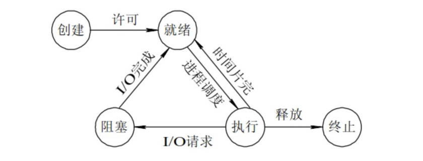

* 运行状态就是进程正在 CPU 上运行。在单处理机环境下，每一时刻最多只有一个进程处于运行状态。
* 就绪状态就是说进程已处于准备运行的状态，即进程获得了除 CPU 之外的一切所需资源，一旦得到 CPU 即可运行。
* 阻塞状态就是进程正在等待某一事件而暂停运行，比如等待某资源为可用或等待 I/O 完成。即使 CPU 空闲，该进程也不能运行。

**运行态→阻塞态：**往往是由于等待外设，等待主存等资源分配或等待人工干预而引起的。

**阻塞态→就绪态：**则是等待的条件已满足，只需分配到处理器后就能运行。

**运行态→就绪态：**不是由于自身原因，而是由外界原因使运行状态的进程让出处理器，这时候就变成就绪态。例如时间片用完，或有更高优先级的进程来抢占处理器等。

**就绪态→运行态：**系统按某种策略选中就绪队列中的一个进程占用处理器，此时就变成了运行态。

### 什么是分页？

把内存空间划分为**大小相等且固定的块**，作为主存的基本单位。因为程序数据存储在不同的页面中，而页面又离散的分布在内存中，**因此需要一个页表来记录映射关系，以实现从页号到物理块号的映射**。

访问分页系统中内存数据需要**两次的内存访问** (一次是从内存中访问页表，从中找到指定的物理块号，加上页内偏移得到实际物理地址；第二次就是根据第一次得到的物理地址访问内存取出数据)。

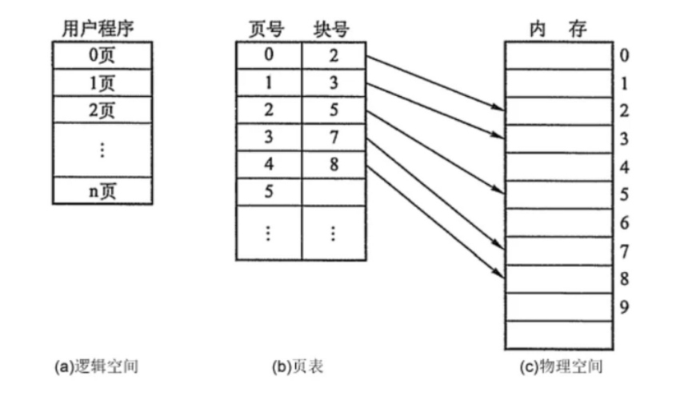

### 什么是分段？

**分页是为了提高内存利用率，而分段是为了满足程序员在编写代码的时候的一些逻辑需求(比如数据共享，数据保护，动态链接等)。**

分段内存管理当中，**地址是二维的，一维是段号，二维是段内地址；其中每个段的长度是不一样的，而且每个段内部都是从 0 开始编址的。**由于分段管理中，每个段内部是连续内存分配，但是段和段之间是离散分配的，因此也存在一个逻辑地址到物理地址的映射关系，相应的就是段表机制。

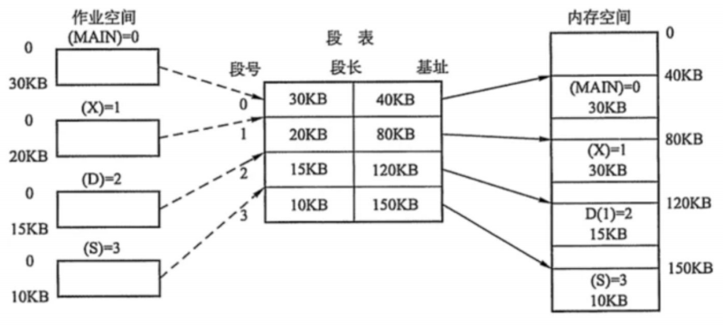

### 分页和分段有什区别？

* 分页对程序员是透明的，但是分段需要程序员显式划分每个段。
* 分页的地址空间是一维地址空间，分段是二维的。
* 页的大小不可变，段的大小可以动态改变。
* 分页主要用于实现虚拟内存，从而获得更大的地址空间；分段主要是为了使程序和数据可以被划分为逻辑上独立的地址空间并且有助于共享和保护。

### 什么是交换空间？

操作系统把物理内存(physical RAM)分成一块一块的小内存，每一块内存被称为页(page)。当内存资源不足时，**Linux 把某些页的内容转移至硬盘上的一块空间上，以释放内存空间**。硬盘上的那块空间叫做交换空间(swap space),而这一过程被称为交换(swapping)。**物理内存和交换空间的总容量就是虚拟内存的可用容量**。

用途：

* 物理内存不足时一些不常用的页可以被交换出去，腾给系统。
* 程序启动时很多内存页被用来初始化，之后便不再需要，可以交换出去。

### 页面替换算法有哪些？

在程序运行过程中，如果要访问的页面不在内存中，就发生缺页中断从而将该页调入内存中。此时如果内存已无空闲空间，系统必须从内存中调出一个页面到磁盘对换区中来腾出空间。

包括以下算法：

* 最佳算法：所选择的被换出的页面将是最长时间内不再被访问，通常可以保证获得最低的缺页率。这是一种理论上的算法，因为无法知道一个页面多长时间不再被访问。
* 先进先出：选择换出的页面是最先进入的页面。该算法将那些经常被访问的页面也被换出，从而使缺页率升高。
* LRU：虽然无法知道将来要使用的页面情况，但是可以知道过去使用页面的情况。LRU 将最近最久未使用的页面换出。为了实现 LRU，需要在内存中维护一个所有页面的链表。当一个页面被访问时，将这个页面移到链表表头。这样就能保证链表表尾的页面是最近最久未访问的。因为每次访问都需要更新链表，因此这种方式实现的 LRU 代价很高。
* 时钟算法：时钟算法使用环形链表将页面连接起来，再使用一个指针指向最老的页面。它将整个环形链表的每一个页面做一个标记，如果标记是 0，那么暂时就不会被替换，然后时钟算法遍历整个环，遇到标记为 1 的就替换，否则将标记为 0 的标记为 1。

### 什么是缓冲区溢出？有什么危害？

缓冲区溢出是指当计算机向缓冲区填充数据时超出了缓冲区本身的容量，溢出的数据覆盖在合法数据上。

危害有以下两点：

* 程序崩溃，导致拒绝额服务
* 跳转并且执行一段恶意代码

造成缓冲区溢出的主要原因是程序中没有仔细检查用户输入。

### 什么是虚拟内存？

虚拟内存就是说，让物理内存扩充成更大的逻辑内存，从而让程序获得更多的可用内存。虚拟内存使用部分加载的技术，让一个进程或者资源的某些页面加载进内存，从而能够加载更多的进程，甚至能加载比内存大的进程，这样看起来好像内存变大了，这部分内存其实包含了磁盘或者硬盘，并且就叫做虚拟内存。

### 讲一讲 IO 多路复用？

IO 多路复用是指内核一旦发现进程指定的一个或者多个 IO 条件准备读取，它就通知该进程。

IO 多路复用适用如下场合：

* 当客户处理多个描述字时（一般是交互式输入和网络套接口），必须使用I/O 复用。
* 当一个客户同时处理多个套接口时，而这种情况是可能的，但很少出现。
* 如果一个 TCP 服务器既要处理监听套接口，又要处理已连接套接口，一般也要用到 I/O 复用。
* 如果一个服务器即要处理 TCP，又要处理 UDP，一般要使用 I/O 复用。
* 如果一个服务器要处理多个服务或多个协议，一般要使用 I/O 复用。
* 与多进程和多线程技术相比，I/O 多路复用技术的最大优势是系统开销小，系统不必创建进程/线程，也不必维护这些进程/线程，从而大大减小了系统的开销。

### 硬链接和软链接有什么区别？

* 硬链接就是在目录下创建一个条目，记录着文件名与 inode 编号，这个 inode 就是源文件的 inode。删除任意一个条目，文件还是存在，只要引用数量不为 0。但是硬链接有限制，它不能跨越文件系统，也不能对目录进行链接。
* 符号链接文件保存着源文件所在的绝对路径，在读取时会定位到源文件上，可以理解为 Windows 的快捷方式。当源文件被删除了，链接文件就打不开了。因为记录的是路径，所以可以为目录建立符号链接。

### 中断的处理过程? 

* 保护现场：将当前执行程序的相关数据保存在寄存器中，然后入栈。
* 开中断：以便执行中断时能响应较高级别的中断请求。
* 中断处理
* 关中断：保证恢复现场时不被新中断打扰
* 恢复现场：从堆栈中按序取出程序数据，恢复中断前的执行状态。

### 中断和轮询有什么区别？

* 轮询：CPU 对特定设备轮流询问。中断：通过特定事件提醒 CPU。
* 轮询：效率低等待时间长，CPU 利用率不高。中断：容易遗漏问题，CPU 利用率不高。

### 请详细介绍一下 TCP 的三次握手机制，为什么要三次握手？

在讲三次握手之前首先要介绍 TCP 报文中两个重要的字段：一个是序号字段，另一个是确认号字段，这两个字段将在握手阶段以及整个信息传输过程起到重要作用。

第一步：客户端 TCP 向服务端的 TCP 发送一个不带额外数据的特殊 TCP 报文段，该报文段的 SYN 标志位会被置 1，所以把它称为 SYN 报文段。这时客户端会选取一个初始序列号（假设为 client_num），并将此编号放置在序号字段中。该报文段会被封装在一个 IP 数据报中发送给服务器。

第二步：服务器接收到 SYN 报文段后，会为该 TCP 分配缓存和变量，并发送允许连接的确认报文。在允许连接的报文中，SYN 标志位仍被置为 1，确认号字段填的是 client_num + 1 的值。最后服务端也会选取一个 server_num 存放到序号字段中，这个报文段称为 SYNACK 报文段。

第三步：在接收到 SYNACK 报文段后，客户端最后也要向服务端发送一个确认报文，这个报文和前两个不一样，SYN 标志位置 0，在确认号字段中填上 server_num + 1 的值，并且这个报文段可以携带数据。一旦完成这 3 个步骤，客户端和服务器之间就可以相互发送包含数据的报文了。

如果不是三次握手，二次两次的话，服务器就不知道客户端是否接收到了自己的 SYNACK 报文段，从而无法建立连接；四次握手就显得多余了。

### 讲一讲 SYN 超时，洪泛攻击，以及解决策略

什么 SYN 是洪泛攻击？ 在 TCP 的三次握手机制的第一步中，客户端会向服务器发送 SYN 报文段。服务器接收到 SYN 报文段后会为该 TCP 分配缓存和变量，如果攻击分子大量地往服务器发送 SYN 报文段，服务器的连接资源终将被耗尽，
导致内存溢出无法继续服务。

解决策略： 当服务器接受到 SYN 报文段时，不直接为该 TCP 分配资源，而只是打开一个半开的套接字。接着会使用 SYN 报文段的源 Id，目的 Id，端口号以及只有服务器自己知道的一个秘密函数生成一个 cookie，并把 cookie 作为序列号响应给客户端。

如果客户端是正常建立连接，将会返回一个确认字段为 cookie + 1 的报文段。接下来服务器会根据确认报文的源 Id，目的 Id，端口号以及秘密函数计算出一个结果，如果结果的值 + 1 等于确认字段的值，则证明是刚刚请求连接的客户端，这时候才为该 TCP 分配资源这样一来就不会为恶意攻击的 SYN 报文段分配资源空间，避免了攻击。

### 详细介绍一下 TCP 的四次挥手机制，为什么要有 TIME_WAIT 状态，为什么需要四次握手？服务器出现了大量 CLOSE_WAIT 状态如何解决？

当客户端要服务器断开连接时，客户端 TCP 会向服务器发送一个特殊的报文段，该报文段的 FIN 标志位会被置 1，接着服务器会向客户端发送一个确认报文段。然后服务器也会客户端发送一个 FIN 标志位为 1 的终止报文段，随后客户端回送一个确认报文段，服务器立即断开连接。客户端等待一段时间后也断开连接。其实四次挥手的过程是很容易理解的，由于 TCP 协议是全双工的，也就是说客户端和服务端都可以发起断开连接。两边各发起一次断开连接的申请，加上各自的两次确认，看起来就像执行了四次挥手。

为什么要有 TIME_WAIT 状态？因为客户端最后向服务器发送的确认 ACK 是有可能丢失的，当出现超时，服务端会再次发送 FIN 报文段，如果客户端已经关闭了就收不到了。还有一点是避免新旧连接混杂。

大量 CLOSE_WAIT 表示程序出现了问题，对方的 socket 已经关闭连接，而我方忙于读或写没有及时关闭连接，需要检查代码，特别是释放资源的代码，或者是处理请求的线程配置。


### IO 多路复用是什么？有哪些 api？

### select 和 epoll 的区别？水平触发和边缘触发的区别是啥？使用的时候需要注意什么？

### epoll 储存描述符的数据结构是什么？

### select 有描述符限制吗？是多少？

### 进程 / 线程 / 协程区别？go 和 swoole 的协程实现有啥区别？（分配资源的基本单位 / 运行和调度的基本单位 / 用户线程，M:N 模型和 N:1 模型）

## 容器技术

### 为什么需要 DevOps

在当今，软件开发公司在软件新版本发布方面，多尝试通过发布一系列以小的特性改变集为目标的新软件版本，代替发布一个大特性改变集的新软件版本的方式。这种方式有许多优点，诸如，快速的客户反馈，软件质量的保证等。也会获得较高的客户满意度评价。完成这样的软件发布模式，开发公司需要做到：

* 增加软件布署的频率
* 降低新发布版本的失败率
* 缩短修复缺陷的交付时间
* 加快解决版本冲突的问题
* DevOps 满足所有这些需求且帮助公司高质完成软件无缝交付的目标。 

### Docker 是什么？

Docker 是一个容器化平台，它包装你所有开发环境依赖成一个整体，像一个容器。保证项目开发，如开发、测试、发布等各生产环节都可以无缝工作在不同的平台

Docker 容器：将一个软件包装在一个完整的文件系统中，该文件系统包含运行所需的一切：代码，运行时，系统工具，系统库等。可以安装在服务器上的任何东西。

这保证软件总是运行在相同的运行环境，无需考虑基础环境配置的改变。

### DevOps 有哪些优势？

**技术优势:** 

* 持续的软件交付能力
* 修复问题变得简单
* 更快得解决问题

**商业优势:** 

* 更快交付的特性
* 更稳定的操作系统环境
* 更多时间可用于创造价值 (而不是修复 / 维护)

### CI 服务有什么用途？

CI （Continuous Integration）-- 持续集成服务 -- 主要用于整合团队开发中不同开发者提交到开发仓库中的项目代码变化，并即时整合编译，检查整合编译错误的服务。它需要一天中多次整合编译代码的能力，若出现整合错误，可以优异地准确定位提交错误源。

### 如何使用 Docker 技术创建与环境无关的容器系统？

Docker 技术有三中主要的技术途径辅助完成此需求：
存储卷（Volumes）
环境变量（Environment variable）注入
只读（Read-only）文件系统

### Dockerfile 配置文件中的 COPY 和 ADD 指令有什么不同？

虽然 ADD 和 COPY 功能相似，推荐 COPY 。

那是因为 COPY 比 ADD 更直观易懂。 COPY 只是将本地文件拷入容器这么简单，而 ADD 有一些其它特性功能（诸如，本地归档解压和支持远程网址访问等），这些特性在指令本身体现并不明显。因此，有必要使用 ADD 指令的最好例子是需要在本地自动解压归档文件到容器中的情况，如 ADD rootfs.tar.xz 。 

### Docker 映像（image）是什么？

Docker image 是 Docker 容器的源。换言之，Docker images 用于创建 Docker 容器（containers）。映像（Images）通过 Docker build 命令创建，当 run 映像时，它启动成一个 容器（container）进程。 做好的映像由于可能非常庞大，常注册存储在诸如 registry.hub.docker.com 这样的公共平台上。映像常被分层设计，每层可单独成为一个小映像，由多层小映像再构成大映像，这样碎片化的设计为了使映像在互联网上共享时，最小化传输数据需求。

### Docker 容器（container）是什么？

Docker containers -- Docker 容器 -- 是包含其所有运行依赖环境，但与其它容器共享操作系统内核的应用，它运行在独立的主机操作系统用户空间进程中。Docker 容器并不紧密依赖特定的基础平台：可运行在任何配置的计算机，任何平台以及任何云平台上。

### Docker 中心（hub）什么概念？

Docker hub 是云基础的 Docker 注册服务平台，它允许用户进行访问 Docker 中心资源库，创建自己的 Docker 映像并测试，推送并存储创建好的 Docker 映像，连接 Docker 云平台将已创建好的指定 Docker 映像布署到本地主机等任务。它提供了一个查找发现 Docker 映像，发布 Docker 映像及控制变化升级的资源中心，成为用户组或团队协作开发中保证自动化开发流程的有效技术途径。

### 在任意给定时间点指出一个 Docker 容器可能存在的运行阶段？

在任意时间点，一个 Docker 容器可能存在以下运行阶段：

* 运行中（Running）
* 已暂停（Paused）
* 重启中（Restarting）
* 已退出（Exited）

### 有什么方法确定一个 Docker 容器运行状态？

使用如下命令行命令确定一个 Docker 容器的运行状态

```bash
$ docker ps –a
```

这将列表形式输出运行在主机上的所有 Docker 容器及其运行状态。从这个列表中很容易找到想要的容器及其运行状态。

### 在 Dockerfile 配置文件中最常用的指令有哪些？

一些最常用的指令如下： 

* FROM：使用 FROM 为后续的指令建立基础映像。在所有有效的 Dockerfile 中， FROM 是第一条指令。
* LABEL：LABEL 指令用于组织项目映像，模块，许可等。在自动化布署方面 LABEL 也有很大用途。在 LABEL 中指定一组键值对，可用于程序化配置或布署 Docker 。
* RUN：RUN 指令可在映像当前层执行任何命令并创建一个新层，用于在映像层中添加功能层，也许最来的层会依赖它。
* CMD：使用 CMD 指令为执行的容器提供默认值。在 Dockerfile 文件中，若添加多个 CMD 指令，只有最后的 CMD 指令运行。

### 什么类型的应用（无状态性或有状态性）更适合 Docker 容器技术？

对于 Docker 容器创建无状态性（Stateless）的应用更可取。通过从应用项目中将与状态相关的信息及配置提取掉，我们可以在项目环境外建立不依赖项目环境的 Docker 容器。这样，我们可以在任意产品中运行同一容器，只需根据产品需要像问 & 答（QA）一样给其配置环境即可。 这帮助我们在不同场景重用相同的 Docker 映像。另外，使用 无状态性（Stateless）容器应用相比有状态性（Stateful）容器应用更具伸缩性，也容易创建。

### 解释基本 Docker 应用流程

初始，所有都有赖于 Dockerfile 配置文件。Dockerfile 配置文件就是创建 Docker image (映像) 的源代码。

一旦 Dockerfile 配置好了，就可以创建（build）并生成 'image（映像）' ，'image' 就是 Dockerfile 配置文件中 「源代码」的「编译」版本。一旦有了 'image' ，就可以在 registry（注册中心） 发布它。 'registry' 类似 git 的资源库 -- 你可以推送你的映像（image），也可取回库中的映像（image）。

之后，你就可以使用 image 去启动运行 'containers（容器）'。运行中的容器在许多方面，与虚拟机非常相似，但容器的运行不需要虚拟管理软件的运行。

### Docker Image 和 Docker Layer (层) 有什么不同？

**Image：**一个 Docker Image 是由一系列 Docker 只读层（read-only Layer）创建出来的。

**Layer：**在 Dockerfile 配置文件中完成的一条配置指令，即表示一个 Docker 层（Layer）。

如下 Dockerfile 文件包含 4 条指令，每条指令创建一个层（Layer）。

```bash
FROM ubuntu:15.04
COPY . /app
RUN make /app
CMD python /app/app.py
```

重点，每层只对其前一层进行一（某）些进化。

### 虚拟化技术是什么？

最初的构想，virtualisation（虚拟化） 被认为是逻辑划分大型主机使得多个应用可以并行运行的一种技术方案。然而，随着技术公司及开源社区的推进，现实发生了戏剧性的转变，以致产生了以一种或某种方式操作特权指令可以在单台基于 x86 硬件的系统上同时运行多个（种）操作系统的技术。

实质的效果是，虚拟化技术允许你在一个硬件平台下运行 2 个完全不同的操作系统。每个客户操作系统可完成像系统自检、启动、载入系统内核等像在独立硬件上的一切动作。同时也具备坚实的安全基础，例如，客户操作系统不能获取完全访问主机或其它客户系统的权限，及其它涉及安全，可能把系统搞坏的操作。

基于对客户操作系统虚拟硬件、运行环境模拟方法的不同，对虚拟化技术进行分类，主要的有如下 3 种虚拟化技术种类：

* 全模拟（Emulation）
* 半虚拟（Paravirtualization）
* 基于容器的虚拟化（Container-based virtualization）

### 虚拟管理层（程序）是什么？

hypervisor -- 虚拟管理层（程序）-- 负责创建客户虚拟机系统运行所需虚拟硬件环境。它监管客户虚拟操作系统的运行，并为客户系统提供必要的运行资源，保证客户虚拟系统的运行。虚拟管理层（程序）驻留在物理主机系统和虚拟客户系统之间，为虚拟客户系统提供必要的虚拟服务。如何理解它，它侦听运行在虚拟机中的客户操作系统的操作并在主机操作系统中模拟客户操作系统所需硬件资源请求。满足客户机的运行需求。

虚拟化技术的快速发展，主要在云平台，由于在虚拟管理程序的帮助下，可允许在单台物理服务器上生成多个虚拟服务器，驱动着虚拟化技术快速发展及广泛应用。诸如，Xen，VMware，KVM 等，以及商业化的处理器硬件生产厂商也加入在硬件层面支持虚拟化技术的支持。诸如，Intel 的 VT 和 AMD-V 。

### Docker 群（Swarm）是什么？

Docker Swarm -- Docker 群 -- 是原生的 Docker 集群服务工具。它将一群 Docker 主机集成为单一一个虚拟 Docker 主机。利用一个 Docker 守护进程，通过标准的 Docker API 和任何完善的通讯工具，Docker Swarm 提供透明地将 Docker 主机扩散到多台主机上的服务。

### 在使用 Docker 技术的产品中如何监控其运行？

Docker 在产品中提供如 运行统计和 Docker 事件的工具。可以通过这些工具命令获取 Docker 运行状况的统计信息或报告。

Docker stats ： 通过指定的容器 id 获取其运行统计信息，可获得容器对 CPU，内存使用情况等的统计信息，类似 Linux 系统中的 top 命令。

Docker events ：Docker 事件是一个命令，用于观察显示运行中的 Docker 一系列的行为活动。

一般的 Docker 事件有：attach（关联），commit（提交），die（僵死），detach（取消关联），rename（改名），destory（销毁）等。也可使用多个选项对事件记录筛选找到想要的事件信息。

### 什么是孤儿卷及如何删除它？

孤儿卷是未与任何容器关联的卷。在 Docker v。1.9 之前的版本中，删除这些孤儿卷存在很大问题。

### 什么是半虚拟化（Paravirtualization）？

Paravirtualization，也称为第 1 类虚拟机管理（层）程序，其直接在硬件或裸机（bare-metal）上运行，提供虚拟机直接使用物理硬件的服务，它帮助主机操作系统，虚拟化硬件和实际硬件进行协作以实现最佳性能。这种虚拟层管理技术的程序一般占用系统资源较小，其本身并不需要占用大量系统资源。

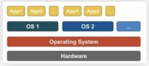

这种虚拟层管理程序有 Xen, KVM 等。

### Docker 技术与虚拟机技术有何不同？

Docker 不是严格意义上的虚拟化硬件的技术。它依赖 container-based virtualization（基于容器的虚拟化） 的技术实现工具，或可以认为它是操作系统用户运行级别的虚拟化。因此， Docker 最初使用 LXC 驱动它，后来移至由 libcontainer 基础库驱动它，现已更名为 runc 。 Docker 主要致力于应用容器内的应用程序的自动化部署。应用容器设计用于包装和运行单一服务，而操作系统设计用于运行多进程任务，提供多种运算服务的能力。如虚拟机中等同完全操作系统的能力。因此，Docker 被认为是容器化系统上管理容器及应用容器化的布署工具。

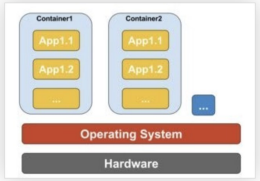

* 与虚拟机不同，容器无需启动操作系统内核，因此，容器可在不到 1 秒钟时间内运行起来。这个特性，使得容器化技术比其它虚拟化技术更具有独特性及可取性。
* 由于容器化技术很少或几乎不给主机系统增加负载，因此，基于容器的虚拟化技术具有近乎原生的性能表现。
* 基于容器的虚拟化，与其他硬件虚拟化不同，运行时不需要其他额外的虚拟管理层软件。
* 主机上的所有容器共享主机操作系统上的进程调度，从而节省了额外的资源的需求。
* 与虚拟机 image 相比，容器（Docker 或 LXC images）映像较小， 因此，容器映像易于分发。
* 容器中的资源分配由 Cgroups 实现。 Cgroup 不会让容器占用比给它们分配的更多的资源。但是，现在其它的虚拟化技术，对于虚拟机，主机的所有资源都可见，但无法使用。这可以通过在容器和主机上同时运行 top 或htop 来观察到。在两个环境中的输出看起来相同。

### 请解释一下 docerfile 配置文件中的 ONBUILD 指令的用途含义？

配置文件中的 ONBUILD 指令为创建的 Docker image （映像）加入在将来执行的指令（译注：在当前配置文件生成的映像中并不执行）， 用于在以这个创建的映像为基础的创建的子映像（image） 中执行或定制。 举例， 以基映像创建自己的映像时，可定制创建特有的用户化的配置环境。

（ 译注： 由于原文较短，关于这个问题容易迷惑。 译者认为，总体来说关键理解 -- 以基础映像创建自有的映像过程中，基础映像中所有的创建层或指令是以整体或固化的方式导入自有映像中的，自有映像是不能对这个过程进行自有定制。 而 ONBUILD 指令提供了将某些层从基础映像中剥离出来提供给之后以自有映像为基础映像派生新的映像的可定制途径。这对发布映像而普适在不同的运行环境定制非常有用。不当之处，请指正！）

### 有否在创建有状态性的 Docker 应用的较好实践？ 最适合的场景有什么？

有状态性 Docker 应用的问题关键在于状态数据保存在哪儿的问题。 若所有数据保存在容器内， 当更新软件版本或想将 Docker 容器移到其它机器上时，找回这些在运行中产生的状态数据将非常困难。

您需要做的是将这些表达运行状态的数据保存在永久卷中。参考如下 3 种模式。

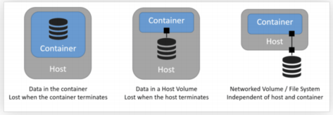

译注：

1 图中文字： 数据保存在容器中，当容器停止运行时，运行状态数据丢失！

2 图中文字： 数据保存在主机卷（Host Volume）中，当主机停机时，运行状态数据将无法访问

3 图中文字： 数据保存在网络文件系统卷中，数据访问不依赖容器的运行与主机的运行

若您使用：docker run -v hostFolder:/containerfolder 命令运行您的容器， 容器运行中任何对 /containerfolder 目录下数据的改变， 将永久保存在主机的 hostfolder 目录下。 使用网络文件系统（nfs）与此类似。 那样您就可以运行您的容器在任何主机上且其运行状态数据被保存在网络文件系统上。

### 在 Windows 系统上可以运行原生的 Docker 容器吗？

在 'Windows Server 2016' 系统上， 你可以运行 Windows 的原生容器， 微软推出其映像是 'Windows Nano Server' ， 一个轻量级的运行在容器中的Windows 原生系统。 您可以在其中布署基于 .NET 的应用。

译注： 结合 Docker 的基本技术原理，参考后面的 问题 26 和 问题 27， 可推测， 微软在系统内核上开发了对 Docker 的支持， 支持其闭源系统的容器化虚拟技术。但译者认为， Windows 系统本就是闭源紧耦合的系统， 好像你在本机上不装 .NET 组件，各应用能很好运行似的。何必再弄个容器，浪费资源。这只是译者自己之孔见，想喷就喷！ 另： Windows Server 2016 版本之后的都可支持这种原生 Docker 技术，如 Windows Server 2018 版。

### 在非 Linux 操作系统平台上如何运行 Docker ?

容器化虚拟技术概念可能来源于，在 Linux 内核版本 2.6.24 上加入的对 命名空间（ namespace） 的技术支持特性。 容器化进程加入其进程 ID 到其创建的每个进程上并且对每个进程中的系统级调用进行访问控制及审查。 其本身是由系统级调用 clone () 克隆出来的进程， 允许其创建属于自己命名空间的进程实例，而区别于之前的，归属与整个本机系统的进程实例。

如果上述在 Linux 系统内核上的技术实现成为可能， 那么明显的问题是如何在 非 Linux 系统上运行容器化的 Docker 。过去， Mac 和 Windows 系统上运行 Docker 容器都使用 Linux 虚拟机（VMs） 技术， Docker 工具箱使用的容器运行在 Virtual Box 虚拟机上。 现在，最新的情况是， Windows 平台上使用的是 Hyper-V 产品技术，Mac 平台上使用的是 Hypervisor.framework （框架）产品技术。

### 容器化技术在底层的运行原理？

2006 年前后， 人们，包括一些谷歌的雇员， 在 Linux 内核级别上实现了一种新的名为 命名空间（namespace） 的技术（实际上这种概念在 FreeBSD 系统上由来已久）。我们知道，操作系统的一个功能就是进程共享公共资源， 诸如，网络和硬盘空间等。 但是，如果一些公共资源被包装在一个命名空间中，只允许属于这个命名空间中的进程访问又如何呢？ 也就是说，可以分配一大块硬盘空间给命名空间 X 供其使用，但是，命名空间 Y 中的进程无法看到或访问这部分资源。 同样地， 命名空间 Y 中分配的资源，命名空间 X 中的进程也无法访问。当然， X 中的进程无法与 Y 中的进程进行交互。这提供了某种对公共资源的虚拟化和隔离的技术。

这就是 Docker 技术的底层工作原理： 每个容器运行在它自己的命名空间中，但是，确实与其它运行中的容器共用相同的系统内核。 隔离的产生是由于系统内核清楚地知道命名空间及其中的进程，且这些进程调用系统 API 时，内核保证进程只能访问属于其命名空间中的资源。

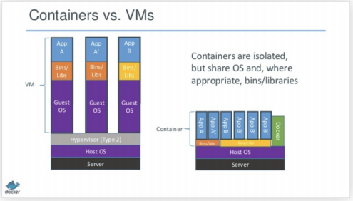

图上文字说明： 运行中的容器是隔离的。准确地说， 各容器共享操作系统内核及操作系统 API。

### 说说容器化技术与虚拟化技术的优缺点

仅有下面的一些对比：

不能像虚拟机那样在容器上运行与主机完全不同的操作系统。 然而， 可以在容器上运行不同的 Linux 发布版，由于容器共享系统内核的缘故。容器的隔离性没有虚拟机那么健壮。事实上， 在早期容器化技术实现上，存在某种方法使客户容器可接管整个主机系统。也可看到，载入新容器并运行，并不会像虚拟机那样装载一个新的操作系统进来。

所有的容器共享同一系统内核， 这也就是容器被认为非常轻量化的原因。同样的原因，不像虚拟机， 你不须为容器预分配大量的内存空间， 因为它不是运行新的整个的操作系统。 这使得在一个操作系统主机上，可以同时运行成百上千个容器应用， 在运行完整操作系统的虚拟机上，进行这么多的并行沙箱实验是不可能的。

### 如何使 Docker 适应多种运行环境？

您必然想改变您的 Docker 应用配置以更适应现实运行环境的变化。下面包含一些修改建议：

移除应用代码中对任何固定存储卷的绑定，由于代码驻留在容器内部，而不能从外部进行修正。

绑定应用端口到主机上的不同端口

差异化设置环境变量 （例如： 减少日志冗余或者使能发电子邮件）

设定重启策略（例如： restart: always ）， 避免长时间宕机

加入额外的服务（例如： log aggregator）

由于以上原因， 您更需要一个 Compose 配置文件，大概叫 production.yml ，它配置了恰当的产品整合服务。 这个配置文件只需包含您选择的合适的原始 Compose 配置文件中，你改动的部分。

docker-compose -f docker-com

### 为什么 Docker compose 采取的是并不等待前面依赖服务项的容器启动就绪后再启动的组合容器启动策略？

Docker 的 Compose 配置总是以依赖启动序列来启动或停止 Compose 中的服务容器， 依赖启动序列是由 Compose 配置文件中的 depends_on ， links ，volumes_from 和 network_mode: "service : ..." 等这些配置指令所确定的。

然而， Compose 启动中， 各容器的启动并不等待其依赖容器（这必定是你整个应用中的某个依赖的服务或应用）启动就绪后才启动。使用这种策略较好的

理由如下：

等待一个数据库服务（举例）就绪这样的问题， 在大型分布式系统中仅是相比其它大问题的某些小问题。 在实际发布产品运维中， 您的数据库服务会由于各种原因，或者迁移宿主机导致其不可访问。 您发布的产品需要有应对这样状况的弹性。

掌控这些， 开发设计您的应用， 使其在访问数据库失效的情况下， 能够试图重连数据库， 直至其连接到数据库为止。最佳的解决方案是在您的应用代码中检查是否有应对意外的发生，无论是任何原因导致的启动或连接失效都应考虑在内。

## 微服务

### 您对微服务有何了解？

微服务，又称微服务架构，是一种架构风格，它将应用程序构建为以业务领域为模型的小型自治服务集合。

通俗地说，你必须看到蜜蜂如何通过对齐六角形蜡细胞来构建它们的蜂窝状物。他们最初从使用各种材料的小部分开始，并继续从中构建一个大型蜂箱。这些细胞形成图案，产生坚固的结构，将蜂窝的特定部分固定在一起。

这里，每个细胞独立于另一个细胞，但它也与其他细胞相关。这意味着对一个细胞的损害不会损害其他细胞，因此，蜜蜂可以在不影响完整蜂箱的情况下重建这些细胞。

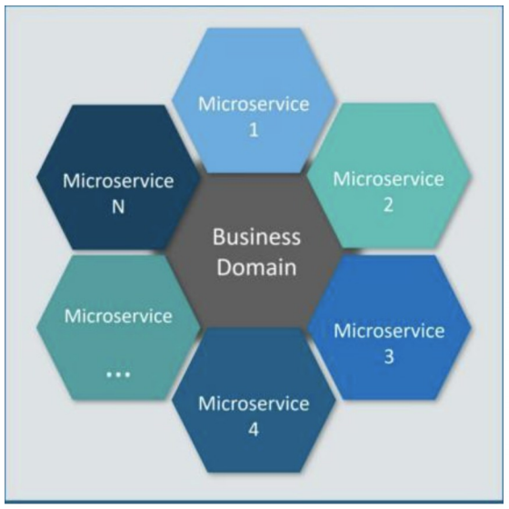


请参考上图。这里，每个六边形形状代表单独的服务组件。与蜜蜂的工作类似，每个敏捷团队都使用可用的框架和所选的技术堆栈构建单独的服务组件。就像在蜂箱中一样，每个服务组件形成一个强大的微服务架构，以提供更好的可扩展性。此外，敏捷团队可以单独处理每个服务组件的问题，而对整个应用程序没有影响或影响最小。

### 说说微服务架构的优势

| 优势       | 说明                                                 |
| ---------- | ---------------------------------------------------- |
| 独立开发   | 所有微服务都可以根据各自的功能轻松开发               |
| 独立部署   | 根据他们所提供的服务，可以在任何应用中单独部署       |
| 故障隔离   | 即使应用中的一个服务不起作用，系统仍然继续运行       |
| 混合技术栈 | 可以用不同的语言和技术来构建同一应用程序的不同服务   |
| 粒度缩放   | 各个组件可根据需要进行扩展，无需将所有组件融合到一起 |

### 微服务有哪些特点？

* 解耦—系统内的服务很大程度上是分离的。因此，整个应用程序可以轻松构建，更改和扩展
* 组件化—微服务被视为可以轻松更换和升级的独立组件
* 业务能力—微服务非常简单，专注于单一功能
* 自治—开发人员和团队可以彼此独立工作，从而提高速度
* 持续交付—通过软件创建，测试和批准的系统自动化，允许频繁发布软件
* 责任—微服务不关注应用程序作为项目。相反，他们将应用程序视为他们负责的产品
* 分散治理—重点是使用正确的工具来做正确的工作。这意味着没有标准化模式或任何技术模式。开发人员可以自由选择最有用的工具来解决他们的问题
* 敏捷—微服务支持敏捷开发。任何新功能都可以快速开发并再次丢弃

### 设计微服务的最佳实践是什么？

以下是设计微服务的最佳实践：

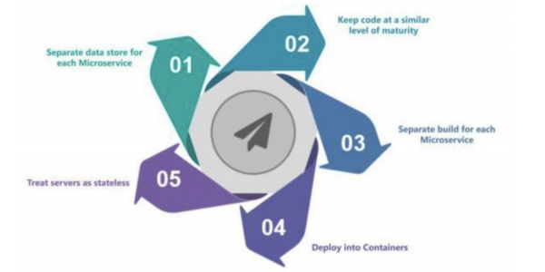

### 微服务架构如何运作？

微服务架构具有以下组件： 

* 客户端 – 来自不同设备的不同用户发送请求。
* 身份提供商 – 验证用户或客户身份并颁发安全令牌。
* API 网关 – 处理客户端请求。
* 静态内容 – 容纳系统的所有内容。
* 管理 – 在节点上平衡服务并识别故障。
* 服务发现 – 查找微服务之间通信路径的指南。
* 内容交付网络 – 代理服务器及其数据中心的分布式网络。
* 远程服务 – 启用驻留在 IT 设备网络上的远程访问信息。

### 微服务架构的优缺点是什么？

**微服务架构的优点：**

* 自由使用不同的技术
* 每个微服务都侧重于单一功能
* 支持单个可部署单元
* 允许经常发布软件
* 确保每项服务的安全性
* 多个服务是并行开发和部署的

**微服务架构的缺点：**

* 增加故障排除挑战
* 由于远程呼叫而增加延迟
* 增加了配置和其他操作的工作量
* 难以保持交易安全
* 艰难地跨越各种便捷跟踪数据
* 难以在服务之间进行编码

### 单片，SOA 和微服务架构有什么区别？

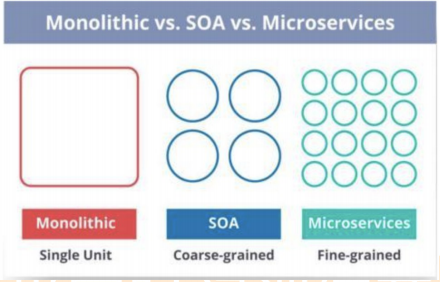

单片 SOA 和微服务之间的比较 – 微服务访谈问题

* 单片架构类似于大容器，其中应用程序的所有软件组件组装在一起并紧密封装。
* 一个面向服务的架构是一种相互通信服务的集合。通信可以涉及简单的数据传递，也可以涉及两个或多个协调某些活动的服务。
* 微服务架构是一种架构风格，它将应用程序构建为以业务域为模型的小型自治服务集合。

### 在使用微服务架构时，您面临哪些挑战？

开发一些较小的微服务听起来很容易，但开发它们时经常遇到的挑战如下。

* 自动化组件：难以自动化，因为有许多较小的组件。因此，对于每个组件，我们必须遵循 Build，Deploy 和 Monitor 的各个阶段。
* 易感性：将大量组件维护在一起变得难以部署，维护，监控和识别问题。它需要在所有组件周围具有很好的感知能力。
* 配置管理：有时在各种环境中维护组件的配置变得困难。
* 调试：很难找到错误的每一项服务。维护集中式日志记录和仪表板以调试问题至关重要。

### SOA 和微服务架构之间的主要区别是什么？

SOA 和微服务之间的主要区别如下：

| SOA                                                   | 微服务                                              |
| ----------------------------------------------------- | --------------------------------------------------- |
| 遵循“尽可能多的共享”架构方法                          | 遵循“尽可能少分享”架构方法                          |
| 重要性在于“业务功能”重用                              | 重要性在于“有界背景”的概念                          |
| 它们有共同的治理和标准                                | 它们专注于人们的合作和其他选择的自由                |
| 使用企业服务总线（ESB）进行通信                       | 简单的消息系统                                      |
| 它们支持多种消息协议                                  | 它们使用轻量级协议，如 HTTP/REST 等                 |
| 多线程，有跟多的开销来处理 I/O                        | 单线程，通常使用 Event Loop 功能进行非锁定 I/O 处理 |
| 最大化应用程序服务可重用性                            | 专注于解耦                                          |
| 传统的关系数据库更常用                                | 现代关系数据库更常用                                |
| 系统的变化需要修改整体                                | 系统的变化是创造一种新的服务                        |
| DevOps/Continuous Delivery 正在变得流行，但还不是主流 | 专注于 DevOps/持续交付                              |

### 微服务有什么特点？

您可以列出微服务的特征，如下所示：

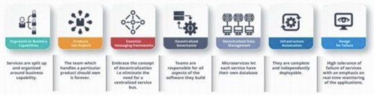

### 什么是领域驱动设计？

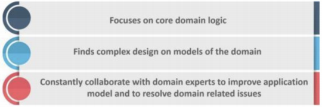

### 为什么需要域驱动设计（DDD）？

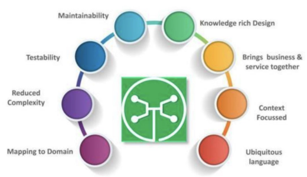

### 什么是无所不在的语言？

如果您必须定义泛在语言（UL），那么它是特定域的开发人员和用户使用的通用语言，通过该语言可以轻松解释域。

无处不在的语言必须非常清晰，以便它将所有团队成员放在同一页面上，并以机器可以理解的方式进行翻译。

### 什么是凝聚力？

模块内部元素所属的程度被认为是凝聚力。

### 什么是耦合？

组件之间依赖关系强度的度量被认为是耦合。一个好的设计总是被认为具有高内聚力和低耦合性。

### 什么是 REST / RESTful 以及它的用途是什么？

Representational State Transfer（REST）/ RESTful Web 服务是一种帮助计算机系统通过 Internet 进行通信的架构风格。这使得微服务更容易理解和实现。

微服务可以使用或不使用 RESTful API 实现，但使用 RESTful API 构建松散耦合的微服务总是更容易。

### 什么是不同类型的微服务测试？

在使用微服务时，由于有多个微服务协同工作，测试变得非常复杂。因此，测试分为不同的级别。

* 在底层，我们有面向技术的测试，如单元测试和性能测试。这些是完全自动化的。
* 在中间层面，我们进行了诸如压力测试和可用性测试之类的探索性测试。
* 在顶层， 我们的验收测试数量很少。这些验收测试有助于利益相关者理解和验证软件功能。

## 分布式

### 分布式服务接口的幂等性如何设计？

所谓幂等性，就是说一个接口，多次发起同一个请求，你这个接口得保证结果是准确得。比如不能多扣款。不能多插入一条数据，不能将统计值多加了 1，这就是幂等性。

其实保证幂等性主要是三点：

* 对于每个请求必须有一个唯一的标识，举个例子：订单支付请求，肯定得包含订单 ID，一个订单 ID 最多支付一次。
* 每次处理完请求之后，必须有一个记录标识这个请求处理过了，比如说常见得方案是再 mysql 中记录个状态啥得，比如支付之前记录一条这个订单得支付流水，而且支付流水采用 order id 作为唯一键（unique key）。只有成功插入这个支付流水，才可以执行实际得支付扣款
* 每次接收请求需要进行判断之前是否处理过得逻辑处理，比如说，如果有一个订单已经支付了，就已经有了一条支付流水，那么如果重复发送这个请求，则此时先插入支付流水，order id 已经存在了，唯一键约束生效，报错插入不进去得。然后你就不用再扣款了。

### 分布式系统中的接口调用如何保证顺序性？

可以接入 MQ，如果是系统 A 使用多线程处理的话，可以使用内存队列，来保证顺序性，如果你要 100% 的顺序性，当然可以使用分布式锁来搞，会影响系统的并发性。

### 说说 ZooKeeper 一般都有哪些使用场景？

* 分布式协调：这个其实就是 zk 很经典的一个用法，简单来说，就好比，你系统 A 发送个请求到 mq，然后 B 消费了之后处理。那 A 系统如何指导 B 系统的处理结果？用 zk 就可以实现分布式系统之间的协调工作。A 系统发送请求之后可以在 zk 上对某个节点的值注册个监听器，一旦 B 系统处理完了就修改 zk 那个节点的值，A 立马就可以收到通知，完美解决。
* 分布所锁：对某一个数据联系发出两个修改操作，两台机器同时收到请求，但是只能一台机器先执行另外一个机器再执行，那么此时就可以使用 zk 分布式锁，一个机器接收到了请求之后先获取 zk 上的一把分布式锁，就是可以去创建一个 znode，接着执行操作，然后另外一个机器也尝试去创建那个 znode，结果发现自己创建不了，因为被别人创建了，那只能等着，等等一个机器执行完了自己再执行。
* 配置信息管理：zk 可以用作很多系统的配置信息的管理，比如 kafka，storm 等等很多分布式系统都会选用 zk 来做一些元数据，配置信息的管理，包括 dubbo 注册中心不也支持 zk 么。
* HA 高可用性：这个应该是很常见的，比如 hdfs，yarn 等很多大数据系统，都选择基于 zk 来开发 HA 高可用机制，就是一个重要进程一般会主备两个，主进程挂了立马通过 zk 感知到切换到备份进程。

### 说说你们的分布式 session 方案是啥？怎么做的？

**Tomcat + redis**

其实还挺方便的，就是使用 session 的代码跟以前一样，还是基于 tomcat 原生的 session 支持即可，然后就是用一个叫做 tomcat RedisSessionManager 的东西，让我们部署的 tomcat 都将 session 数据存储到 redis 即可.

**Spring Session + redis**

分布式会话的这个东西重耦合在 tomcat，如果我要将 web 容器迁移成 jetty，不能重新把 jetty 都配置一遍.

所以现在比较好用的还是基于 java 的一站式解决方案，使用 spring session是一个很好的选择，给 spring session 配置基于 redis 来存储 session 数据，然后配置一个 spring session 的过滤器，这样的话，session 相关操作都会交给 spring session 来管了。接着在代码中，就是用原生的 session 操作，就是直接基于 spring session 从 redis 中获取数据了。

### 分布式事务了解吗？

**XA 方案/两阶段提交方案**

第一个阶段（先询问）

第二个阶段（再执行）

**TCC 方案**

TCC 的全程是：Try、Confirm、Cancel

这个其实是用到了补偿的概念，分为了三个阶段

Try 阶段：这个阶段说的是对各个服务的资源做检测以及对资源进行锁定或者预留

Confirm 阶段：这个阶段说的是在各个服务中执行实际的操作

Cancel 阶段：如果任何一个服务的业务方法执行出错，那么这里就需要进行补偿，就是执行已经成功的业务逻辑的回滚操作

* 本地消息表
* 可靠消息最终一致性方案
* 最大努力通知方案

### 那常见的分布式锁有哪些解决方案？

* Reids 的分布式锁，很多大公司会基于 Reidis 做扩展开发
* 基于 Zookeeper
* 基于数据库，比如 Mysql

### ZK 和 Redis 的区别，各自有什么优缺点？

**先说 Redis：**

* Redis 只保证最终一致性，副本间的数据复制是异步进行（Set 是写，Get 是读，Reids 集群一般是读写分离架构，存在主从同步延迟情况），主从切换之后可能有部分数据没有复制过去可能会丢失锁情况，故强一致性要求的业务不推荐使用 Reids，推荐使用 zk。
* Redis 集群各方法的响应时间均为最低。随着并发量和业务数量的提升其响应时间会有明显上升（公有集群影响因素偏大），但是极限 qps 可以达到最大且基本无异常。

**再说 ZK：**

* 使用 ZooKeeper 集群，锁原理是使用 ZooKeeper 的临时节点，临时节点的生命周期在 Client 与集群的 Session 结束时结束。因此如果某个 Client节点存在网络问题，与 ZooKeeper 集群断开连接，Session 超时同样会导致锁被错误的释放（导致被其他线程错误地持有），因此 ZooKeeper 也无法保证完全一致。
* ZK 具有较好的稳定性；响应时间抖动很小，没有出现异常。但是随着并发量和业务数量的提升其响应时间和 qps 会明显下降。

### MySQL 如何做分布式锁？

**方法一：**

利用 Mysql 的锁表，创建一张表，设置一个 UNIQUE KEY 这个 KEY 就是要锁的 KEY，所以同一个 KEY 在 mysql 表里只能插入一次了，这样对锁的竞争就交给了数据库，处理同一个 KEY 数据库保证了只有一个节点能插入成功，其他节点都会插入失败。

DB 分布式锁的实现：通过主键 id 的唯一性进行加锁，说白了就是加锁的形式是向一张表中插入一条数据，该条数据的 id 就是一把分布式锁，例如当一次请求插入了一条 id 为 1 的数据，其他想要进行插入数据的并发请求必须等第一次请求执行完成后删除这条 id 为 1 的数据才能继续插入，实现了分布式锁的功能。

**方法二：**

使用流水号+时间戳做幂等操作，可以看作是一个不会释放的锁。

### 你了解业界哪些大公司的分布式锁框架

**Google:Chubby**

Chubby 是一套分布式协调系统，内部使用 Paxos 协调 Master 与 Replicas。Chubby lock service 被应用在 GFS, BigTable 等项目中，其首要设计目标是高可靠性，而不是高性能。

Chubby 被作为粗粒度锁使用，例如被用于选主。持有锁的时间跨度一般为小时或天，而不是秒级。

Chubby 对外提供类似于文件系统的 API，在 Chubby 创建文件路径即加锁操作。Chubby 使用 Delay 和 SequenceNumber 来优化锁机制。Delay 保证客户端异常释放锁时，Chubby 仍认为该客户端一直持有锁。Sequence number 指锁的持有者向 Chubby 服务端请求一个序号（包括几个属性），然后之后在需要使用锁的时候将该序号一并发给 Chubby 服务器，服务端检查序号的合法性，包括 number 是否有效等。

**京东 SharkLock**

SharkLock 是基于 Redis 实现的分布式锁。锁的排他性由 SETNX 原语实现，使用 timeout 与续租机制实现锁的强制释放。

**蚂蚁金服 SOFAJRaft-RheaKV 分布式锁**

RheaKV 是基于 SOFAJRaft 和 RocksDB 实现的嵌入式、分布式、高可用、强一致的 KV 存储类库。

RheaKV 对外提供 lock 接口，为了优化数据的读写，按不同的存储类型，提供不同的锁特性。RheaKV 提供 wathcdog 调度器来控制锁的自动续租机制，避免锁在任务完成前提前释放，和锁永不释放造成死锁。

**Netflix: Curator**

Curator 是 ZooKeeper 的客户端封装，其分布式锁的实现完全由 ZooKeeper 完成。

在 ZooKeeper 创建 EPHEMERAL_SEQUENTIAL 节点视为加锁，节点的 EPHEMERAL 特性保证了锁持有者与 ZooKeeper 断开时强制释放锁；节点的 SEQUENTIAL 特性避免了加锁较多时的惊群效应。

### 请讲一下你对 CAP 理论的理解

在理论计算机科学中，CAP 定理（CAP theorem），又被称作布鲁尔定理（Brewer’s theorem），它指出对于一个分布式计算系统来说，不可能同时满足以下三点：

* Consistency（一致性） 指数据在多个副本之间能够保持一致的特性（严格的一致性）
* Availability（可用性） 指系统提供的服务必须一直处于可用的状态，每次请求都能获取到非错的响应（不保证获取的数据为最新数据）
* Partition tolerance（分区容错性） 分布式系统在遇到任何网络分区故障的时候，仍然能够对外提供满足一致性和可用性的服务，除非整个网络环境都发生了故障

Spring Cloud 在 CAP 法则上主要满足的是 A 和 P 法则，Dubbo 和 Zookeeper 在 CAP 法则主要满足的是 C 和 P 法则。 

CAP 仅适用于原子读写的 NOSQL 场景中，并不适合数据库系统。现在的分布式系统具有更多特性比如扩展性、可用性等等，在进行系统设计和开发时，我们不应该仅仅局限在 CAP 问题上。

现实生活中，大部分人解释这一定律时，常常简单的表述为：“一致性、可用性、分区容忍性三者你只能同时达到其中两个，不可能同时达到”。实际上这是一个非常具有误导性质的说法，而且在 CAP 理论诞生 12 年之后，CAP 之父也
在 2012 年重写了之前的论文。

当发生网络分区的时候，如果我们要继续服务，那么强一致性和可用性只能 2 选 1。也就是说当网络分区之后 P 是前提，决定了 P 之后才有 C 和 A 的选择。也就是说分区容错性（Partition tolerance）我们是必须要实现的。

### 请讲一下你对 BASE 理论的理解

BASE 理论由 eBay 架构师 Dan Pritchett 提出，在 2008 年上被分表为论文，并且 eBay 给出了他们在实践中总结的基于 BASE 理论的一套新的分布式事务解决方案。

BASE 是 Basically Available（基本可用） 、Soft-state（软状态） 和 Eventually Consistent（最终一致性） 三个短语的缩写。BASE 理论是对 CAP 中一致性和可用性权衡的结果，其来源于对大规模互联网系统分布式实践的总结，是基于 CAP 定理逐步演化而来的，它大大降低了我们对系统的要求。

BASE 理论的核心思想是即使无法做到强一致性，但每个应用都可以根据自身业务特点，采用适当的方式来使系统达到最终一致性。也就是牺牲数据的一致性来满足系统的高可用性，系统中一部分数据不可用或者不一致时，仍需要保持系统整体“主要可用”。

针对数据库领域，BASE 思想的主要实现是对业务数据进行拆分，让不同的数据分布在不同的机器上，以提升系统的可用性，当前主要有以下两种做法：

* 按功能划分数据库
* 分片（如开源的 Mycat、Amoeba 等）。

### 分布式与集群的区别是什么？

分布式：一个业务分拆多个子业务，部署在不同的服务器上

集群：同一个业务，部署在多个服务器上。比如之前做电商网站搭的 redis 集群以及 solr 集群都是属于将 redis 服务器提供的缓存服务以及 solr 服务器提供的搜索服务部署在多个服务器上以提高系统性能、并发量解决海量存储问题。

### 请讲一下 BASE 理论的三要素

**基本可用**

基本可用是指分布式系统在出现不可预知故障的时候，允许损失部分可用性。但是，这绝不等价于系统不可用。

比如：

* 响应时间上的损失：正常情况下，一个在线搜索引擎需要在 0.5 秒之内返回给用户相应的查询结果，但由于出现故障，查询结果的响应时间增加了 1~2 秒
* 系统功能上的损失：正常情况下，在一个电子商务网站上进行购物的时候，消费者几乎能够顺利完成每一笔订单，但是在一些节日大促购物高峰的时候，由于消费者的购物行为激增，为了保护购物系统的稳定性，部分消费者可能会被引导到一个降级页面

**软状态**

软状态指允许系统中的数据存在中间状态，并认为该中间状态的存在不会影响系统的整体可用性，即允许系统在不同节点的数据副本之间进行数据同步的过程存在延时。

**最终一致性**

强调的是系统中所有的数据副本，在经过一段时间的同步后，最终能够达到一个一致的状态。因此，最终一致性的本质是需要系统保证最终数据能够达到一致，而不需要实时保证系统数据的强一致性。

### 请说一下对两阶段提交协议的理解

分布式系统的一个难点是如何保证架构下多个节点在进行事务性操作的时候保持一致性。为实现这个目的，二阶段提交算法的成立基于以下假设：

* 该分布式系统中，存在一个节点作为协调者(Coordinator)，其他节点作为参与者(Cohorts)。且节点之间可以进行网络通信。
* 所有节点都采用预写式日志，且日志被写入后即被保持在可靠的存储设备上，即使节点损坏不会导致日志数据的消失。
* 所有节点不会永久性损坏，即使损坏后仍然可以恢复。

第一阶段（投票阶段）

* 协调者节点向所有参与者节点询问是否可以执行提交操作(vote)，并开始等待各参与者节点的响应。
* 参与者节点执行询问发起为止的所有事务操作，并将 Undo 信息和 Redo 信息写入日志。（注意：若成功这里其实每个参与者已经执行了事务操作）
* 各参与者节点响应协调者节点发起的询问。如果参与者节点的事务操作实际执行成功，则它返回一个”同意”消息；如果参与者节点的事务操作实际执行失败，则它返回一个”中止”消息。

第二阶段（提交执行阶段）

当协调者节点从所有参与者节点获得的相应消息都为”同意”： 

* 协调者节点向所有参与者节点发出”正式提交(commit)”的请求。
* 参与者节点正式完成操作，并释放在整个事务期间内占用的资源。
* 参与者节点向协调者节点发送”完成”消息。
* 协调者节点受到所有参与者节点反馈的”完成”消息后，完成事务。

如果任一参与者节点在第一阶段返回的响应消息为”中止”：

* 协调者节点向所有参与者节点发出”回滚操作(rollback)”的请求。
* 参与者节点利用之前写入的 Undo 信息执行回滚，并释放在整个事务期间内占用的资源。
* 参与者节点向协调者节点发送”回滚完成”消息。
* 协调者节点受到所有参与者节点反馈的”回滚完成”消息后，取消事务。

### 请讲一下对 TCC 协议的理解

Try Confirm Cancel

* Try：尝试待执行的业务 ，这个过程并未执行业务，只是完成所有业务的一致性检查，并预留好执行所需的全部资源。
* Confirm：执行业务，这个过程真正开始执行业务，由于 Try 阶段已经完成了一致性检查，因此本过程直接执行，而不做任何检查。并且在执行的过程中，会使用到 Try 阶段预留的业务资源。
* Cancel：取消执行的业务，若业务执行失败，则进入 Cancel 阶段，它会释放所有占用的业务资源，并回滚 Confirm 阶段执行的操作。

### 分布式事务怎么处理（高德 陌陌）

### 简述 raft 原理（陌陌）

### 分布式 id 的几种实现和优缺点（滴滴）

### 降级 限流 熔断实现原理（高德 陌陌）

## 缓存

### 缓存如何实现高性能？

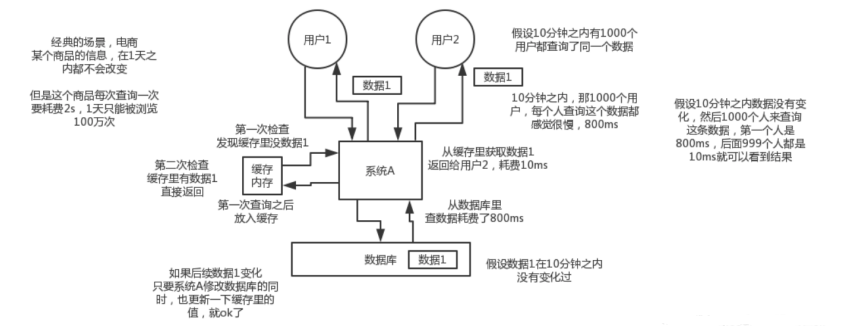

### 缓存如何实现高并发？

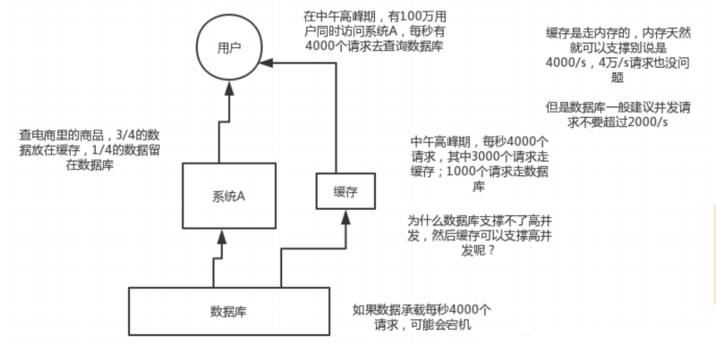

### Redis 和 Memcached 的区别

* redis 拥有更多的数据结构和丰富的数据操作
* redis 内存利用率高于 memcached
* redis 是单线程，memcached 是多线程，在存储大数据的情况下，redis 比 memcached 稍有逊色
* memcached 没有原生的集群模式，redis 官方支持 redis cluster 集群模式

### 用缓存可能出现的问题

* 数据不一致
* 缓存雪崩
* 缓存穿透
* 缓存并发竞争

### 当查询缓存报错，怎么提高可用性？

缓存可以极大的提高查询性能，但是缓存数据丢失和缓存不可用不能影响应用的正常工作。因此，一般情况下，如果缓存出现异常，需要手动捕获这个异常，并且记录日志，并且从数据库查询数据返回给用户，而不应该导致业务不可用。

### 如果避免缓存”穿透”的问题？

缓存穿透，是指查询一个一定不存在的数据，由于缓存是不命中时被动写，并且处于容错考虑，如果从 DB 查不到数据则不写入缓存，这将导致这个不存在的数据每次请求都要到 DB 去查询，失去了缓存的意义。

如何解决？有两种方案可以解决：

**方案一，缓存空对象。** 

当从 DB 查询数据为空，我们仍然将这个空结果进行缓存，具体的值需要使用特殊的标识，能和真正缓存的数据区分开。另外，需要设置较短的过期时间，一般建议不要超过 5 分钟。

**方案二，BloomFilter 布隆过滤器。** 

在缓存服务的基础上，构建 BloomFilter 数据结构，在 BloomFilter 中存储对应的 KEY 是否存在，如果存在，说明该 KEY 对应的值不为空。 

### 如何避免缓存“雪崩”的问题？

**缓存雪崩**

缓存雪崩，是指缓存由于某些原因无法提供服务( 例如，缓存挂掉了 )，所有请求全部达到 DB 中，导致 DB 负荷大增，最终挂掉的情况。

**如何解决**

预防和解决缓存雪崩的问题，可以从以下多个方面进行共同着手。

* 缓存高可用：通过搭建缓存的高可用，避免缓存挂掉导致无法提供服务的情况，从而降低出现缓存雪崩的情况。假设我们使用 Redis 作为缓存，则可以使用 Redis Sentinel 或 Redis Cluster 实现高可用。
* 本地缓存：如果使用本地缓存时，即使分布式缓存挂了，也可以将 DB 查询到的结果缓存到本地，避免后续请求全部到达 DB 中。如果我们使用 JVM ，则可以使用 Ehcache、Guava Cache 实现本地缓存的功能。

### 如果避免缓存“击穿”的问题？

**缓存击穿**

缓存击穿，是指某个极度“热点”数据在某个时间点过期时，恰好在这个时间点对这个 KEY 有大量的并发请求过来，这些请求发现缓存过期一般都会从 DB 加载数据并回设到缓存，但是这个时候大并发的请求可能会瞬间 DB 压垮。对于一些设置了过期时间的 KEY ，如果这些 KEY 可能会在某些时间点被超高并发地访问，是一种非常“热点”的数据。这个时候，需要考虑这个问题。

区别：

* 和缓存“雪崩“”的区别在于，前者针对某一 KEY 缓存，后者则是很多KEY 。
* 和缓存“穿透“”的区别在于，这个 KEY 是真实存在对应的值的。

**如何解决**

有两种方案可以解决：

* 方案一，使用互斥锁。请求发现缓存不存在后，去查询 DB 前，使用分布式锁，保证有且只有一个线程去查询 DB ，并更新到缓存。
* 方案二，手动过期。缓存上从不设置过期时间，功能上将过期时间存在 KEY 对应的 VALUE 里。流程如下：
  1. 获取缓存。通过 VALUE 的过期时间，判断是否过期。如果未过期，则直接返回；如果已过期，继续往下执行。
  2. 通过一个后台的异步线程进行缓存的构建，也就是“手动”过期。通过后台的异步线程，保证有且只有一个线程去查询 DB。
  3. 同时，虽然 VALUE 已经过期，还是直接返回。通过这样的方式，保证服务的可用性，虽然损失了一定的时效性。

### 什么是缓存预热？如何实现缓存预热？

**缓存预热**

在刚启动的缓存系统中，如果缓存中没有任何数据，如果依靠用户请求的方式重建缓存数据，那么对数据库的压力非常大，而且系统的性能开销也是巨大的。

此时，最好的策略是启动时就把热点数据加载好。这样，用户请求时，直接读取的就是缓存的数据，而无需去读取 DB 重建缓存数据。举个例子，热门的或者推荐的商品，需要提前预热到缓存中。

**如何实现**

一般来说，有如下几种方式来实现：

* 数据量不大时，项目启动时，自动进行初始化。
* 写个修复数据脚本，手动执行该脚本。
* 写个管理界面，可以手动点击，预热对应的数据到缓存中。

### 缓存数据的淘汰策略有哪些？

除了缓存服务器自带的缓存自动失效策略之外，我们还可以根据具体的业务需求进行自定义的“手动”缓存淘汰，常见的策略有两种：

1. 定时去清理过期的缓存。
2. 当有用户请求过来时，再判断这个请求所用到的缓存是否过期，过期的话就去底层系统得到新数据并更新缓存。

两者各有优劣，第一种的缺点是维护大量缓存的 key 是比较麻烦的，第二种的缺点就是每次用户请求过来都要判断缓存失效，逻辑相对比较复杂！具体用哪种方案，大家可以根据自己的应用场景来权衡。

## 高并发

### 高并发的解决方案

web服务器优化 ：负载均衡 
流量优化：防盗链处理 将恶意请求屏蔽，
前端优化：减少http请求、添加异步请求、启用浏览器缓存和文件压缩、cdn加速、建立独立的图片服务器、
服务端优化：  页面静态化、并发处理、队列处理、
数据库优化： 数据库缓存、分库分表、分区操作 、读写分离、负载均衡

### 如何处理负载、高并发

1、HTML静态化
其实大家都知道，效率最高、消耗最小的就是纯静态化的html页面，所以我们尽可能使我们的 网站上的页面采用静态页面来实现，这个最简单的方法其实也是最有效的方法。
2、图片服务器分离
把图片单独存储，尽量减少图片等大流量的开销，可以放在一些相关的平台上，如七牛等。
3、数据库集群和库表散列及缓存
数据库的并发连接为100，一台数据库远远不够，可以从读写分离、主从复制，数据库集群方面来着手。另外尽量减少数据库的访问，可以使用缓存数据库如memcache、redis。
4、镜像
尽量减少下载，可以把不同的请求分发到多个镜像端。
5、负载均衡：
Apache的最大并发连接为1500，只能增加服务器，可以从硬件上着手，如F5服务器。当然硬件的成本比较高，我们往往从软件方面着手。

负载均衡 （Load Balancing） 建立在现有网络结构之上，它提供了一种廉价有效透明的方法扩展网络设备和服务器的带宽、增加吞吐量、加强网络数据处理能力，同时能够提高网络的灵活性和可用性。目前使用最为广泛的负载均衡软件是Nginx、LVS、HAProxy。我分别来说下三种的优缺点:

**Nginx的优点是：**
工作在网络的7层之上，可以针对http应用做一些分流的策略，比如针对域名、目录结构，它的正则规则比HAProxy更为强大和灵活，这也是它目前广泛流行的主要原因之一，Nginx单凭这点可利用的场合就远多于LVS了。
Nginx对网络稳定性的依赖非常小，理论上能ping通就就能进行负载功能，这个也是它的优势之一；相反LVS对网络稳定性依赖比较大，这点本人深有体会；
Nginx安装和配置比较简单，测试起来比较方便，它基本能把错误用日志打印出来。LVS的配置、测试就要花比较长的时间了，LVS对网络依赖比较大。
可以承担高负载压力且稳定，在硬件不差的情况下一般能支撑几万次的并发量，负载度比LVS相对小些。
Nginx可以通过端口检测到服务器内部的故障，比如根据服务器处理网页返回的状态码、超时等等，并且会把返回错误的请求重新提交到另一个节点，不过其中缺点就是不支持url来检测。比如用户正在上传一个文件，而处理该上传的节点刚好在上传过程中出现故障，Nginx会把上传切到另一台服务器重新处理，而LVS就直接断掉了，如果是上传一个很大的文件或者很重要的文件的话，用户可能会因此而不满。
Nginx不仅仅是一款优秀的负载均衡器/反向代理软件，它同时也是功能强大的Web应用服务器。LNMP也是近几年非常流行的web架构，在高流量的环境中稳定性也很好。
Nginx现在作为Web反向加速缓存越来越成熟了，速度比传统的Squid服务器更快，可以考虑用其作为反向代理加速器。
Nginx可作为中层反向代理使用，这一层面Nginx基本上无对手，唯一可以对比Nginx的就只有 lighttpd了，不过 lighttpd目前还没有做到Nginx完全的功能，配置也不那么清晰易读，社区资料也远远没Nginx活跃。
Nginx也可作为静态网页和图片服务器，这方面的性能也无对手。还有Nginx社区非常活跃，第三方模块也很多。

**Nginx的缺点是：**
Nginx仅能支持http、https和Email协议，这样就在适用范围上面小些，这个是它的缺点。
对后端服务器的健康检查，只支持通过端口来检测，不支持通过url来检测。不支持Session的直接保持，但能通过ip_hash来解决。
LVS：使用Linux内核集群实现一个高性能、高可用的负载均衡服务器，它具有很好的可伸缩性（Scalability)、可靠性（Reliability)和可管理性（Manageability)。

**LVS的优点是：**

抗负载能力强、是工作在网络4层之上仅作分发之用，没有流量的产生，这个特点也决定了它在负载均衡软件里的性能最强的，对内存和cpu资源消耗比较低。

配置性比较低，这是一个缺点也是一个优点，因为没有可太多配置的东西，所以并不需要太多接触，大大减少了人为出错的几率。

工作稳定，因为其本身抗负载能力很强，自身有完整的双机热备方案，如LVS+Keepalived，不过我们在项目实施中用得最多的还是LVS/DR+Keepalived。

无流量，LVS只分发请求，而流量并不从它本身出去，这点保证了均衡器IO的性能不会受到大流量的影响。

应用范围比较广，因为LVS工作在4层，所以它几乎可以对所有应用做负载均衡，包括http、数据库、在线聊天室等等。

**LVS的缺点是：**

软件本身不支持正则表达式处理，不能做动静分离；而现在许多网站在这方面都有较强的需求，这个是Nginx/HAProxy+Keepalived的优势所在。

如果是网站应用比较庞大的话，LVS/DR+Keepalived实施起来就比较复杂了，特别后面有 Windows Server的机器的话，如果实施及配置还有维护过程就比较复杂了，相对而言，Nginx/HAProxy+Keepalived就简单多了。

**HAProxy的特点是：**

HAProxy也是支持虚拟主机的。

HAProxy的优点能够补充Nginx的一些缺点，比如支持Session的保持，Cookie的引导；同时支持通过获取指定的url来检测后端服务器的状态。

HAProxy跟LVS类似，本身就只是一款负载均衡软件；单纯从效率上来讲HAProxy会比Nginx有更出色的负载均衡速度，在并发处理上也是优于Nginx的。

HAProxy支持TCP协议的负载均衡转发，可以对MySQL读进行负载均衡，对后端的MySQL节点进行检测和负载均衡，大家可以用LVS+Keepalived对MySQL主从做负载均衡。

HAProxy负载均衡策略非常多，HAProxy的负载均衡算法现在具体有如下8种：

① roundrobin，表示简单的轮询，这个不多说，这个是负载均衡基本都具备的；

② static-rr，表示根据权重，建议关注；

③ leastconn，表示最少连接者先处理，建议关注；

④ source，表示根据请求源IP，这个跟Nginx的IP_hash机制类似，我们用其作为解决session问题的一种方法，建议关注；

⑤ ri，表示根据请求的URI；

⑥ rl_param，表示根据请求的URl参数’balance url_param’ requires an URL parameter name；

⑦ hdr(name)，表示根据HTTP请求头来锁定每一次HTTP请求；

⑧ rdp-cookie(name)，表示根据据cookie(name)来锁定并哈希每一次TCP请求。

**Nginx和LVS对比的总结：**

Nginx工作在网络的7层，所以它可以针对http应用本身来做分流策略，比如针对域名、目录结构等，相比之下LVS并不具备这样的功能，所以Nginx单凭这点可利用的场合就远多于LVS了；但Nginx有用的这些功能使其可调整度要高于LVS，所以经常要去触碰触碰，触碰多了，人为出问题的几率也就会大。

Nginx对网络稳定性的依赖较小，理论上只要ping得通，网页访问正常，Nginx就能连得通，这是Nginx的一大优势！Nginx同时还能区分内外网，如果是同时拥有内外网的节点，就相当于单机拥有了备份线路；LVS就比较依赖于网络环境，目前来看服务器在同一网段内并且LVS使用direct方式分流，效果较能得到保证。另外注意，LVS需要向托管商至少申请多一个ip来做Visual IP，貌似是不能用本身的IP来做VIP的。要做好LVS管理员，确实得跟进学习很多有关网络通信方面的知识，就不再是一个HTTP那么简单了。

Nginx安装和配置比较简单，测试起来也很方便，因为它基本能把错误用日志打印出来。LVS的安装和配置、测试就要花比较长的时间了；LVS对网络依赖比较大，很多时候不能配置成功都是因为网络问题而不是配置问题，出了问题要解决也相应的会麻烦得多。

Nginx也同样能承受很高负载且稳定，但负载度和稳定度差LVS还有几个等级：Nginx处理所有流量所以受限于机器IO和配置；本身的bug也还是难以避免的。

Nginx可以检测到服务器内部的故障，比如根据服务器处理网页返回的状态码、超时等等，并且会把返回错误的请求重新提交到另一个节点。目前LVS中 ldirectd也能支持针对服务器内部的情况来监控，但LVS的原理使其不能重发请求。比如用户正在上传一个文件，而处理该上传的节点刚好在上传过程中出现故障，Nginx会把上传切到另一台服务器重新处理，而LVS就直接断掉了，如果是上传一个很大的文件或者很重要的文件的话，用户可能会因此而恼火。

Nginx对请求的异步处理可以帮助节点服务器减轻负载，假如使用 apache直接对外服务，那么出现很多的窄带链接时apache服务器将会占用大 量内存而不能释放，使用多一个Nginx做apache代理的话，这些窄带链接会被Nginx挡住，apache上就不会堆积过多的请求，这样就减少了相当多的资源占用。这点使用squid也有相同的作用，即使squid本身配置为不缓存，对apache还是有很大帮助的。

Nginx能支持http、https和email（email的功能比较少用），LVS所支持的应用在这点上会比Nginx更多。在使用上，一般最前端所采取的策略应是LVS，也就是DNS的指向应为LVS均衡器，LVS的优点令它非常适合做这个任务。重要的ip地址，最好交由LVS托管，比如数据库的 ip、webservice服务器的ip等等，这些ip地址随着时间推移，使用面会越来越大，如果更换ip则故障会接踵而至。所以将这些重要ip交给 LVS托管是最为稳妥的，这样做的唯一缺点是需要的VIP数量会比较多。Nginx可作为LVS节点机器使用，一是可以利用Nginx的功能，二是可以利用Nginx的性能。当然这一层面也可以直接使用squid，squid的功能方面就比Nginx弱不少了，性能上也有所逊色于Nginx。Nginx也可作为中层代理使用，这一层面Nginx基本上无对手，唯一可以撼动Nginx的就只有lighttpd了，不过lighttpd目前还没有能做到 Nginx完全的功能，配置也不那么清晰易读。另外，中层代理的IP也是重要的，所以中层代理也拥有一个VIP和LVS是最完美的方案了。具体的应用还得具体分析，如果是比较小的网站（日PV小于1000万），用Nginx就完全可以了，如果机器也不少，可以用DNS轮询，LVS所耗费的机器还是比较多的；大型网站或者重要的服务，机器不发愁的时候，要多多考虑利用LVS。

## Elasticsearch

### 为什么要使用 Elasticsearch?

系统中的数据，随着业务的发展，时间的推移，将会非常多，而业务中往往采用模糊查询进行数据的搜索，而模糊查询会导致查询引擎放弃索引，导致系统查询数据时都是全表扫描，在百万级别的数据库中，查询效率是非常低下的，而我们使用 ES 做一个全文索引，将经常查询的系统功能的某些字段，比如说电商系统的商品表中商品名，描述、价格还有 id 这些字段我们放入 ES 索引库里，可以提高查询速度。

### Elasticsearch 的 master 选举流程？

* Elasticsearch 的选主是 ZenDiscovery 模块负责的，主要包含 Ping（节点之间通过这个 RPC 来发现彼此）和 Unicast（单播模块包含一个主机列表以控制哪些节点需要 ping 通）这两部分。
* 对所有可以成为 master 的节点（node.master: true）根据 nodeId 字典排序，每次选举每个节点都把自己所知道节点排一次序，然后选出第一个（第 0 位）节点，暂且认为它是 master 节点。
* 如果对某个节点的投票数达到一定的值（可以成为 master 节点数 n/2+1）并且该节点自己也选举自己，那这个节点就是 master。否则重新选举一直到满足上述条件。
* master 节点的职责主要包括集群、节点和索引的管理，不负责文档级别的管理；data 节点可以关闭 http 功能。

### Elasticsearch 集群脑裂问题？

**“脑裂” 问题可能的成因:**

* **网络问题：**集群间的网络延迟导致一些节点访问不到 master，认为 master 挂掉了从而选举出新的 master，并对 master 上的分片和副本标红，分配新的主分片。

* **节点负载：**主节点的角色既为 master 又为 data，访问量较大时可能会导致 ES 停止响应造成大面积延迟，此时其他节点得不到主节点的响应认为主节点挂掉了，会重新选取主节点。

* **内存回收：**data 节点上的 ES 进程占用的内存较大，引发 JVM 的大规模内存回收，造成 ES 进程失去响应。

**“脑裂” 问题解决方案：**

* **减少误判：**`discovery.zen.ping_timeout` 节点状态的响应时间，默认为 3s，可以适当调大，如果 master 在该响应时间的范围内没有做出响应应答，判断该节点已经挂掉了。调大参数（如 6s，`discovery.zen.ping_timeout:6`），可适当减少误判。
* **选举触发:** `discovery.zen.minimum_master_nodes:1` 该参数是用于控制选举行为发生的最小集群主节点数量。当备选主节点的个数大于等于该参数的值，且备选主节点中有该参数个节点认为主节点挂了，进行选举。官方建议为 `(n/2)+1`，n 为主节点个数（即有资格成为主节点的节点个数）。
* **角色分离：**即 master 节点与 data 节点分离，限制角色，主节点配置为：`node.master: true node.data: false`，从节点配置为：`node.master: false node.data: true`。

### Elasticsearch 索引文档的流程？

* 协调节点默认使用文档 ID 参与计算（也支持通过 routing），以便为路由提供合适的分片：`shard = hash(document_id) % (num_of_primary_shards)`。
* 当分片所在的节点接收到来自协调节点的请求后，会将请求写入到 Memory Buffer，然后定时（默认是每隔 1 秒）写入到 Filesystem Cache，这个从 Memory Buffer 到 Filesystem Cache 的过程就叫做 refresh。
* 当然在某些情况下，存在 Momery Buffer 和 Filesystem Cache 的数据可能会丢失，ES 是通过 translog 的机制来保证数据的可靠性的。其实现机制是接收到请求后，同时也会写入到 translog 中，当 Filesystem cache 中的数据写入到磁盘中时，才会清除掉，这个过程叫做 flush。
* 在 flush 过程中，内存中的缓冲将被清除，内容被写入一个新段，段的 fsync 将创建一个新的提交点，并将内容刷新到磁盘，旧的translog 将被删除并开始一个新的 translog。
* flush 触发的时机是定时触发（默认 30 分钟）或者 translog 变得太大（默认为 512M）时。

### Elasticsearch 更新和删除文档的流程？

* 删除和更新也都是写操作，但是 Elasticsearch 中的文档是不可变的，因此不能被删除或者改动以展示其变更。
* 磁盘上的每个段都有一个相应的 .del 文件。当删除请求发送后，文档并没有真的被删除，而是在 .del 文件中被标记为删除。该文档依然能匹配查询，但是会在结果中被过滤掉。当段合并时，在 .del 文件中被标记为删除的文档将不会被写入新段。
* 在新的文档被创建时，Elasticsearch 会为该文档指定一个版本号，当执行更新时，旧版本的文档在 .del 文件中被标记为删除，新版本的文档被索引到一个新段。旧版本的文档依然能匹配查询，但是会在结果中被过滤掉。

### Elasticsearch 搜索的流程？

* 搜索被执行成一个两阶段过程，我们称之为 Query Then Fetch。
* 在初始查询阶段时，查询会广播到索引中每一个分片拷贝（主分片或者副本分片）。 每个分片在本地执行搜索并构建一个匹配文档的大小为 from + size 的优先队列。PS：在搜索的时候是会查询 Filesystem Cache 的，但是有部分数据还在 Memory Buffer，所以搜索是近实时的。
* 每个分片返回各自优先队列中 所有文档的 ID 和排序值 给协调节点，它合并这些值到自己的优先队列中来产生一个全局排序后的结果列表。
* 接下来就是取回阶段，协调节点辨别出哪些文档需要被取回并向相关的分片提交多个 GET 请求。每个分片加载并丰富文档，如果有需要的话，接着返回文档给协调节点。一旦所有的文档都被取回了，协调节点返回结果给客户端。
* Query Then Fetch 的搜索类型在文档相关性打分的时候参考的是本分片的数据，这样在文档数量较少的时候可能不够准确，DFS Query Then Fetch 增加了一个预查询的处理，询问 Term 和 Document frequency，这个评分更准确，但是性能会变差。

### Elasticsearch 在部署时，对 Linux 的设置有哪些优化方法？

* 64 GB 内存的机器是非常理想的，但是 32 GB 和 16 GB 机器也是很常见的。少于 8 GB 会适得其反。
* 如果你要在更快的 CPUs 和更多的核心之间选择，选择更多的核心更好。多个内核提供的额外并发远胜过稍微快一点点的时钟频率。
* 如果你负担得起 SSD，它将远远超出任何旋转介质。 基于 SSD 的节点，查询和索引性能都有提升。如果你负担得起，SSD 是一个好的选择。
* 即使数据中心们近在咫尺，也要避免集群跨越多个数据中心。绝对要避免集群跨越大的地理距离。
* 请确保运行你应用程序的 JVM 和服务器的 JVM 是完全一样的。 在 Elasticsearch 的几个地方，使用 Java 的本地序列化。
* 通过设置 `gateway.recover_after_nodes`、`gateway.expected_nodes`、`gateway.recover_after_time` 可以在集群重启的时候避免过多的分片交换，这可能会让数据恢复从数个小时缩短为几秒钟。
* Elasticsearch 默认被配置为使用单播发现，以防止节点无意中加入集群。只有在同一台机器上运行的节点才会自动组成集群。最好使用单播代替组播。
* 不要随意修改垃圾回收器（CMS）和各个线程池的大小。
* 把你的内存的（少于）一半给 Lucene（但不要超过 32 GB！），通过 `ES_HEAP_SIZE` 环境变量设置。
* 内存交换到磁盘对服务器性能来说是致命的。如果内存交换到磁盘上，一个 100 微秒的操作可能变成 10 毫秒。 再想想那么多 10 微秒的操作时延累加起来。 不难看出 swapping 对于性能是多么可怕。
* Lucene 使用了大量的文件。同时，Elasticsearch 在节点和 HTTP 客户端之间进行通信也使用了大量的套接字。 所有这一切都需要足够的文件描述符。你应该增加你的文件描述符，设置一个很大的值，如 64,000。

**补充：索引阶段性能提升方法**

* 使用批量请求并调整其大小：每次批量数据 5–15 MB 大是个不错的起始点。
* 存储：使用 SSD
* 段和合并：Elasticsearch 默认值是 20 MB/s，对机械磁盘应该是个不错的设置。如果你用的是 SSD，可以考虑提高到 100–200 MB/s。如果你在做批量导入，完全不在意搜索，你可以彻底关掉合并限流。另外还可以增加 index.translog.flush_threshold_size 设置，从默认的 512 MB 到更大一些的值，比如 1 GB，这可以在一次清空触发的时候在事务日志里积累出更大的段。
* 如果你的搜索结果不需要近实时的准确度，考虑把每个索引的 index.refresh_interval 改到 30s。  如果你在做大批量导入，考虑通过设置 index.number_of_replicas: 0 关闭副本。

### GC 方面，在使用 Elasticsearch 时要注意什么？

* 倒排词典的索引需要常驻内存，无法 GC，需要监控 data node 上 segment memory 增长趋势。
* 各类缓存，field cache, filter cache, indexing cache, bulk queue 等等，要设置合理的大小，并且要应该根据最坏的情况来看 heap 是否够用，也就是各类缓存全部占满的时候，还有 heap 空间可以分配给其他任务吗？避免采用 clear cache 等“自欺欺人”的方式来释放内存。
* 避免返回大量结果集的搜索与聚合。确实需要大量拉取数据的场景，可以采用 scan & scroll api 来实现。
* cluster stats 驻留内存并无法水平扩展，超大规模集群可以考虑分拆成多个集群通过 tribe node 连接。
* 想知道 heap 够不够，必须结合实际应用场景，并对集群的 heap 使用情况做持续的监控。

### Elasticsearch 对于大数据量（上亿量级）的聚合如何实现？

Elasticsearch 提供的首个近似聚合是 cardinality 度量。它提供一个字段的基数，即该字段的 distinct 或者 unique 值的数目。它是基于 HLL 算法的。HLL 会先对我们的输入作哈希运算，然后根据哈希运算的结果中的 bits 做概率估算从而得到基数。其特点是：可配置的精度，用来控制内存的使用（更精确 ＝ 更多内存）；小的数据集精度是非常高的；我们可以通过配置参数，来设置去重需要的固定内存使用量。无论数千还是数十亿的唯一值，内存使用量只与你配置的精确度相关。

### 在并发情况下，Elasticsearch 如果保证读写一致？

* 可以通过版本号使用乐观并发控制，以确保新版本不会被旧版本覆盖，由应用层来处理具体的冲突。
* 另外对于写操作，一致性级别支持 quorum/one/all，默认为 quorum，即只有当大多数分片可用时才允许写操作。但即使大多数可用，也可能存在因为网络等原因导致写入副本失败，这样该副本被认为故障，分片将会在一个不同的节点上重建。
* 对于读操作，可以设置 replication 为 sync(默认)，这使得操作在主分片和副本分片都完成后才会返回；如果设置 replication 为 async 时，也可以通过设置搜索请求参数 _preference 为 primary 来查询主分片，确保文档是最新版本。

### 如何监控 Elasticsearch 集群状态？

elasticsearch-head 插件

通过 Kibana 监控 Elasticsearch。你可以实时查看你的集群健康状态和性能，也可以分析过去的集群、索引和节点指标。

### 是否了解字典树？

常用字典数据结构如下所示：

字典树又称单词查找树，Trie 树，是一种树形结构，是一种哈希树的变种。典型应用是用于统计，排序和保存大量的字符串（但不仅限于字符串），所以经常被搜索引擎系统用于文本词频统计。它的优点是：利用字符串的公共前缀来减少查询时间，最大限度地减少无谓的字符串比较，查询效率比哈希树高。

Trie 的核心思想是空间换时间，利用字符串的公共前缀来降低查询时间的开销以达到提高效率的目的。它有 3 个基本性质:

* 根节点不包含字符，除根节点外每一个节点都只包含一个字符。

* 从根节点到某一节点，路径上经过的字符连接起来，为该节点对应的字符串。

* 每个节点的所有子节点包含的字符都不相同。


对于中文的字典树，每个节点的子节点用一个哈希表存储，这样就不用浪费太大的空间，而且查询速度上可以保留哈希的复杂度 O(1)。

### Elasticsearch 中的集群、节点、索引、文档、类型是什么？

* 集群是一个或多个节点（服务器）的集合，它们共同保存您的整个数据，并提供跨所有节点的联合索引和搜索功能。群集由唯一名称标识，默认情况下为 “elasticsearch”。此名称很重要，因为如果节点设置为按名称加入群集，则该节点只能是群集的一部分。
* 节点是属于集群一部分的单个服务器。它存储数据并参与群集索引和搜索功能。
* 索引就像关系数据库中的 “数据库”。它有一个定义多种类型的映射。索引是逻辑名称空间，映射到一个或多个主分片，并且可以有零个或多个副本分片。 MySQL=>数据库 Elasticsearch=>索引
* 文档类似于关系数据库中的一行。不同之处在于索引中的每个文档可以具有不同的结构（字段），但是对于通用字段应该具有相同的数据类型。 MySQL => Databases => Tables => Columns / Rows Elasticsearch => Indices => Types =>具有属性的文档
* 类型是索引的逻辑类别/分区，其语义完全取决于用户。

### Elasticsearch 中的倒排索引是什么？

倒排索引是搜索引擎的核心。搜索引擎的主要目标是在查找发生搜索条件的文档时提供快速搜索。ES中的倒排索引其实就是 lucene 的倒排索引，区别于传统的正向索引，倒排索引会再存储数据时将关键词和数据进行关联，保存到倒排表中，然后查询时，将查询内容进行分词后在倒排表中进行查询，最后匹配数据即可。

### 深度分页会有什么问题（滴滴 百度 陌陌）

### 倒排索引的原理（字节 高德）

### lsm 树原理（字节）

## 系统设计

- 设计秒杀系统，需要支持 100W 以上 QPS（滴滴）
- 设计微博首页，需要拉取所有关注用户的最近 20 条微博（百度）
- 抢红包算法设计（百度 滴滴）
- 设计一个短链系统（百度）

## 其他

- 布隆过滤器的实现原理和使用场景（滴滴）
- 进程间通信有哪几种方式（腾讯）
- 进程线程协程区别（滴滴 知乎）
- lvs 原理，如何保证高可用（滴滴）
- 502 504 什么原因，如何处理（滴滴 百度 腾讯 顺丰）
- 给你两个一模一样的玻璃球，求出 100 层楼哪一层开始玻璃球会被摔碎（腾讯）
- 一致性 hash 原理，怎么解决节点少数据倾斜的问题（滴滴 陌陌）