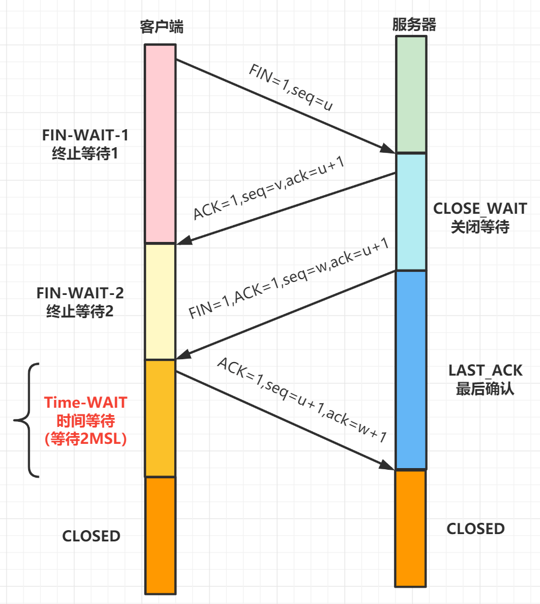

## 基础

### 计算机网络体系结构

计算机网路体系结构主要有

* ISO 七层模型
* TCP/IP 四层模型
* 五层体系结构


**ISO 七层模型**

ISO 七层模型是国际标准化组织（ISO）制定的一个用于计算机或通信系统间互联的标准体系。

- 应用层：网络服务与最终用户的一个接口，协议有：**HTTP FTP TFTP SMTP SNMP DNS TELNET HTTPS POP3 DHCP**
- 表示层：数据的表示、安全、压缩。
- 会话层：建立、管理、终止会话。对应主机进程，指本地主机与远程主机正在进行的会话
- 传输层：定义传输数据的协议端口号，以及流控和差错校验。协议有：**TCP UDP，数据包一旦离开网卡即进入网络传输层**
- 网络层：进行逻辑地址寻址，实现不同网络之间的路径选择。协议有：**ICMP IGMP IP（IPV4 IPV6）**
- 数据链路层：建立逻辑连接、进行硬件地址寻址、差错校验等功能。
- 物理层：建立、维护、断开物理连接。

**TCP/IP 四层模型**

- 应用层：对应于 OSI 参考模型的（应用层、表示层、会话层），为用户提供所需要的各种服务，例如：FTP、Telnet、DNS、SMTP 等
- 传输层：对应 OSI 的传输层，为应用层实体提供端到端的通信功能，保证了数据包的顺序传送及数据的完整性。定义了 TCP 和 UDP 两层协议。
- 网际层：对应于 OSI 参考模型的网络层，主要解决主机到主机的通信问题。三个主要协议：网际协议（IP）、互联网组管理协议（IGMP）和互联网控制报文协议（ICMP）
- 网络接口层：与 OSI 参考模型的数据链路层、物理层对应。它负责监视数据在主机和网络之间的交换。

**五层体系结构**

- 应用层：通过应用进程间的交互来完成特定网络应用。对应于 OSI 参考模型的（应用层、表示层、会话层），应用层协议很多，如**域名系统 DNS**，HTTP 协议，支持电子邮件的 **SMTP 协议**等等。我们把应用层交互的数据单元称为报文。
- 传输层：负责向两台主机进程之间的通信提供通用的数据传输服务。对应 OSI 参考模型的传输层，协议有传输控制协议 TCP 和 用户数据协议 UDP。
- 网络层：对应 OSI 参考模型的的网络层
- 数据链路层：对应 OSI 参考模型的的数据链路层
- 物理层：对应 OSI 参考模型的的物理层层。在物理层上所传送的数据单位是比特。 物理层 (physical layer) 的作用是实现相邻计算机节点之间比特流的透明传送，尽可能屏蔽掉具体传输介质和物理设备的差异。

### 常用端口及对应的服务

| 端口 | 服务                     |
| ---- | ------------------------ |
| 21   | FTP（文件传输协议）      |
| 22   | SSH                      |
| 23   | Telnet（远程登录）服务   |
| 25   | SMTP（简单邮件传输协议） |
| 53   | DNS 域名服务器           |
| 80   | HTTP 超文本传输协议      |
| 110  | POP3 邮件协议            |
| 443  | HTTPS                    |
| 1080 | Sockets                  |
| 1521 | Oracle 数据库默认端口    |
| 3306 | MySQL 服务默认端口       |
| 6379 | Redis                    |

## HTTP 相关

### HTTP 协议实现了什么

1. 客户与服务器建立连接 tcp
2. 客户向服务器提出请求
3. 服务器接受请求，并根据请求返回相应的文件作为应答
4. 客户与服务器关闭连接。

### HTTP 与 HTTPS 的区别

HTTP，超文本传输协议，英文是 **Hyper Text Transfer Protocol**，是一个基于 TCP/IP 通信协议来传递数据的协议。HTTP 存在这**几个问题**：

- 请求信息明文传输，容易被窃听截取。
- 数据的完整性未校验，容易被篡改
- 没有验证对方身份，存在冒充危险

HTTPS 就是为了解决 HTTP 存在问题的。HTTPS，英文是 HyperText Transfer Protocol over Secure Socket Layer，可以这么理解 Https 是身披 SSL (Secure Socket Layer) 的 HTTP，即 **HTTPS 协议 = HTTP+SSL/TLS**。通过 SSL 证书来验证服务器的身份，并为浏览器和服务器之间的传输数据进行**加密**。

它们主要区别：

- https 协议需要到 ca 申请证书，一般免费证书很少，需要交费。
- http 是超文本传输协议，信息是明文传输，https 则是具有安全性的 ssl 加密传输协议。
- http 和 https 使用的是完全不同的连接方式用的端口也不一样，前者是 80，后者是 443。
- http 的连接很简单，是无状态的 。
- https 协议是由 ssl + http 协议构建的可进行加密传输、身份认证的网络协议， 要比 http 协议安全。
- https 通信比 http 会消耗更多的 CPU 和内存资源，因为需要加解密处理。

### HTTP 常用的状态码及含义

- 1xx：接受的请求正在处理 （信息性状态码）
- 2xx：表示请求正常处理完毕 （成功状态码）
- 3xx：表示重定向状态，需要重新请求 （重定向状态码）
- 4xx：服务器无法处理请求 （客户端错误状态码）
- 5xx：服务器处理请求出错 （服务端错误状态码）

**常用状态码如下：**

- 101 切换请求协议，从 HTTP 切换到 WebSocket
- 200 请求成功，表示正常返回信息。
- 301 永久重定向，会缓存
- 302 临时重定向，不会缓存
- 400 请求错误
- 403 服务器禁止访问
- 404 找不到与 URI 相匹配的资源。
- 500 常见的服务器端错误

### HTTP 常用的请求方式

- **GET**: 发送请求，获取服务器数据
- **POST**：向 URL 指定的资源提交数据
- **PUT**：向服务器提交数据，以修改数据
- **HEAD**: 请求页面的首部，获取资源的元信息
- **DELETE**：删除服务器上的某些资源。
- **CONNECT**：建立连接隧道，用于代理服务器；
- **OPTIONS**：列出可对资源实行的请求方法，常用于跨域
- **TRACE**：追踪请求 - 响应的传输路径

### GET 和 POST 区别

- get 方法一般用于请求，比如你在浏览器地址栏输入 `www.cxuanblog.com` 其实就是发送了一个 get 请求，它的主要特征是请求服务器返回资源，而 **post 方法一般用于```表单`的提交，相当于是把信息提交给服务器，等待服务器作出响应**，get 相当于一个是 pull/拉的操作，而 post 相当于是一个 push/推的操作。
- **get 方法是不安全的**，因为你在发送请求的过程中，你的请求参数会拼在 URL 后面，从而导致容易被攻击者窃取，对你的信息造成破坏和伪造；而 **post 方法是把参数放在请求体 body 中的，这对用户来说不可见。**
- get 请求的 URL 有长度限制，**这个限制是**浏览器或者服务器给添加的，http协议并没有对url长度进行限制，目的是为了保证服务器和浏览器能够正常运行，防止有人恶意发送请求。而 post 请求会把参数和值放在消息体中，对数据长度没有要求。
- get 请求会被浏览器主动 cache，而 post 不会，除非手动设置。
- **get 请求在发送过程中会产生一个 TCP 数据包；post 在发送过程中会产生两个 TCP 数据包**。对于 get 方式的请求，浏览器会把 http header 和 data 一并发送出去，服务器响应 200（返回数据）；而对于 post，**浏览器先发送 header，服务器响应 100 continue，浏览器再发送 data，服务器响应 200 ok**（返回数据）。

---

- **请求参数**：GET 把参数包含在 URL 中，用 & 连接起来；POST 通过 request body 传递参数。
- **请求缓存**：GET 请求会被主动 Cache，而 POST 请求不会，除非手动设置。
- **收藏为书签**：GET 请求支持收藏为书签，POST 请求不支持。
- **安全性**：POST 比 GET 安全，GET 请求在浏览器回退时是无害的，而 POST 会再次请求。
- **历史记录**：GET 请求参数会被完整保留在浏览历史记录里，而 POST 中的参数不会被保留。
- **编码方式**：GET 请求只能进行 url 编码，而 POST 支持多种编码方式。
- **参数数据类型**：GET 只接受 ASCII 字符，而 POST 没有限制数据类型。
- **数据包**: GET 产生一个 TCP 数据包；POST 可能产生两个 TCP 数据包。

### 常见的 HTTP 状态码以及含义

1xx消息：这一类型的状态码，代表请求已被接受，需要继续处理。由于HTTP/1.0协议中没有定义任何1xx状态码，所以除非在某些试验条件下，服务器禁止向此类客户端发送1xx响应。

2xx成功：这一类型的状态码，代表请求已成功被服务器接收、理解、并接受
200 OK：请求已成功，请求所希望的响应头或数据体将随此响应返回。实际的响应将取决于所使用的请求方法。在GET请求中，响应将包含与请求的资源相对应的实体。在POST请求中，响应将包含描述或操作结果的实体
202 Accepted：服务器已接受请求，但尚未处理。最终该请求可能会也可能不会被执行，并且可能在处理发生时被禁止。
204 No Content：服务器成功处理了请求，没有返回任何内容

3xx重定向：这类状态码代表需要客户端采取进一步的操作才能完成请求。通常，这些状态码用来重定向，后续的请求地址（重定向目标）在本次响应的Location域中指明。
301 Moved Permanently：被请求的资源已永久移动到新位置，并且将来任何对此资源的引用都应该使用本响应返回的若干个URI之一。如果可能，拥有链接编辑功能的客户端应当自动把请求的地址修改为从服务器反馈回来的地址。除非额外指定，否则这个响应也是可缓存的。新的永久性的URI应当在响应的Location域中返回。除非这是一个HEAD请求，否则响应的实体中应当包含指向新的URI的超链接及简短说明。如果这不是一个GET或者HEAD请求，那么浏览器禁止自动进行重定向，除非得到用户的确认，因为请求的条件可能因此发生变化。注意：对于某些使用HTTP/1.0协议的浏览器，当它们发送的POST请求得到了一个301响应的话，接下来的重定向请求将会变成GET方式。
4xx客户端错误：这类的状态码代表了客户端看起来可能发生了错误，妨碍了服务器的处理。除非响应的是一个HEAD请求，否则服务器就应该返回一个解释当前错误状况的实体，以及这是临时的还是永久性的状况。这些状态码适用于任何请求方法。浏览器应当向用户显示任何包含在此类错误响应中的实体内容
400 Bad Request：由于明显的客户端错误（例如，格式错误的请求语法，太大的大小，无效的请求消息或欺骗性路由请求），服务器不能或不会处理该请求
401 Unauthorized：类似于403 Forbidden，401语义即“未认证”，即用户没有必要的凭据。[32]该状态码表示当前请求需要用户验证。该响应必须包含一个适用于被请求资源的WWW-Authenticate信息头用以询问用户信息。客户端可以重复提交一个包含恰当的Authorization头信息的请求。
403 Forbidden：服务器已经理解请求，但是拒绝执行它。与401响应不同的是，身份验证并不能提供任何帮助，而且这个请求也不应该被重复提交。如果这不是一个HEAD请求，而且服务器希望能够讲清楚为何请求不能被执行，那么就应该在实体内描述拒绝的原因。当然服务器也可以返回一个404响应，假如它不希望让客户端获得任何信息。
404 Not Found：请求失败，请求所希望得到的资源未被在服务器上发现，但允许用户的后续请求。[35]没有信息能够告诉用户这个状况到底是暂时的还是永久的。假如服务器知道情况的话，应当使用410状态码来告知旧资源因为某些内部的配置机制问题，已经永久的不可用，而且没有任何可以跳转的地址。404这个状态码被广泛应用于当服务器不想揭示到底为何请求被拒绝或者没有其他适合的响应可用的情况下。
405 Method Not Allowed：请求行中指定的请求方法不能被用于请求相应的资源。
408 Request Timeout：请求超时
5xx服务器错误：表示服务器无法完成明显有效的请求。[56]这类状态码代表了服务器在处理请求的过程中有错误或者异常状态发生，也有可能是服务器意识到以当前的软硬件资源无法完成对请求的处理。除非这是一个HEAD请求，否则服务器应当包含一个解释当前错误状态以及这个状况是临时的还是永久的解释信息实体。浏览器应当向用户展示任何在当前响应中被包含的实体。这些状态码适用于任何响应方法
500 Internal Server Error：通用错误消息，服务器遇到了一个未曾预料的状况，导致了它无法完成对请求的处理。没有给出具体错误信息
502 Bad Gateway：作为网关或者代理工作的服务器尝试执行请求时，从上游服务器接收到无效的响应
503 Service Unavailable：由于临时的服务器维护或者过载，服务器当前无法处理请求。这个状况是暂时的，并且将在一段时间以后恢复。
504 Gateway Timeout：作为网关或者代理工作的服务器尝试执行请求时，未能及时从上游服务器（URI标识出的服务器，例如HTTP、FTP、LDAP）或者辅助服务器（例如DNS）收到响应。注意：某些代理服务器在DNS查询超时时会返回400或者500错误。

### HTTP 1.0，1.1，2.0 的版本区别

**HTTP 1.0**

- HTTP 1.0 规定浏览器与服务器只保持**短暂的连接**，浏览器的每次请求都需要与服务器建立一个 TCP 连接，服务器完成请求处理后立即断开 TCP 连接。它也可以强制开启长链接，例如设置 `Connection: keep-alive` 这个字段

**HTTP 1.1**

- 引入了长连接，即 **TCP 连接默认不关闭，可以被多个请求复用**。
- 引入了管道机制（pipelining），即在同一个 TCP 连接里面，客户端可以同时发送多个请求。
- 缓存处理，引入了更多的缓存控制策略，如 `Cache-Control`、`Etag/If-None-Match` 等。
- 错误状态管理，新增了 24 个错误状态响应码，如 409 表示请求的资源与资源的当前状态发生冲突。

**HTTP 2**

- 采用了**多路复用**，即在一个连接里，客户端和浏览器都可以同时发送多个请求或回应，而且不用按照顺序一一对应。
- 服务端推送，HTTP 2 允许服务器未经请求，主动向客户端发送资源

总结：HTTP 1.0 默认是**短连接**，可以强制开启，HTTP 1.1 默认**长连接**，HTTP 2.0 采用**多路复用**

### HTTP 如何实现长连接？在什么时候会超时？

**HTTP 如何实现长连接？**

- HTTP 分为长连接和短连接，其实**本质上说的是 TCP 的长短连接**。TCP 连接是一个双向的通道，它是可以保持一段时间不关闭的，因此 TCP 连接才有真正的长连接和短连接这一个说法。
- 长连接是指的是 TCP 连接，而不是 HTTP 连接。
- TCP 长连接可以复用一个 TCP 连接来发起多次 HTTP 请求，这样可以减少资源消耗，比如一次请求 HTML，短连接可能还需要请求后续的 JS/CSS/ 图片等

要实现 HTTP 长连接，在响应头设置 **Connection 为 keep-alive**，HTTP1.1 默认是长连接，而 HTTP 1.0 协议也支持长连接，但是默认是关闭的。

**在什么时候会超时呢？**

- HTTP 一般会有 httpd 守护进程，里面可以设置 keep-alive timeout，当 tcp 链接闲置超过这个时间就会关闭，也可以在 HTTP 的 header 里面设置超时时间
- TCP 的 keep-alive 包含三个参数，支持在系统内核的 net.ipv4 里面设置：当 TCP 连接之后，闲置了 tcp_keepalive_time，则会发生侦测包，如果没有收到对方的 ACK，那么会每隔 tcp_keepalive_intvl 再发一次，直到发送了 tcp_keepalive_probes，就会丢弃该连接。

1. tcp_keepalive_intvl = 15
2. tcp_keepalive_probes = 5
3. tcp_keepalive_time = 1800

### Http 请求的过程与原理

HTTP是一个基于TCP/IP协议来传递数据的超文本传输协议，传输的数据类型有HTML,图片等。以访问百度有例子，看下一次Http的请求过程吧


Http请求过程

1. 客户端进行DNS域名解析，得到对应的IP地址
2. 根据这个IP，找到对应的服务器建立连接（三次握手）
3. 建立TCP连接后发起HTTP请求（一个完整的http请求报文）
4. 服务器响应HTTP请求，客户端得到html代码
5. 客户端解析html代码，用html代码中的资源(如js,css,图片等等)渲染页面。
6. 服务器关闭TCP连接（四次挥手）

### HTTPS 流程是怎样的？

- HTTPS = HTTP + SSL/TLS，即用 SSL/TLS 对数据进行加密和解密，Http 进行传输。
- SSL，即 Secure Sockets Layer（安全套接层协议），是网络通信提供安全及数据完整性的一种安全协议。
- TLS，即 Transport Layer Security (安全传输层协议)，它是 SSL 3.0 的后续版本。


1. 用户在浏览器里输入一个 https 网址，然后连接到 server 的 443 端口。
2. 服务器必须要有一套数字证书，可以自己制作，也可以向组织申请，区别就是自己颁发的证书需要客户端验证通过。这套证书其实就是一对公钥和私钥。
3. 服务器将自己的数字证书（含有公钥）发送给客户端。
4. 客户端收到服务器端的数字证书之后，会对其进行检查，如果不通过，则弹出警告框。如果证书没问题，则生成一个密钥（对称加密），用证书的公钥对它加密。
5. 客户端会发起 HTTPS 中的第二个 HTTP 请求，将加密之后的客户端密钥发送给服务器。
6. 服务器接收到客户端发来的密文之后，会用自己的私钥对其进行非对称解密，解密之后得到客户端密钥，然后用客户端密钥对返回数据进行对称加密，这样数据就变成了密文。
7. 服务器将加密后的密文返回给客户端。
8. 客户端收到服务器发返回的密文，用自己的密钥（客户端密钥）对其进行对称解密，得到服务器返回的数据。

### HTTP 状态码 301 和 302 的区别？

- 301（永久移动）请求的网页已被永久移动到新位置。服务器返回此响应（作为对 GET 或 HEAD 请求的响应）时，会自动将请求者转到新位置。
- 302：（临时移动）服务器目前正从不同位置的网页响应请求，但请求者应继续使用原有位置来进行以后的请求。此代码与响应 GET 和 HEAD 请求的 301 代码类似，会自动将请求者转到不同的位置。

HTTP 状态码 301 与 302 的区别：

1. 它们之间关键区别在，资源是否存在有效性；
2. 301 资源还在只是换了一个位置，返回的是新位置的内容；
3. 302 资源暂时失效，返回的是一个临时的代替页上。

### 讲一下HTTP 请求页面的过程？

- 有了 HTTP 服务器的 IP 地址之后，主机就能够生成 TCP 套接字，该套接字将用于向 Web 服务器发送 HTTP GET 报文。
- 在生成 TCP 套接字之前，必须先与 HTTP 服务器进行三次握手来建立连接。生成一个具有目的端口 80 的 TCP SYN 报文段，并向 HTTP 服务器发送该报文段。
- HTTP 服务器收到该报文段之后，生成 TCP SYN ACK 报文段，发回给主机。
- 连接建立之后，浏览器生成 HTTP GET 报文，并交付给 HTTP 服务器。
- HTTP 服务器从 TCP 套接字读取 HTTP GET 报文，生成一个 HTTP 响应报文，将 Web 页面内容放入报文主体中，发回给主机。
- 浏览器收到 HTTP 响应报文后，抽取出 Web 页面内容，之后进行渲染，显示 Web 页面。

---

**思路:** 这道题主要考察的知识点是HTTP的请求过程，**DNS解析，TCP三次握手，四次挥手这几个要点**，我们都可以讲下。

1. DNS解析，查找域名对应的IP地址。
2. 与服务器通过三次握手，建立TCP连接
3. 向服务器发送HTTP请求
4. 服务器处理请求，返回网页内容
5. 浏览器解析并渲染页面
6. TCP四次挥手，连接结束

### 说说 DNS 的解析过程？

DNS，英文全称是**domain name system**，域名解析系统，是 Internet 上作为域名和IP相互映射的一个分布式数据库。它的作用很明确，就是可以根据域名查出对应的 IP 地址。在浏览器缓存、本地 DNS 服务器、根域名服务器都是怎么查找的，大家回答的时候都可以说下哈。

DNS的解析过程如下图：


DNS解析查找过程

假设你要查询 **www.baidu.com** 的IP地址:

- 首先会查找浏览器的缓存,看看是否能找到 **www.baidu.com** 对应的IP地址，找到就直接返回；否则进行下一步。
- 将请求发往给本地DNS服务器，如果查找到也直接返回，否则继续进行下一步；
- 本地DNS服务器向 **根域名服务器** 发送请求，根域名服务器返回负责 `.com` 的顶级域名服务器的IP地址的列表。
- 本地DNS服务器再向其中一个负责 `.com` 的顶级域名服务器发送一个请求，返回负责 `.baidu` 的权威域名服务器的IP地址列表。
- 本地DNS服务器再向其中一个权威域名服务器发送一个请求，返回 **www.baidu.com** 所对应的IP地址。

## TCP 相关

### TCP 的三次握手机制


开始客户端和服务器都处于 CLOSED 状态，然后服务端开始监听某个端口，进入 LISTEN 状态

- 第一次握手 (SYN=1, seq=x)，发送完毕后，客户端进入 SYN_SEND 状态
- 第二次握手 (SYN=1, ACK=1, seq=y, ACKnum=x+1)， 发送完毕后，服务器端进入 SYN_RCV 状态。
- 第三次握手 (ACK=1，ACKnum=y+1)，发送完毕后，客户端进入 ESTABLISHED 状态，当服务器端接收到这个包时

### TCP 握手为什么是三次，不能是两次？不能是四次？

TCP 握手为什么是三次呢？为了方便理解，我们以谈恋爱为个例子：两个人能走到一起，最重要的事情就是相爱，就是**我爱你，并且我知道，你也爱我**，接下来我们以此来模拟三次握手的过程：


**为什么握手不能是两次呢？**

如果只有两次握手，女孩子可能就不知道，她的那句**我也爱你**，男孩子是否**收到**，恋爱关系就不能愉快展开。

**为什么握手不能是四次呢？**

因为握手不能是四次呢？因为三次已经够了，三次已经能让双方都知道：你爱我，我也爱你。而四次就多余了。

### TCP 的四次挥手过程


1. 第一次挥手 (FIN=1，seq=u)，发送完毕后，客户端进入 FIN_WAIT_1 状态
2. 第二次挥手 (ACK=1，ack=u+1,seq =v)，发送完毕后，服务器端进入 CLOSE_WAIT 状态，客户端接收到这个确认包之后，进入 FIN_WAIT_2 状态
3. 第三次挥手 (FIN=1，ACK1,seq=w,ack=u+1)，发送完毕后，服务器端进入 LAST_ACK 状态，等待来自客户端的最后一个 ACK。
4. 第四次挥手 (ACK=1，seq=u+1,ack=w+1)，客户端接收到来自服务器端的关闭请求，发送一个确认包，并进入 TIME_WAIT 状态，**等待了某个固定时间（两个最大段生命周期，2MSL，2 Maximum Segment Lifetime）之后**，没有收到服务器端的 ACK ，认为服务器端已经正常关闭连接，于是自己也关闭连接，进入 CLOSED 状态。服务器端接收到这个确认包之后，关闭连接，进入 CLOSED 状态。

### TCP 四次挥手过程中，客户端为什么需要等待 2MSL, 才进入 CLOSED 状态



2MSL，2 Maximum Segment Lifetime，即两个最大段生命周期

> - 1 个 MSL 保证四次挥手中主动关闭方最后的 ACK 报文能最终到达对端
> - 1 个 MSL 保证对端没有收到 ACK 那么进行重传的 FIN 报文能够到达

### 为什么需要四次挥手？

举个例子吧

> 小明和小红打电话聊天，通话差不多要结束时，小红说 “我没啥要说的了”，小明回答 “我知道了”。但是小明可能还会有要说的话，小红不能要求小明跟着自己的节奏结束通话，于是小明可能又叽叽歪歪说了一通，最后小明说 “我说完了”，小红回答 “知道了”，这样通话才算结束。


### TCP 是如何保证可靠性的

- 首先，TCP 的连接是基于**三次握手**，而断开则是**四次挥手**。确保连接和断开的可靠性。
- 其次，TCP 的可靠性，还体现在**有状态** ;TCP 会记录哪些数据发送了，哪些数据被接受了，哪些没有被接受，并且保证数据包按序到达，保证数据传输不出差错。
- 再次，TCP 的可靠性，还体现在**可控制**。它有数据包校验、ACK 应答、**超时重传 (发送方)**、失序数据重传（接收方）、丢弃重复数据、流量控制（滑动窗口）和拥塞控制等机制。

### TCP 和 UDP 的区别

1. TCP 面向连接（（如打电话要先拨号建立连接）;UDP 是无连接的，即发送数据之前不需要建立连接。
2. TCP 要求安全性，提供可靠的服务，通过 TCP 连接传送的数据，不丢失、不重复、安全可靠。而 UDP 尽最大努力交付，即不保证可靠交付。
3. TCP 是点对点连接的，UDP 一对一，一对多，多对多都可以
4. TCP 传输效率相对较低，而 UDP 传输效率高，它适用于对高速传输和实时性有较高的通信或广播通信。
5. TCP 适合用于网页，邮件等；UDP 适合用于视频，语音广播等
6. TCP 面向字节流，UDP 面向报文

### TCP 和 UDP 分别对应的常见应用层协议有哪些？

**基于 TCP 的应用层协议有：HTTP、FTP、SMTP、TELNET、SSH**

- **HTTP**：HyperText Transfer Protocol（超文本传输协议），默认端口 80
- **FTP**: File Transfer Protocol (文件传输协议), 默认端口 (20 用于传输数据，21 用于传输控制信息)
- **SMTP**: Simple Mail Transfer Protocol (简单邮件传输协议) , 默认端口 25
- **TELNET**: Teletype over the Network (网络电传), 默认端口 23
- **SSH**： Secure Shell（安全外壳协议），默认端口 22

**基于 UDP 的应用层协议：DNS、TFTP、SNMP**

- **DNS** : Domain Name Service (域名服务), 默认端口 53
- **TFTP**: Trivial File Transfer Protocol (简单文件传输协议)，默认端口 69
- **SNMP**：Simple Network Management Protocol（简单网络管理协议），通过 UDP 端口 161 接收，只有 Trap 信息采用 UDP 端口 162。

### TCP 报文首部有哪些字段，说说其作用


- **16 位端口号**：源端口号，主机该报文段是来自哪里；目标端口号，要传给哪个上层协议或应用程序
- **32 位序号**：一次 TCP 通信（从 TCP 连接建立到断开）过程中某一个传输方向上的字节流的每个字节的编号。
- **32 位确认号**：用作对另一方发送的 tcp 报文段的响应。其值是收到的 TCP 报文段的序号值加 1。
- **4 位头部长度**：表示 tcp 头部有多少个 32bit 字（4 字节）。因为 4 位最大能标识 15，所以 TCP 头部最长是 60 字节。
- **6 位标志位**：URG (紧急指针是否有效)，ACk（表示确认号是否有效），PSH（缓冲区尚未填满），RST（表示要求对方重新建立连接），SYN（建立连接消息标志接），FIN（表示告知对方本端要关闭连接了）
- **16 位窗口大小**：是 TCP 流量控制的一个手段。这里说的窗口，指的是接收通告窗口。它告诉对方本端的 TCP 接收缓冲区还能容纳多少字节的数据，这样对方就可以控制发送数据的速度。
- **16 位校验和**：由发送端填充，接收端对 TCP 报文段执行 CRC 算法以检验 TCP 报文段在传输过程中是否损坏。注意，这个校验不仅包括 TCP 头部，也包括数据部分。这也是 TCP 可靠传输的一个重要保障。
- **16 位紧急指针**：一个正的偏移量。它和序号字段的值相加表示最后一个紧急数据的下一字节的序号。因此，确切地说，这个字段是紧急指针相对当前序号的偏移，不妨称之为紧急偏移。TCP 的紧急指针是发送端向接收端发送紧急数据的方法。

### 聊聊 TCP 的重传机制

#### 超时重传

TCP 为了实现可靠传输，实现了重传机制。最基本的重传机制，就是**超时重传**，即在发送数据报文时，设定一个定时器，每间隔一段时间，没有收到对方的 ACK 确认应答报文，就会重发该报文。

这个间隔时间，一般设置为多少呢？我们先来看下什么叫 **RTT（Round-Trip Time，往返时间）**。


RTT 就是，一个数据包从发出去到回来的时间，即**数据包的一次往返时间**。超时重传时间，就是 Retransmission Timeout ，简称 **RTO**。

**RTO 设置多久呢？**

- 如果 RTO 比较小，那很可能数据都没有丢失，就重发了，这会导致网络阻塞，会导致更多的超时出现。
- 如果 RTO 比较大，等到花儿都谢了还是没有重发，那效果就不好了。

一般情况下，RTO 略大于 RTT，效果是最好的。一些小伙伴会问，超时时间有没有计算公式呢？有的！有个标准方法算 RTO 的公式，也叫 **Jacobson / Karels 算法**。我们一起来看下计算 RTO 的公式

**1. 先计算 SRTT（计算平滑的 RTT）**

```php
SRTT = (1 - α) * SRTT + α * RTT  //求 SRTT 的加权平均
```

**2. 再计算 RTTVAR (round-trip time variation)**

```php
RTTVAR = (1 - β) * RTTVAR + β * (|RTT - SRTT|) //计算 SRTT 与真实值的差距
```

**3. 最终的 RTO**

```php
RTO = µ * SRTT + ∂ * RTTVAR  =  SRTT + 4·RTTVAR
```

其中，`α = 0.125，β = 0.25， μ = 1，∂ = 4`，这些参数都是大量结果得出的最优参数。

但是，超时重传会有这些缺点：

> - 当一个报文段丢失时，会等待一定的超时周期然后才重传分组，增加了端到端的时延。
> - 当一个报文段丢失时，在其等待超时的过程中，可能会出现这种情况：其后的报文段已经被接收端接收但却迟迟得不到确认，发送端会认为也丢失了，从而引起不必要的重传，既浪费资源也浪费时间。

并且，TCP 有个策略，就是超时时间间隔会加倍。超时重传需要**等待很长时间**。因此，还可以使用**快速重传**机制。

#### 快速重传

**快速重传**机制，它不以时间驱动，而是以数据驱动。它基于接收端的反馈信息来引发重传。

一起来看下快速重传流程：


发送端发送了 1，2，3，4，5,6 份数据:

- 第一份 Seq=1 先送到了，于是就 Ack 回 2；
- 第二份 Seq=2 也送到了，假设也正常，于是 ACK 回 3；
- 第三份 Seq=3 由于网络等其他原因，没送到；
- 第四份 Seq=4 也送到了，但是因为 Seq3 没收到。所以 ACK 回 3；
- 后面的 Seq=4,5 的也送到了，但是 ACK 还是回复 3，因为 Seq=3 没收到。
- 发送端连着收到三个重复冗余 ACK=3 的确认（实际上是 4 个，但是前面一个是正常的 ACK，后面三个才是重复冗余的），便知道哪个报文段在传输过程中丢失了，于是在定时器过期之前，重传该报文段。
- 最后，接收到收到了 Seq3，此时因为 Seq=4，5，6 都收到了，于是 ACK 回 7.

但**快速重传**还可能会有个问题：ACK 只向发送端告知最大的有序报文段，到底是哪个报文丢失了呢？**并不确定**！那到底该重传多少个包呢？

> 是重传 Seq3 呢？还是重传 Seq3、Seq4、Seq5、Seq6 呢？因为发送端并不清楚这三个连续的 ACK3 是谁传回来的。

#### 带选择确认的重传（SACK）

为了解决快速重传的问题：**应该重传多少个包** ? TCP 提供了 **SACK 方法**（带选择确认的重传，Selective Acknowledgment）。

**SACK 机制**就是，在快速重传的基础上，接收端返回最近收到的报文段的序列号范围，这样发送端就知道接收端哪些数据包没收到，酱紫就很清楚该重传哪些数据包啦。SACK 标记是加在 TCP 头部**选项**字段里面的。


如上图中，发送端收到了三次同样的 ACK=30 的确认报文，于是就会触发快速重发机制，通过 SACK 信息发现只有 `30~39` 这段数据丢失，于是重发时就只选择了这个 `30~39` 的 TCP 报文段进行重发。

#### D-SACK

D-SACK，即 Duplicate SACK（重复 SACK），在 SACK 的基础上做了一些扩展，，主要用来告诉发送方，有哪些数据包自己重复接受了。DSACK 的目的是帮助发送方判断，是否发生了包失序、ACK 丢失、包重复或伪重传。让 TCP 可以更好的做网络流控。来看个图吧：


### 聊聊 TCP 的滑动窗口

TCP 发送一个数据，需要收到确认应答，才会发送下一个数据。这样有个缺点，就是效率会比较低。

> 这就好像我们面对面聊天，你说完一句，我应答后，你才会说下一句。那么，如果我在忙其他事情，没有能够及时回复你。你说完一句后，要等到我忙完回复你，你才说下句，这显然很不现实。

为了解决这个问题，TCP 引入了**窗口**，它是操作系统开辟的一个缓存空间。窗口大小值表示无需等待确认应答，而可以继续发送数据的最大值。

TCP 头部有个字段叫 win，也即那个 **16 位的窗口大小**，它告诉对方本端的 TCP 接收缓冲区还能容纳多少字节的数据，这样对方就可以控制发送数据的速度，从而达到**流量控制**的目的。

> 通俗点讲，就是接受方每次收到数据包，在发送确认报文的时候，同时告诉发送方，自己的缓存区还有多少空余空间，缓冲区的空余空间，我们就称之为接受窗口大小。这就是 win。

TCP 滑动窗口分为两种：发送窗口和接收窗口。**发送端的滑动窗口**包含四大部分，如下：

- 已发送且已收到 ACK 确认
- 已发送但未收到 ACK 确认
- 未发送但可以发送
- 未发送也不可以发送


- 虚线矩形框，就是发送窗口。
- SND.WND: 表示发送窗口的大小，上图虚线框的格子数就是 14 个。
- SND.UNA: 一个绝对指针，它指向的是已发送但未确认的第一个字节的序列号。
- SND.NXT：下一个发送的位置，它指向未发送但可以发送的第一个字节的序列号。

接收方的滑动窗口包含三大部分，如下：

- 已成功接收并确认
- 未收到数据但可以接收
- 未收到数据并不可以接收的数据


- 虚线矩形框，就是接收窗口。
- REV.WND: 表示接收窗口的大小，上图虚线框的格子就是 9 个。
- REV.NXT: 下一个接收的位置，它指向未收到但可以接收的第一个字节的序列号。

### 聊聊 TCP 的流量控制

TCP 三次握手，发送端和接收端进入到 ESTABLISHED 状态，它们即可以愉快地传输数据啦。

但是发送端不能疯狂地向接收端发送数据，因为接收端接收不过来的话，接收方只能把处理不过来的数据存在缓存区里。如果缓存区都满了，发送方还在疯狂发送数据的话，接收方只能把收到的数据包丢掉，这就浪费了网络资源啦。

> TCP 提供一种机制可以让发送端根据接收端的实际接收能力控制发送的数据量，这就是**流量控制**。

TCP 通过滑动窗口来控制流量，我们看下流量控制的**简要流程**吧：

首先双方三次握手，初始化各自的窗口大小，均为 400 个字节。


1. 假如当前发送方给接收方发送了 200 个字节，那么，发送方的 `SND.NXT` 会右移 200 个字节，也就是说当前的可用窗口减少了 200 个字节。
2. 接受方收到后，放到缓冲队列里面，REV.WND =400-200=200 字节，所以 win=200 字节返回给发送方。接收方会在 ACK 的报文首部带上缩小后的滑动窗口 200 字节
3. 发送方又发送 200 字节过来，200 字节到达，继续放到缓冲队列。不过这时候，由于大量负载的原因，接受方处理不了这么多字节，只能处理 100 字节，剩余的 100 字节继续放到缓冲队列。这时候，REV.WND = 400-200-100=100 字节，即 win=100 返回发送方。
4. 发送方继续干活，发送 100 字节过来，这时候，接受窗口 win 变为 0。
5. 发送方停止发送，开启一个定时任务，每隔一段时间，就去询问接受方，直到 win 大于 0，才继续开始发送。

### 说下 TCP 的拥塞控制

拥塞控制是**作用于网络的，防止过多的数据包注入到网络中，避免出现网络负载过大的情况**。它的目标主要是最大化利用网络上瓶颈链路的带宽。它跟**流量控制**又有什么区别呢？流量控制是作用于接收者的，根据**接收端的实际接收能力控制发送速度**，防止分组丢失的。

我们可以把网络链路比喻成一根水管，如果我们想最大化利用网络来传输数据，那就是尽快让水管达到最佳充满状态。


发送方维护一个**拥塞窗口 cwnd（congestion window）** 的变量，用来估算在一段时间内这条链路（水管）可以承载和运输的数据（水）的数量。它大小代表着网络的拥塞程度，并且是动态变化的，但是为了达到最大的传输效率，我们该如何知道这条水管的运送效率是多少呢？

一个比较简单的方法就是不断增加传输的水量，直到水管快要爆裂为止（对应到网络上就是发生丢包），用 TCP 的描述就是：

> 只要网络中没有出现拥塞，拥塞窗口的值就可以再增大一些，以便把更多的数据包发送出去，但只要网络出现拥塞，拥塞窗口的值就应该减小一些，以减少注入到网络中的数据包数。

实际上，拥塞控制主要有这几种常用算法

- 慢启动
- 拥塞避免
- 拥塞发生
- 快速恢复

#### 慢启动算法

慢启动算法，表面意思就是，别急慢慢来。它表示 TCP 建立连接完成后，一开始不要发送大量的数据，而是先探测一下网络的拥塞程度。由小到大逐渐增加拥塞窗口的大小，如果没有出现丢包，**每收到一个 ACK，就将拥塞窗口 cwnd 大小就加 1（单位是 MSS）**。**每轮次**发送窗口增加一倍，呈指数增长，如果出现丢包，拥塞窗口就减半，进入拥塞避免阶段。

- TCP 连接完成，初始化 cwnd = 1，表明可以传一个 MSS 单位大小的数据。
- 每当收到一个 ACK，cwnd 就加一；
- 每当过了一个 RTT，cwnd 就增加一倍；呈指数让升


为了防止 cwnd 增长过大引起网络拥塞，还需设置一个**慢启动阀值 ssthresh**（slow start threshold）状态变量。当 `cwnd` 到达该阀值后，就好像水管被关小了水龙头一样，减少拥塞状态。即当 **cwnd >ssthresh** 时，进入了**拥塞避免**算法。

#### 拥塞避免算法

一般来说，慢启动阀值 ssthresh 是 65535 字节，`cwnd` 到达**慢启动阀值**后

- 每收到一个 ACK 时，cwnd = cwnd + 1/cwnd
- 当每过一个 RTT 时，cwnd = cwnd + 1

显然这是一个线性上升的算法，避免过快导致网络拥塞问题。


#### 拥塞发生

当网络拥塞发生**丢包**时，会有两种情况：

- RTO 超时重传
- 快速重传

如果是发生了 **RTO 超时重传**，就会使用拥塞发生算法

- 慢启动阀值 sshthresh = cwnd /2
- cwnd 重置为 1
- 进入新的慢启动过程


这真的是**辛辛苦苦几十年，一朝回到解放前**。其实还有更好的处理方式，就是**快速重传**。发送方收到 3 个连续重复的 ACK 时，就会快速地重传，不必等待 **RTO 超时**再重传。


慢启动阀值 ssthresh 和 cwnd 变化如下：

- 拥塞窗口大小 cwnd = cwnd/2
- 慢启动阀值 ssthresh = cwnd
- 进入快速恢复算法

#### 快速恢复

快速重传和快速恢复算法一般同时使用。快速恢复算法认为，还有 3 个重复 ACK 收到，说明网络也没那么糟糕，所以没有必要像 RTO 超时那么强烈。

正如前面所说，进入快速恢复之前，cwnd 和 sshthresh 已被更新：

```php
- cwnd = cwnd /2
- sshthresh = cwnd
```

然后，真正的快速算法如下：

- cwnd = sshthresh + 3
- 重传重复的那几个 ACK（即丢失的那几个数据包）
- 如果再收到重复的 ACK，那么 cwnd = cwnd +1
- 如果收到新数据的 ACK 后，cwnd = sshthresh。因为收到新数据的 ACK，表明恢复过程已经结束，可以再次进入了拥塞避免的算法了。


### 聊聊保活计时器的作用

除时间等待计时器外，TCP 还有一个保活计时器（keepalive timer）。设想这样的场景：客户已主动与服务器建立了TCP连接。但后来客户端的主机突然发生故障。显然，服务器以后就不能再收到客户端发来的数据。因此，应当有措施使服务器不要再白白等待下去。这就需要使用保活计时器了。

服务器每收到一次客户的数据，就重新设置保活计时器，时间的设置通常是两个小时。若两个小时都没有收到客户端的数据，服务端就发送一个探测报文段，以后则每隔 75秒钟发送一次。若连续发送10个探测报文段后仍然无客户端的响应，服务端就认为客户端出了故障，接着就关闭这个连接。

### 如果服务器出现了大量CLOSE_WAIT状态如何解决。

我们先来复习下TCP的四次挥手


- 服务器端收到客户端发送的`FIN`后，TCP协议栈就会自动发送ACK，接着进入**CLOSE_WAIT**状态。
- 但是如果服务器端不执行socket的close()操作，那么就没法进入LAST_ACK,导致大量连接处于CLOSE_WAIT状态
- 所以，如果服务器出现了大量**CLOSE_WAIT**状态，一般是程序Bug，或者关闭socket不及时。

### 说下 ping 的原理

ping，**Packet Internet Groper**，是一种因特网包探索器，用于测试网络连接量的程序。Ping是工作在TCP/IP网络体系结构中应用层的一个服务命令， 主要是向特定的目的主机发送ICMP（Internet Control Message Protocol 因特网报文控制协议） 请求报文，测试目的站是否可达及了解其有关状态

一般来说，ping 可以用来检测网络通不通。它是基于`ICMP`协议工作的。假设**机器A** ping**机器B**，工作过程如下：

1. ping通知系统，新建一个固定格式的ICMP请求数据包
2. ICMP协议，将该数据包和目标机器B的IP地址打包，一起转交给IP协议层
3. IP层协议将本机IP地址为源地址，机器B的IP地址为目标地址，加上一些其他的控制信息，构建一个IP数据包
4. 先获取目标机器B的MAC地址。
5. 数据链路层构建一个数据帧，目的地址是IP层传过来的**MAC地址**，源地址是本机的**MAC地址**
6. 机器B收到后，对比目标地址，和自己本机的MAC地址是否一致，符合就处理返回，不符合就丢弃。
7. 根据目的主机返回的ICMP回送回答报文中的时间戳，从而计算出往返时间
8. 最终显示结果有这几项：发送到目的主机的IP地址、发送 & 收到 & 丢失的分组数、往返时间的最小、最大& 平均值

## IP 相关

### IP 地址有哪些分类？

一句话概括，IP 地址 = 网络号 + 主机号。

1. 网络号：它标志主机（或路由器）所连接到的网络，网络地址表示属于互联网的哪一个网络
2. 主机号：它标志该主机（或路由器），主机地址表示其属于该网络中的哪一台主机

IP 地址 分为 A，B，C，D，E 五大类：

- A 类地址 (1~126)：以 0 开头，网络号占前 8 位，主机号占后 24 位。
- B 类地址 (128~191)：以 10 开头，网络号占前 16 位，主机号占后 16 位。
- C 类地址 (192~223)：以 110 开头，网络号占前 24 位，主机号占后 8 位。
- D 类地址 (224~239)：以 1110 开头，保留位多播地址。
- E 类地址 (240~255)：以 11110 开头，保留位为将来使用


### 聊聊 ARP 协议

ARP 协议，地址解析协议，是一个由 IP 地址获取 MAC 物理地址的 TCP/IP 协议。

**什么是 IP 地址，什么是 MAC 地址？**

- IP 地址：是互联网协议地址，它是 IP 协议提供的一种统一的地址格式，它为互联网上的每一个网络和每一台主机分配一个逻辑地址，以此来屏蔽物理地址的差异。
- MAC 地址：以太网地址或物理地址，它是一个用来确认网络设备位置的位址。

**为什么需要 ARP 协议呢？**

> - 在网络访问层中，同一局域网中的一台主机要和另一台主机进行通信，需要通过 MAC 地址进行定位，然后才能进行数据包的发送。
> - 而在网络层和传输层中，计算机之间是通过 IP 地址定位目标主机，对应的数据报文只包含目标主机的 IP 地址，而没有 MAC 地址。
> - 因此，在发送之前需要根据 IP 地址获取 MAC 地址，然后才能将数据包发送到正确的目标主机，而这个获取过程是通过 ARP 协议完成的。

**ARP 的工作流程**


当主机 A 与主机 B 要通信时，工作流程如下：

1. 查询本地 ARP 缓存表，看是否有 IP 地址及其对应的 MAC 地址。
2. 如果没匹配到主机 B 的 MAC 地址，主机 A 会在局域网内广播发送一个 ARP 请求分组，局域网内所有主机都会收到该请求分组。
3. 主机 B 收到请求分组报文，发现报文中的 IP 与自己匹配，就 A 的 IP 和 MAC 地址添加到本地 ARP 缓存表中。
4. 主机 B 向主机 A 响应一个含自身 MAC 地址的报文。
5. 主机 A 收到报文后，将 B 的 IP 和 MAC 地址添加至 ARP 缓存表中。

### 说下 ARP 协议的工作原理？

ARP 协议协议，即 **Address Resolution Protocol**，地址解析协议，用于实现 IP 地址到 MAC 地址的映射。

1. 首先，每台主机都会在自己的 ARP 缓冲区中建立一个 ARP 列表，以表示 IP 地址和 MAC 地址的对应关系。
2. 当源主机需要将一个数据包要发送到目的主机时，会首先检查自己的 ARP 列表，是否存在该 IP 地址对应的 MAC 地址；如果存在﹐就直接将数据包发送到这个 MAC 地址；如果不存在，就向本地网段发起一个 ARP 请求的广播包，查询此目的主机对应的 MAC 地址。此 ARP 请求的数据包里，包括源主机的 IP 地址、硬件地址、以及目的主机的 IP 地址。
3. 网络中所有的主机收到这个 ARP 请求后，会检查数据包中的目的 IP 是否和自己的 IP 地址一致。如果不相同就忽略此数据包；如果相同，该主机首先将发送端的 MAC 地址和 IP 地址添加到自己的 ARP 列表中，如果 ARP 表中已经存在该 IP 的信息，则将其覆盖，然后给源主机发送一个 ARP 响应数据包，告诉对方自己是它需要查找的 MAC 地址。
4. 源主机收到这个 ARP 响应数据包后，将得到的目的主机的 IP 地址和 MAC 地址添加到自己的 ARP 列表中，并利用此信息开始数据的传输。如果源主机一直没有收到 ARP 响应数据包，表示 ARP 查询失败。

### 有了 IP 地址，为什么还要用 MAC 地址？

- 简而言之，标识网络中的一台计算机，比较常用的就是 **IP 地址和 MAC 地址**，但计算机的 IP 地址可由用户自行更改，管理起来就相对困难，而 MAC 地址不可更改，所以一般会把 IP 地址和 MAC 地址组合起来使用。
- 那只使用 MAC 地址不用 IP 地址行不行呢？不行的！因为最早就是 MAC 地址先出现的，并且当时并不用 IP 地址，只用 MAC 地址，后来随着网络中的设备越来越多，整个路由过程越来越复杂，便出现了子网的概念。对于目的地址在其他子网的数据包，路由只需要将数据包送到那个子网即可。
- 那为什么要用 IP 地址呢？是因为 IP 地址是和地域相关的，对于同一个子网上的设备，IP 地址的前缀都是一样的，这样路由器通过 IP 地址的前缀就知道设备在在哪个子网上了，而只用 MAC 地址的话，路由器则需要记住每个 MAC 地址在哪个子网，这需要路由器有极大的存储空间，是无法实现的。
- IP 地址可以比作为地址，MAC 地址为收件人，在一次通信过程中，两者是缺一不可的。

## 安全

### 什么是CSRF攻击，如何避免

**什么是CSRF 攻击？**

CSRF，跨站请求伪造（英文全称是Cross-site request forgery），是一种挟制用户在当前已登录的 Web 应用程序上执行非本意的操作的攻击方法。

**CSRF是如何攻击的呢？**

来看一个来自百度百科的例子哈：

1. Tom 登陆银行，没有退出，浏览器包含了Tom在银行的身份认证信息。
2. 黑客Jerry将伪造的转账请求，包含在在帖子
3. Tom在银行网站保持登陆的情况下，浏览帖子
4. 将伪造的转账请求连同身份认证信息，发送到银行网站
5. 银行网站看到身份认证信息，以为就是Tom的合法操作，最后造成Tom资金损失。

**怎么解决CSRF攻击呢？**

- 检查Referer字段。
- 添加校验token。

### 什么是DoS、DDoS、DRDoS攻击？

- **DOS**: (Denial of Service),翻译过来就是拒绝服务,一切能引起DOS行为的攻击都被称为DOS攻击。最常见的DoS攻击就有**计算机网络宽带攻击**、**连通性攻击**。
- **DDoS**: (Distributed Denial of Service),翻译过来是分布式拒绝服务。是指处于不同位置的多个攻击者同时向一个或几个目标发动攻击，或者一个攻击者控制了位于不同位置的多台机器并利用这些机器对受害者同时实施攻击。常见的DDos有**SYN Flood、Ping of Death、ACK Flood、UDP Flood**等。
- **DRDoS**: (Distributed Reflection Denial of Service)，中文是分布式反射拒绝服务，该方式靠的是发送大量带有被害者IP地址的数据包给攻击主机，然后攻击主机对IP地址源做出大量回应，从而形成拒绝服务攻击。

### 什么是 XSS 攻击，如何避免?

**思路:** XSS攻击也是比较常见，XSS，叫**跨站脚本攻击（Cross-Site Scripting）**，因为会与层叠样式表(Cascading Style Sheets, CSS)的缩写混淆，因此有人将跨站脚本攻击缩写为XSS。它指的是恶意攻击者往Web页面里插入恶意html代码，当用户浏览该页之时，嵌入其中Web里面的html代码会被执行，从而达到恶意攻击用户的特殊目的。XSS攻击一般分三种类型：**存储型 、反射型 、DOM型XSS**

### 聊聊 SQL 注入？

SQL注入是一种代码注入技术，一般被应用于攻击web应用程序。它通过在web应用接口传入一些特殊参数字符，来欺骗应用服务器，执行恶意的SQL命令，以达到非法获取系统信息的目的。它目前是黑客对数据库进行攻击的最常用手段之一。

**如何预防SQL注入问题**

**1). 使用#{}而不是 ${}**

在MyBatis中,使用`#{}`而不是`${}`，可以很大程度防止sql注入。

- 因为`#{}`是一个参数占位符，对于字符串类型，会自动加上""，其他类型不加。由于Mybatis采用**预编译**，其后的参数不会再进行SQL编译，所以一定程度上防止SQL注入。
- `${}`是一个简单的字符串替换，字符串是什么，就会解析成什么，存在SQL注入风险

**2). 不要暴露一些不必要的日志或者安全信息，比如避免直接响应一些sql异常信息。**

如果SQL发生异常了，不要把这些信息暴露响应给用户，可以自定义异常进行响应

**3). 不相信任何外部输入参数，过滤参数中含有的一些数据库关键词关键词**

可以加个参数校验过滤的方法，过滤`union，or`等数据库关键词

**4). 适当的权限控制**

在你查询信息时，先校验下当前用户是否有这个权限。比如说，实现代码的时候，可以让用户多传一个企业Id什么的，或者获取当前用户的session信息等，在查询前，先校验一下当前用户是否是这个企业下的等等，是的话才有这个查询员工的权限。

## 综合

### 地址栏输入 URL 发生了什么

- 首先，你需要在浏览器中的 URL 地址上，输入你想访问的地址，比如www.baidu.com

- 然后，浏览器会根据你输入的 URL 地址，**去查找域名是否被本地 DNS 缓存**，**不同浏览器对 DNS 的设置不同，如果浏览器缓存了你想访问的 URL 地址，那就直接返回 ip。如果没有缓存你的 URL 地址，浏览器就会发起系统调用来查询本机 `hosts` 文件是否有配置 ip 地址，如果找到，直接返回。如果找不到，就向网络中发起一个 DNS 查询。在由根域名服务器 -> 顶级域名服务器 -> 权威 DNS 服务器后，由权威服务器告诉本地服务器目标 IP 地址，再有本地 DNS 服务器告诉用户需要访问的 IP 地址。**

  > DNS是域名系统(DomainNameSystem)的缩写，该系统用于命名组织到域层次结构中的计算机和网络服务，**可以简单地理解为将URL转换为IP地址**。

- 第三步，浏览器需要和目标服务器建立 TCP 连接，需要经过三次握手的过程，TCP/IP 分为四层，在发送数据时，每层都要对数据进行封装：

- - 将数据段打包，并加入源及目标的IP地址，并且负责寻找传输路线。
  - 判断目标地址是否与当前地址处于同一网络中，是的话直接根据 Mac 地址发送，否则使用路由表查找下一跳地址，以及使用 ARP 协议查询它的 Mac 地址。
  - 传输层会发起一条到达服务器的 TCP 连接，为了方便传输，会对数据进行分割（以报文段为单位），并标记编号，方便服务器接受时能够准确地还原报文信息。
  - 请求报头（Request Header）：请求方法、目标地址、遵循的协议等等
  - 请求主体（其他参数）
  - **1. 应用层：发送 HTTP 请求**
  - 在前面的步骤我们已经得到服务器的 IP 地址，浏览器会开始构造一个 HTTP 报文，其中包括：
  - **2. 传输层：TCP 传输报文**
  - **3. 网络层：IP协议查询Mac地址**
  - **4. 链路层：以太网协议**

- 在建立连接后，浏览器会向目标服务器发起 `HTTP-GET` 请求，包括其中的 URL，**HTTP 1.1 后默认使用长连接，只需要一次握手即可多次传输数据。**

- 如果目标服务器只是一个简单的页面，就会直接返回。但是对于某些大型网站的站点，往往不会直接返回主机名所在的页面，而会直接重定向。返回的状态码就不是 200 ，而是 301,302 以 3 开头的重定向码，**浏览器在获取了重定向响应后，在响应报文中 Location 项找到重定向地址，浏览器重新第一步访问即可**。

- 然后浏览器重新发送请求，携带新的 URL，返回状态码 200 OK，表示服务器可以响应请求，返回报文。

- **渲染页面**

### 从浏览器地址栏输入 url 到显示主页的过程

1. DNS 解析，查找真正的 ip 地址
2. 与服务器建立 TCP 连接
3. 发送 HTTP 请求
4. 服务器处理请求并返回 HTTP 报文
5. 浏览器解析渲染页面
6. 连接结束


### 了解下 DNS，解析过程？

DNS，**domain name system**，域名解析系统，是因特网上作为域名和 IP 地址相互映射的一个分布式数据库。它的作用非常简单，就是可以根据域名查出对应的 IP 地址。

解析过程如下：

1. 首先，检查**浏览器缓存**中，查找对应的 IP 地址，找到就直接返回；否则下一步。
2. 将请求发送给**本地 DNS 服务器**，在本地 DNS 服务器缓存中查询，如果查找到就直接返回，否则下一步；
3. 本地 DNS 服务器向**根域名服务器**发送请求，根域名服务器会告诉本地 DNS 服务器去查询**哪个顶级域名服务器**。
4. 本地域名服务器向顶级域名服务器发起查询请求，顶级域名服务器会告诉本地 DNS 服务器，去查找**哪个权限域名服务器**。
5. 本地域名服务器向权限域名服务器发起查询请求，权限域名服务器告诉本地域名服务器请求域名所对应的 IP 地址。
6. 最后，本地域名服务器告诉主机**请求域名**所对应的 IP 地址。

比如要查询 [www.baidu.com](https://www.baidu.com) 的 IP 地址:

> - 首先会在浏览器的缓存中，是否查找到 www.baidu.com 的对应的 IP，找到就直接返回；否则下一步。
> - 将请求发送给本地 DNS 服务器，在本地 DNS 服务器缓存中查询，如果查找到就直接返回，否则下一步；
> - 本地 DNS 服务器向**根域名服务器**发送请求，根域名服务器返回负责.com 的顶级域名服务器的 IP 地址的列表。
> - 本地 DNS 服务器再向其中一个负责 **.com** 的顶级域名服务器发送一个请求，返回负责 **.baidu** 的权威域名服务器的 IP 地址列表。
> - 本地 DNS 服务器再向其中一个权威域名服务器发送一个请求，返回 [www.baidu.com 所对应的 IP 地址。](

### 有哪些方面的因素会导致网站访问慢？

**1. 服务器出口带宽不够用**

1. 本身服务器购买的出口带宽比较。一旦并发量大的话，就会造成分给每个用户的出口带宽就小，访问速度自然就会慢。
2. **跨运营商网络导致带宽缩减**。例如，公司网站放在电信的网络上，那么客户这边对接是长城宽带或联通，这也可能导致带宽的缩减。

**2. 服务器负载过大，导致响应不过来**

可以从两个方面入手分析：

1. 分析系统负载，使用 w 命令或者 uptime 命令查看系统负载。如果负载很高，则使用 top 命令查看 CPU ，MEM 等占用情况，要么是 CPU 繁忙，要么是内存不够。
2. 如果这二者都正常，再去使用 sar 命令分析网卡流量，分析是不是遭到了攻击。一旦分析出问题的原因，采取对应的措施解决，如决定要不要杀死一些进程，或者禁止一些访问等。

**3. 数据库瓶颈**

1. 如果慢查询比较多。那么就要开发人员或 DBA 协助进行 SQL 语句的优化。
2. 如果数据库响应慢，考虑可以加一个数据库缓存，如 Redis 等。然后，也可以搭建 MySQL 主从，一台 MySQL 服务器负责写，其他几台从数据库负责读。

**4. 网站开发代码没有优化好**

例如 SQL 语句没有优化，导致数据库读写相当耗时。

### 针对网站访问慢，怎么去排查？

1. 首先要确定是用户端还是服务端的问题。当接到用户反馈访问慢，那边自己立即访问网站看看，如果自己这边访问快，基本断定是用户端问题，就需要耐心跟客户解释，协助客户解决问题。
2. 如果访问也慢，那么可以利用浏览器的调试功能，看看加载那一项数据消耗时间过多，是图片加载慢，还是某些数据加载慢。
3. 针对服务器负载情况。 **查看服务器硬件(网络、CPU、内存)的消耗情况**。如果是购买的云主机，比如阿里云，可以登录阿里云平台提供各方面的监控，比如 CPU、内存、带宽的使用情况。
4. **如果发现硬件资源消耗都不高，那么就需要通过查日志，比如看看 MySQL慢查询的日志，看看是不是某条 SQL 语句查询慢，导致网站访问慢。**

### 怎么去解决访问慢问题？

1. 如果是出口带宽问题，那么久申请加大出口带宽。
2. **如果慢查询比较多，那么就要开发人员或 DBA 协助进行 SQL 语句的优化**。
3. **如果数据库响应慢，考虑可以加一个数据库缓存，如 Redis 等**等。然后**也可以搭建MySQL 主从，一台 MySQL 服务器负责写，其他几台从数据库负责读。**
4. 申请购买 CDN 服务，加载用户的访问。
5. 如果访问还比较慢，那就需要从整体架构上进行优化咯。做到专角色专用，多台服务器提供同一个服务。

